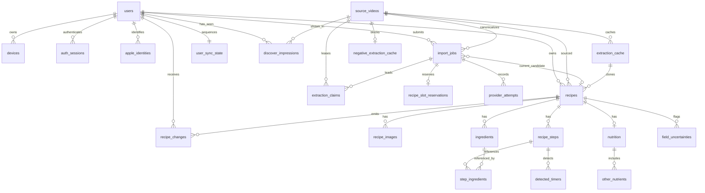

# Ladle backend integration reference

This is the practical map for running the backend, connecting the iOS app,
calling the HTTP API, configuring providers, and inspecting or changing the
PostgreSQL schema.

The implementation described here is on branch `codex/ladle-backend`.

## Repository paths

| Area | Path |
| --- | --- |
| Backend root | `Backend/` |
| Runtime settings and environment parsing | `Backend/ladle/config.py` |
| FastAPI composition root | `Backend/ladle/api/app.py` |
| Auth routes | `Backend/ladle/api/routes/auth.py` |
| Import routes | `Backend/ladle/api/routes/imports.py` |
| Recipe and sync routes | `Backend/ladle/api/routes/recipes.py` |
| Health and metrics routes | `Backend/ladle/api/routes/health.py` |
| JSON wire contracts | `Backend/ladle/contracts/` |
| SQLAlchemy schema | `Backend/ladle/db/models.py` |
| Alembic migrations | `Backend/alembic/versions/` |
| Celery entry point | `Backend/ladle/worker/app.py` |
| Import worker task | `Backend/ladle/worker/tasks.py` |
| Worker dependency wiring | `Backend/ladle/worker/runtime.py` |
| Import worker reliability | `Backend/docs/import-worker-reliability.md` |
| Dispatch recovery and dead letters | `Backend/docs/import-dispatch-recovery.md` |
| Production startup and migration gate | `Backend/docs/production-startup-and-migrations.md` |
| Account deletion and cleanup | `Backend/docs/account-deletion.md` |
| Import/cache orchestration | `Backend/ladle/imports/`, `Backend/ladle/cache/` |
| Provider adapters | `Backend/ladle/acquisition/` |
| Claude extraction | `Backend/ladle/extraction/` |
| Local containers | `Backend/docker-compose.yml` |
| Environment template | `Backend/.env.example` |
| iOS API base URLs | `Config/Debug.xcconfig`, `Config/Release.xcconfig` |
| iOS HTTP client | `Ladle/Remote/APIClient.swift` |
| iOS auth client | `Ladle/Account/AuthClient.swift` |
| iOS import client | `Ladle/Import/RemoteImportService.swift` |
| iOS recipe sync | `Ladle/Sync/RecipeSyncService.swift` |
| Shared Python/Swift fixtures | `Contracts/Fixtures/` |

The feature worktree used to build this branch is:

```text
/Users/chetangoel/Desktop/Repositories/recipe-app/.worktrees/ladle-backend
```

## Runtime addresses

| Service | Local address | Notes |
| --- | --- | --- |
| Ladle API | `http://127.0.0.1:4112` | Published by Docker Compose |
| Optional Caddy hostname | `http://api.ladle.localhost` | Current iOS Debug URL |
| Swagger UI | `http://127.0.0.1:4112/docs` | Development only; includes pipeline examples and bearer auth |
| OpenAPI JSON | `http://127.0.0.1:4112/openapi.json` | Generated OpenAPI 3.1 contract |
| Metrics | `http://127.0.0.1:4112/metrics` | Prometheus text format |
| MinIO S3 API | `http://127.0.0.1:9000` | Local object storage |
| MinIO console | `http://127.0.0.1:9001` | Local-only development credentials |
| PostgreSQL | Internal Compose hostname `postgres:5432` | Not published to the host |
| Redis | Internal Compose hostname `redis:6379` | DB 0 broker, DB 1 results |

The release iOS configuration currently points to
`https://api.ladle.app`. That hostname, TLS certificate, and routing must
exist before a release build can reach the backend.

## Start the complete local stack

From the repository root:

```bash
cd Backend
docker compose up -d --build
docker compose ps
curl --fail http://127.0.0.1:4112/health/live
curl --fail http://127.0.0.1:4112/health/ready
```

The Compose stack runs:

- PostgreSQL 16
- Redis 7
- MinIO and a one-shot bucket initializer
- a one-shot Alembic migration container
- FastAPI on container port 4111, published on host port 4112
- a Celery worker with local concurrency 1 and a 2 GiB memory ceiling

Compose deliberately uses `LADLE_WORKER_PROVIDER_MODE=fake`. This makes local
imports deterministic and free. The fake path exercises API admission, Redis,
the worker, PostgreSQL, cache cloning, recipe persistence, and sync without
calling paid services.
The long-running API, worker, and Beat services restart after unexpected
exits. Raise the worker concurrency or resource limits only when Docker
Desktop has the corresponding capacity.

Useful operations:

```bash
docker compose logs -f api worker
docker compose restart api worker
docker compose exec -T api uv run alembic current
docker compose exec -T api uv run alembic check
docker compose down
```

`docker compose down` keeps the named database, Redis, and MinIO volumes.
Adding `--volumes` destroys local data and should only be used intentionally.

### Configuration loading

`Settings` reads `LADLE_*` process variables and `Backend/.env` when the API
or worker is launched from the Backend directory.

The checked-in Compose file injects its development dependencies and forwards
provider mode and provider keys from `Backend/.env`, with fake-mode defaults.
To guarantee a free deterministic test even when the private environment uses
live providers, start Compose with
`LADLE_WORKER_PROVIDER_MODE=fake docker compose up -d --build`. Production
still receives its values through the deployment environment, not this local
profile.

`Backend/.env.example` uses host addresses for PostgreSQL and Redis. The
checked-in Compose file does not publish those two ports, because the normal
local path runs the API and worker inside Compose. If processes are run
directly with `uv`, use host Postgres/Redis instances or explicitly publish
the container ports in a local-only Compose override.

### Connect the Debug iOS app

`Config/Debug.xcconfig` uses `http://api.ladle.localhost`. Either configure
Caddy:

```caddyfile
http://api.ladle.localhost {
    reverse_proxy 127.0.0.1:4112
}
```

or temporarily point `LADLE_API_BASE_URL` at port 4112 in the Debug xcconfig.
In xcconfig syntax, preserve the escaped URL form:

```xcconfig
LADLE_API_BASE_URL = http:/$()/127.0.0.1:4112
```

The value becomes `LadleAPIBaseURL` in `Config/Ladle-Info.plist`, then
`APIConfiguration` reads it when the app starts. This loopback route works on
the Mac and iOS Simulator. A physical iPhone resolves `.localhost` to itself.
Release builds use the guarded VPS. For a Debug device build backed by local
Docker, run:

```bash
cd Backend
./scripts/device_tunnel.sh rotate
```

The command creates `.private/DeviceTunnel.xcconfig` with the current HTTPS
URL, a fresh per-build access key, and App Attest disabled to match local
Compose. Pass that file to `xcodebuild` with `-xcconfig`. Run `start` instead
of `rotate` while serving an already-installed build, and run `stop` when
device testing ends. Neither the access key nor generated xcconfig is
committed.

## Wire-format rules

All request and response bodies use these rules:

- JSON property names are lower camel case.
- Acronyms remain uppercase: `jobID`, `sourceURL`, `userID`, `deviceID`.
- UUIDs are lowercase, hyphenated strings.
- Decimal values are strings, such as `"4"` or `"82.5"`, never JSON numbers.
- Dates are UTC ISO-8601 with milliseconds, such as
  `"2026-07-23T20:15:00.000Z"`.
- Unknown JSON properties are rejected.
- Authenticated routes require `Authorization: Bearer <accessToken>`.
- Clients may send `X-Request-ID` as a UUID. The server always echoes the
  accepted/generated ID in the response header.

Canonical recipe payloads are available in:

- `Contracts/Fixtures/recipe-ready.json`
- `Contracts/Fixtures/recipe-needs-review.json`
- `Contracts/Fixtures/sync-page.json`
- `Contracts/Fixtures/errors.json`
- `Contracts/Fixtures/auth-tokens.json`
- `Contracts/Fixtures/auth-profile.json`

## HTTP API

### Route inventory

| Method and path | Auth | Success | Purpose |
| --- | --- | --- | --- |
| `POST /v1/auth/guest` | No | `201` | Create or resume a guest device and issue tokens |
| `POST /v1/auth/apple` | Guest bearer | `200` | Verify Apple credentials and atomically merge the guest |
| `POST /v1/auth/google` | Guest bearer | `200` | Verify a Google identity token and atomically merge the guest |
| `POST /v1/auth/refresh` | No | `200` | Rotate a refresh token and issue a new access token |
| `PATCH /v1/auth/profile` | Bearer | `200` | Set the cook's display name; blank clears it back to the provider's |
| `PUT /v1/auth/avatar` | Bearer | `200` | Store the cook's profile photo — a raw `image/jpeg` body of at most 512 KiB — and answer with the profile |
| `DELETE /v1/auth/avatar` | Bearer | `200` | Remove the cook's profile photo, leaving whatever the provider supplied |
| `DELETE /v1/auth/session` | Bearer | `204` | Revoke the current session |
| `DELETE /v1/auth/account` | Bearer | `204` | Delete the account and everything it owns |
| `POST /v1/imports` | Bearer | `202` | Admit and enqueue an import |
| `GET /v1/imports/{jobID}` | Bearer | `200` | Poll an import owned by the current user |
| `DELETE /v1/imports/{jobID}` | Bearer | `204` | Cancel an actively parsing import and release its reserved slot |
| `POST /v1/imports/{jobID}/retry` | Bearer | `202` | Retry with optional correction or pasted text |
| `GET /v1/recipes/sync?cursor=&limit=` | Bearer | `200` | Read ordered recipe upserts and tombstones |
| `GET /v1/recipes/discover?limit=&cursor=&q=&sort=&max_total_minutes=&seen_before=&record_impressions=` | Bearer | `200` | Rank unsaved public recipe-video sources; `sort` is `popular` (default), `newest`, `mostLiked` or `alphabetical`, `max_total_minutes` keeps only timed sources at or under that total, and `seen_before` pins a paging session — sources shown to this account before it and inside the seen window sort last, and the page served is recorded unless `record_impressions=false` asks for the ranking without the write |
| `GET /v1/recipes/discover/{sourceVideoID}` | Bearer | `200` | Read the current shared recipe as a non-owned Discover preview |
| `POST /v1/recipes/discover/{sourceVideoID}/save` | Bearer | `200` | Idempotently clone a ready shared extraction into the account |
| `GET /v1/recipes/{recipeID}` | Bearer | `200` | Fetch one current recipe |
| `PUT /v1/recipes/{recipeID}` | Bearer | `200` | Create or update a recipe with revision checking |
| `DELETE /v1/recipes/{recipeID}?baseRevision=` | Bearer | `204` | Soft-delete and emit a tombstone |
| `GET /health/live` | No | `200` | Process liveness only |
| `GET /health/ready` | No | `200`/`503` | Database, Redis, and object-storage readiness |
| `GET /metrics` | No | `200` | Bounded-label Prometheus metrics |
| `GET /docs` | No | `200` | Development-only Swagger pipeline console |
| `GET /openapi.json` | No | `200` | Generated machine-readable API contract |

There is no separate private recipe-list endpoint. Clients rebuild local state
from `/v1/recipes/sync` and use `/v1/recipes/{recipeID}` for an individual
refresh. Discover is a public-source preview: it excludes sources ever saved by
the requesting account, even after the owned recipe is deleted, and returns
aggregate save counts and source metadata
only, and never returns another user's identity, ingredients, steps, or edits.
Each item carries an opaque source ID. Saving that source instantiates the ready
shared extraction directly and emits a normal sync upsert. It does not create
an import job or rerun acquisition, transcription, or extraction. Reading an
individual Discover source returns the same current shared extraction for a
read-only detail screen without creating or changing an account recipe.

Discover's two shelves are this same endpoint under a different order or
filter, not a section resource of their own — so a shelf, the ranked list and
a search all return `DiscoverPageDTO` and page the same way:

```
GET /v1/recipes/discover?sort=newest&limit=10
GET /v1/recipes/discover?sort=popular&max_total_minutes=30&limit=10
```

`sort=newest` orders by when the source arrived in Overeasy
(`source_videos.created_at`), not by when its creator published it:
`published_at` is nullable and absent for Instagram, so publication order
would drop an entire platform out of the shelf. `max_total_minutes` filters on
the minimum total time across the savers of a source, so one saver's padded
edit cannot hide a source the rest call quick; a source no saver timed is
excluded rather than assumed quick.

`seen_before` is a UTC timestamp: the moment the client began this paging
session. It governs both halves of the recently-seen behaviour, and only
appears on the ranked list — the two shelves omit it, so a rail stays a
ranking rather than a reading position.

- **Demotion.** A source whose latest `discover_impressions.seen_at` for this
  account is both earlier than `seen_before` and later than
  `now - LADLE_DISCOVER_SEEN_WINDOW_HOURS` (24) sorts after everything unseen.
  Each group keeps the ranking it would otherwise have had, so nothing is
  removed from the feed and a cook who has seen the whole corpus simply gets
  the plain order back rather than a short page.
- **Recording.** Every item on the served page is upserted with
  `seen_at = now`, in the request's own transaction. Ranked rows dropped for a
  stale extraction cache are not recorded: they never reached the reader.

Because impressions are written at request time and demotion only considers
`seen_at < seen_before`, the rows one session writes cannot re-rank the pages
that session has not fetched yet — which is what makes an offset cursor safe
here. Omitting the parameter demotes nothing and records nothing.

```
GET /v1/recipes/discover?cursor=0&limit=30&seen_before=2026-09-01T09:00:00.000Z
GET /v1/recipes/discover?cursor=30&limit=30&seen_before=2026-09-01T09:00:00.000Z
```

`record_impressions=false` keeps the demotion and drops the write. It exists
for a page fetched behind the reader's back: Discover fetches page 1 quietly
when the cook scrolls back to the top and holds it behind a "New recipes"
pill. That page has to be ranked as a session — under a fresh pin, or it
returns what they have just been reading — but a page nobody has looked at
must not be marked as read. Taking the pill re-fetches under the *same* pin
with recording on; the ranking is deterministic and nothing was written in
between, so the rows come back identical and what the cook is handed is
exactly what the server records.

```
GET /v1/recipes/discover?cursor=0&limit=30&seen_before=2026-09-01T09:31:00.000Z&record_impressions=false
GET /v1/recipes/discover?cursor=0&limit=30&seen_before=2026-09-01T09:31:00.000Z
```

The parameter is ignored without `seen_before`, which records nothing anyway.

### Authentication payloads

Create a guest:

```json
{
  "installationID": "a-keychain-stable-installation-identifier",
  "attestation": null
}
```

The response is:

```json
{
  "accessToken": "<short-lived JWT>",
  "accessTokenExpiresAt": "2026-07-24T12:15:00.000Z",
  "refreshToken": "<rotating opaque token>",
  "userID": "00000000-0000-4000-8000-000000000001",
  "deviceID": "00000000-0000-4000-8000-000000000002",
  "userKind": "guest",
  "createdAt": "2026-07-24T12:00:00.000Z",
  "displayName": null,
  "avatarURL": null,
  "avatarIsCustom": false
}
```

The profile travels with the tokens rather than behind a `/me` call, so every
refresh keeps it current. `displayName` and `avatarURL` are null until a
provider supplies them or the cook edits the name; `createdAt` is when the
account was created, is always present, and is server-owned — there is no
request field for it, and `PATCH /v1/auth/profile` rejects one. The app reads
it for the "cooking since August 2026" line on the Profile sheet.

`avatarIsCustom` says which of two pictures `avatarURL` is. False: the
provider's own link, served as it stands. True: the photo the cook chose,
served as a **signed read URL** for a private object, good for six hours. A
client cannot tell them apart by looking, and it has to, because only the
cook's own photo can be removed.

Nothing re-signs an avatar URL on demand, and no endpoint exists to ask for
one. The profile is re-sent with every `POST /v1/auth/refresh`, and an access
token lasts fifteen minutes, so a running app always holds a live URL. A cold
launch after more than six hours idle shows the stored URL until the first
refresh replaces it.

`PATCH /v1/auth/profile` takes `{"displayName": "Priya Raman"}` and answers
with `userKind`, `displayName`, `avatarURL`, `avatarIsCustom` and `createdAt`
— the shape in `Contracts/Fixtures/auth-profile.json`. A blank or absent name
clears the stored one back to whatever the provider supplied.

`PUT /v1/auth/avatar` is the one route whose body is not JSON. It takes the
JPEG itself with `Content-Type: image/jpeg`, at most 512 KiB; the app crops to
a 512-pixel centre square and steps the quality down until it fits, so the cap
bounds a mistake rather than ordinary use. Another content type is `415`,
bytes that do not start with a JPEG marker are `400`, and a larger body is
`413` — all in the ordinary error envelope. `DELETE /v1/auth/avatar` removes
the photo and is idempotent: an account with none gets `200` and its unchanged
profile, not `404`. Both answer with `ProfileResponse`, and both are covered
by the global rate limiter only, exactly as `PATCH /profile` is.

The object a photo replaces is queued for deletion rather than erased inline,
the way a replaced recipe image is; so is the photo of a deleted account, and
a guest's photo when they sign into an account that has its own.

Refresh:

```json
{
  "refreshToken": "<current refresh token>",
  "deviceID": "00000000-0000-4000-8000-000000000002"
}
```

Sign in with Apple:

```json
{
  "identityToken": "<Apple identity JWT>",
  "authorizationCode": "<single-use Apple authorization code>",
  "nonce": "<raw nonce generated by the iOS client>",
  "idempotencyKey": "<stable ID for this merge attempt>"
}
```

The Apple call must carry the current guest access token. The identity token's
`nonce` claim must contain SHA-256 of the raw nonce sent in the request. A
successful response contains replacement account tokens with
`userKind: "apple"`.

### Copy-ready local import smoke test

This works against the fake-provider Compose stack and avoids printing the
access token:

```bash
LADLE_LOCAL_API=http://127.0.0.1:4112
LADLE_LOCAL_INSTALLATION_ID="local-$(uuidgen | tr '[:upper:]' '[:lower:]')"
LADLE_LOCAL_AUTH="$(
  curl --fail --silent --show-error \
    -X POST "$LADLE_LOCAL_API/v1/auth/guest" \
    -H 'Content-Type: application/json' \
    -d "{\"installationID\":\"$LADLE_LOCAL_INSTALLATION_ID\",\"attestation\":null}"
)"
LADLE_LOCAL_ACCESS_TOKEN="$(jq -er '.accessToken' <<<"$LADLE_LOCAL_AUTH")"
LADLE_LOCAL_JOB_ID="$(uuidgen | tr '[:upper:]' '[:lower:]')"

curl --fail --silent --show-error \
  -X POST "$LADLE_LOCAL_API/v1/imports" \
  -H "Authorization: Bearer $LADLE_LOCAL_ACCESS_TOKEN" \
  -H 'Content-Type: application/json' \
  -d "{
    \"jobID\":\"$LADLE_LOCAL_JOB_ID\",
    \"sourceURL\":\"https://www.youtube.com/watch?v=localDemo123\",
    \"allowDuplicate\":false,
    \"idempotencyKey\":\"$LADLE_LOCAL_JOB_ID\"
  }" | jq

curl --fail --silent --show-error \
  "$LADLE_LOCAL_API/v1/imports/$LADLE_LOCAL_JOB_ID" \
  -H "Authorization: Bearer $LADLE_LOCAL_ACCESS_TOKEN" | jq
```

The first response is normally `parsing`. Poll until it becomes `ready`,
`needsReview`, or `failed`. For `ready` and `needsReview`, fetch the returned
`recipeID` from `/v1/recipes/{recipeID}`.

### Import submission

```json
{
  "jobID": "00000000-0000-4000-8000-000000000010",
  "sourceURL": "https://www.youtube.com/watch?v=video123",
  "allowDuplicate": false,
  "idempotencyKey": "00000000-0000-4000-8000-000000000010",
  "currentRecipeID": null,
  "correctionNotes": null,
  "pastedText": null
}
```

Important behavior:

- `jobID` is client-generated and is also the recommended idempotency key.
- Accepted social links include YouTube watch, Shorts, and `youtu.be` URLs;
  direct TikTok video URLs and TikTok `/t/`, `vm.tiktok.com`, or
  `vt.tiktok.com` share links; and Instagram `/reel/`, `/p/`, and `/share/`
  equivalents. Share redirects are resolved through the backend's DNS-pinned
  social-host allowlist before canonicalization.
- A repeated `(userID, idempotencyKey)` returns the original job.
- `allowDuplicate: false` returns `duplicateRecipe` when that user already
  owns the source recipe.
- Set `currentRecipeID` for a safe re-import of an existing recipe.
- Supplying `correctionNotes` or `pastedText` marks the job private and bypasses
  the shared public cache.
- The current API still requires `sourceURL` when pasted text is supplied. The
  pasted text replaces acquisition evidence; it is not a source-less manual
  recipe endpoint.
- Correction and pasted text are encrypted before database persistence and are
  excluded from logs and error bodies.

The response has this shape:

```json
{
  "jobID": "00000000-0000-4000-8000-000000000010",
  "status": "parsing",
  "failureReason": null,
  "recipeID": null,
  "retryCount": 0,
  "createdAt": "2026-07-24T12:00:00.000Z",
  "updatedAt": "2026-07-24T12:00:00.000Z"
}
```

Statuses are `parsing`, `ready`, `needsReview`, and `failed`. Failure reasons
are `parserUnavailable`, `insufficientTextEvidence`, `privateOrDeleted`,
`unsupportedSource`, `invalidURL`, `networkUnavailable`, and `quotaExceeded`.
Cancellation is exposed as a `204` delete operation rather than another
pollable client status. The server records the terminal cancellation, releases
the recipe-slot reservation, and prevents later worker completion from creating
an account recipe.

Retry an existing job:

```json
{
  "correctionNotes": "The spoken quantity is two cups, not two tablespoons.",
  "pastedText": null
}
```

### Recipe synchronization

Start at cursor zero:

```bash
curl --fail --silent --show-error \
  "$LADLE_LOCAL_API/v1/recipes/sync?cursor=0&limit=100" \
  -H "Authorization: Bearer $LADLE_LOCAL_ACCESS_TOKEN" | jq
```

The response contains:

```json
{
  "changes": [
    {
      "sequence": 1,
      "recipeID": "00000000-0000-4000-8000-000000000020",
      "kind": "upsert",
      "recipeRevision": 1,
      "changedAt": "2026-07-24T12:00:00.000Z",
      "recipe": {}
    }
  ],
  "nextCursor": 1,
  "hasMore": false
}
```

Apply every page transactionally, persist `nextCursor` only after the page is
stored locally, and continue while `hasMore` is true. Delete changes have
`recipe: null`.

For manual recipe creation:

- `PUT /v1/recipes/{recipeID}`
- body is `{ "baseRevision": 0, "recipe": <RecipeDTO> }`
- path ID and `recipe.id` must match
- the DTO's starting `revision` is 1

For an update, send the last server revision as `baseRevision`. The server
increments the revision. A stale revision returns `syncConflict` with the
current recipe and current revision.

Use `Contracts/Fixtures/recipe-ready.json` as the complete `RecipeDTO`
reference. For a manual recipe, change `id`, set `source` to `other`, and use
an HTTPS `originalURL`, for example
`https://manual.ladle.local/{recipeID}`.

Recipe text, collection, number, duration, nesting, and total-complexity
limits are part of the wire contract. See `docs/recipe-graph-limits.md` before
constructing mutation payloads.

### Error envelope

Every application error uses:

```json
{
  "error": {
    "code": "invalidRequest",
    "message": "The request is invalid.",
    "retryable": false,
    "requestID": "00000000-0000-4000-8000-000000000099",
    "details": null
  }
}
```

Codes are:

- `invalidRequest`
- `invalidURL`
- `unsupportedSource`
- `duplicateRecipe`
- `guestRecipeLimitReached`
- `authenticationRequired`
- `syncConflict`
- `providerUnavailable`
- `quotaExceeded`
- `rateLimited`
- `notFound`
- `conflict`
- `internalError`

Only these codes carry typed details:

- `duplicateRecipe`: `existingRecipeID`
- `syncConflict`: `currentRecipe`, `currentRevision`
- `rateLimited`: `retryAt`

## Provider and cache pipeline

With `LADLE_WORKER_PROVIDER_MODE=live`, the worker follows this order:

1. Free platform metadata, captions, platform-published sticker/accessibility
   text, and linked recipe pages.
2. If evidence is incomplete, Whisper transcription of the acquired media,
   with one retry only for transport, timeout, or provider 5xx failures.
3. If configured and no transcript is available, one Supadata `mode=auto`
   request, which
   performs its own native-first/generated-fallback policy.
4. If configured and no transcript is available, SoScripted transcription.
5. Structured recipe and nutrition extraction from the collected text.
6. Review gating and transactional recipe/cache completion.

Outbound adapter paths:

| Provider | Adapter | Calls |
| --- | --- | --- |
| Supadata | `ladle/acquisition/supadata.py` | `GET /metadata`, `GET /transcript`, `GET /transcript/{jobID}` |
| SoScripted | `ladle/acquisition/soscripted.py` | `POST /transcribe` |
| OpenRouter (default) | `ladle/extraction/openrouter.py` | Chat completions with `json_schema` response format, Pydantic-validated |
| Anthropic (alternative) | `ladle/extraction/claude.py` | SDK `messages.parse` with a Pydantic output model |
| Apple | `ladle/auth/apple.py` | Apple JWKS GET and authorization-code token POST |

The public extraction cache is keyed by:

```text
(source_video_id, source_revision, contract_version, prompt_version, model_id)
```

This is deliberately not keyed by user. Two users requesting the same public,
canonical video share provider work and receive separately owned recipe rows.
An active partial unique index allows only one unreleased extraction claim per
source video, so concurrent first requests coalesce behind one leader.

Cache safety rules:

- public cache entries contain reusable recipe templates, never user ownership
- private/deleted sources are represented by a short-lived negative cache
- pasted text and correction notes bypass the public cache
- private re-parses cannot write public cache entries
- changing the source revision, contract, prompt, or model naturally misses
  the old cache
- invalidation keeps old rows for audit while excluding them from reuse

### Private server-media transcription

Purpose: make a personal worker able to import Instagram and TikTok without
depending on the URL-transcript vendors.

When free evidence is thin, `MediaAudioSource` downloads the direct media URL
published by a platform adapter or asks `yt-dlp` for the best audio stream.
`ffmpeg` converts it to 16 kHz mono MP3, and the worker sends that compact audio
to the configured OpenRouter Whisper endpoint. The source media and MP3 live
inside a `TemporaryDirectory`; neither is stored in object storage, and both
are removed when transcription returns or raises.

Supadata and SoScripted keys are optional. Without them the chain remains:

```text
permitted free evidence -> temporary media download -> Whisper
-> structured recipe extraction
```

For a personal session that public extraction cannot reach, set
`LADLE_YTDLP_COOKIES_FILE` to a Netscape-format cookie file. Every `yt-dlp`
metadata, caption, audio, and video command receives the same file. The file is
an account credential: keep it under the ignored `Backend/.private/` directory,
never send it to the API or iOS app, and mount it read-only into the worker.

For Docker Compose, use a private override such as:

```yaml
services:
  worker:
    environment:
      LADLE_YTDLP_COOKIES_FILE: /run/secrets/yt-dlp-cookies.txt
    volumes:
      - /absolute/path/to/cookies.txt:/run/secrets/yt-dlp-cookies.txt:ro
```

The OpenRouter key is still required because it performs Whisper, frame
analysis, and structured extraction. No provider extraction runs on the
iPhone.

Affected components:

- `ladle/acquisition/free/ytdlp.py`
- `ladle/acquisition/provider_chain.py`
- `ladle/worker/runtime.py`
- `ladle/config.py`
- `.env.example` and `docker-compose.yml`
- acquisition and configuration unit tests

Verification on 2026-07-26:

- the focused acquisition/configuration suite passed all 50 tests;
- the complete backend suite passed 286 tests with three explicitly selected
  live-provider tests skipped;
- Ruff formatting and lint, Mypy, Compose configuration validation, and
  `git diff --check` passed;
- a live Instagram import of reel `Ct-OnLxJlxw` with both transcript vendors
  omitted returned a Whisper transcript and the
  `instagramEmbedUsed`/`audioTranscriptionUsed` diagnostics.

## PostgreSQL schema

### Relationship map



### Identity and sessions

| Table | Columns |
| --- | --- |
| `users` | `id uuid PK`; `kind varchar(16)` (`guest`/`apple`); `created_at timestamptz`; `merged_into_user_id uuid FK users` |
| `apple_identities` | `apple_sub varchar(255) PK`; `user_id uuid FK users ON DELETE CASCADE`; `created_at timestamptz` |
| `devices` | `id uuid PK`; `user_id uuid FK users ON DELETE CASCADE`; `installation_id varchar(255) UNIQUE`; `attestation_state varchar(32)`; `created_at`, `last_seen_at timestamptz` |
| `auth_sessions` | `id uuid PK`; `user_id`, `device_id uuid FKs`; `token_family_id uuid`; current/previous refresh hashes `bytea`; grace/expiry/revocation/creation/rotation timestamps |

Only refresh-token hashes are stored. Access tokens are signed JWTs and are
not persisted.

### Source acquisition and shared caching

| Table | Columns |
| --- | --- |
| `source_videos` | `id uuid PK`; `platform varchar(16)`; `platform_video_id varchar(255)`; `canonical_url text`; public/check timestamps; `source_revision varchar(255)`; `metadata_json json`; `created_at` |
| `extraction_cache` | `id uuid PK`; `source_video_id uuid FK`; source/contract/prompt/model versions; `template_json json`; `review_status`; thumbnail object key; creation/invalidation timestamps |
| `negative_extraction_cache` | `id uuid PK`; `source_video_id uuid UNIQUE FK`; `reason`; `created_at`; `expires_at` |
| `extraction_claims` | `id uuid PK`; `source_video_id uuid FK`; `owner_job_id uuid FK`; `claim_version`; lease/heartbeat/release timestamps |
| `provider_attempts` | `id uuid PK`; `import_job_id uuid FK`; provider/operation/idempotency/status; optional external job, latency, billed units, provider-reported USD cost, failure code, timestamps |

Key constraints:

- source identity is unique on `(platform, platform_video_id)`
- cache identity is unique on source plus all four version dimensions
- only one unreleased extraction claim may exist per source video
- negative cache reason is `privateOrDeleted` or `parserUnavailable`
- provider attempt idempotency is unique per import job

### Imports and recipe limits

| Table | Columns |
| --- | --- |
| `import_jobs` | Client UUID PK; user/source FKs; source/canonical URLs; platform, status, stage, typed failure and diagnostic; retry count; cache bypass; encrypted correction/paste `bytea`; current/candidate/cache FKs; idempotency key; base revision; timestamps |
| `import_dispatch_outbox` | Job UUID PK/FK; availability/dispatch timestamps; dispatch count; sanitized last error |
| `import_dead_letters` | UUID PK; unique job FK; failure code; attempts; creation timestamp |
| `recipe_slot_reservations` | `id uuid PK`; user/job FKs; `state` (`reserved`/`consumed`/`released`); creation and expiry timestamps |

`(user_id, idempotency_key)` is unique. Each import job can own at most one
slot reservation. Reservations make the ten-recipe guest limit safe under
concurrent requests.

### Recipes

| Table | Columns |
| --- | --- |
| `recipes` | `id uuid PK`; owner/source/cache FKs; title/description/creator/source/original URL; preparation/cooking/total minutes; `servings numeric(18,6)`; favorite; review status; soft-delete timestamp; positive revision; created/updated timestamps |
| `recipe_images` | `id uuid PK`; `recipe_id uuid FK`; exactly one of `object_key` or `remote_url`; unique `order_index` per recipe |
| `ingredients` | `id uuid PK`; recipe FK; quantity text; normalized quantity `numeric(18,6)`; unit/name/preparation; unique order per recipe |
| `recipe_steps` | `id uuid PK`; recipe FK; unique order per recipe; instruction |
| `step_ingredients` | Composite PK `(recipe_id, step_id, ingredient_id)` with composite FKs that guarantee the step and ingredient belong to the same recipe |
| `detected_timers` | `id uuid PK`; step FK; label; positive duration enforced by the API contract |
| `nutrition` | Recipe UUID PK/FK; standard nutrients as `numeric(18,6)`; serving basis; estimated flag |
| `other_nutrients` | `id uuid PK`; nutrition recipe FK; name; amount `numeric(18,6)`; unit |
| `field_uncertainties` | `id uuid PK`; recipe FK; optional ingredient/step FKs; field path; reason; confidence `numeric(5,4)` |

Child recipe rows cascade when the recipe is physically removed. Normal API
deletion is soft: `recipes.deleted_at` is set and a sync tombstone is emitted.

### Discover reading position

| Table | Columns |
| --- | --- |
| `discover_impressions` | Composite PK `(user_id, source_video_id)`, both FKs `ON DELETE CASCADE`; `seen_at timestamptz` |

One row per account and source, holding the moment that source was last
served — overwritten rather than appended, so the table is bounded by corpus
size per account rather than by how often a cook scrolls.
`ix_discover_impressions_user_seen_at` on `(user_id, seen_at)` serves the
retention sweep, which deletes rows older than
`LADLE_RETENTION_DISCOVER_IMPRESSION_DAYS` (30). Both cascades matter: the
record must not outlive the account or the source it refers to. A guest merge
upserts the guest's rows onto the destination keeping the later `seen_at`,
then removes the guest's, since the pair is the primary key and a plain
re-point would collide.

### Sync

| Table | Columns |
| --- | --- |
| `user_sync_state` | `user_id uuid PK/FK`; `next_sequence bigint > 0`; minimum retained sequence for safe snapshot resets |
| `recipe_changes` | Composite PK `(user_id, sequence)`; recipe FK; `kind` (`upsert`/`delete`); recipe revision; changed timestamp |

Sequence allocation locks the user's `user_sync_state` row. This makes
changes monotonic for one user even when multiple API transactions commit
concurrently.

## Admin commands

One-off maintenance runs as a module inside the application image, so it uses
the same settings, database URL and provider keys as the service.

| Command | What it does |
| --- | --- |
| `python -m ladle.admin.cache_cli invalidate --platform tiktok --video-id 123` | Marks a source's extraction cache stale so the next import re-extracts it |
| `python -m ladle.admin.cache_cli backfill-thumbnails` | Copies legacy provider thumbnails into private object storage |
| `python -m ladle.admin.backfill_times [--dry-run] [--limit N]` | Estimates a total cooking time for live recipes that carry none |

`backfill_times` selects `deleted_at IS NULL AND total_minutes IS NULL`, and
asks the configured extraction provider (`LADLE_EXTRACTION_PROVIDER`) the
timing question alone against the stored recipe — title, the creator's
caption in `recipes.description`, ingredients, ordered steps with their
timers, any stated preparation and cooking time. There is no re-extraction
and no transcript.

- `--dry-run` asks the provider and prints the table without writing.
- An estimate below the recipe's own step timers, or below stated prep plus
  cook, is refused rather than written.
- A write goes through the recipe edit path, so `revision` bumps, a
  `recipe_changes` row is emitted and the estimate reaches the next sync page.
  It adds a `total_minutes` uncertainty carrying the reason the cook is shown
  and never changes `review_status`.
- Recipes that already carry a total are skipped, so re-running is safe.

On the VPS the command runs through `manage.sh`, which supplies the `api`
service's environment:

```bash
sudo /opt/ladle/app/Backend/deploy/vps/manage.sh backfill-times --dry-run
sudo /opt/ladle/app/Backend/deploy/vps/manage.sh backfill-times
```

## Migrations and schema inspection

The current migration chain is:

```text
0001_initial_schema
  -> 0002_support_remote_recipe_images
  -> 0003_add_negative_extraction_cache
  -> 0004_add_recipe_notes_and_step_timing
  -> 0005_add_app_attest_state
  -> 0006_store_apple_refresh_token
  -> 0007_add_google_identity
  -> 0008_add_quota_and_provider_budgets
  -> 0009_add_import_dispatch_outbox
  -> 0010_add_account_deletion_audit
  -> 0011_add_sync_retention_floor
```

Alembic also owns the small `alembic_version` table that records the currently
applied revision; application code must not modify it directly.

Apply and verify:

```bash
cd Backend
docker compose exec -T api uv run alembic current
docker compose exec -T api uv run alembic upgrade head
docker compose exec -T api uv run alembic check
```

Inspect the live local schema without publishing PostgreSQL to the host:

```bash
docker compose exec -T postgres psql -U ladle -d ladle -c '\dt'
docker compose exec -T postgres psql -U ladle -d ladle -c '\d+ import_jobs'
docker compose exec -T postgres psql -U ladle -d ladle -c '\d+ extraction_cache'
docker compose exec -T postgres psql -U ladle -d ladle -c '\d+ recipes'
docker compose exec -T postgres psql -U ladle -d ladle -c '\d+ recipe_changes'
docker compose exec -T postgres \
  pg_dump -U ladle -d ladle --schema-only --no-owner --no-privileges
```

When changing the schema:

1. modify `ladle/db/models.py`;
2. create a new migration instead of editing an applied migration;
3. run `uv run alembic revision --autogenerate -m "description"`;
4. review the generated upgrade and downgrade manually;
5. run integration tests against real PostgreSQL;
6. run `uv run alembic check`.

## Production configuration checklist

Copy `.env.example` into the deployment's secret/config system; do not commit
a populated `.env`.

Minimum core values:

```text
LADLE_ENVIRONMENT=production
LADLE_JWT_SIGNING_SECRET
LADLE_DATA_ENCRYPTION_KEY
LADLE_DATABASE_URL
LADLE_CELERY_ENABLED=true
LADLE_CELERY_BROKER_URL
LADLE_CELERY_RESULT_BACKEND
```

The signing and encryption secrets must each be non-placeholder values of at
least 32 characters.

For live extraction:

```text
LADLE_WORKER_PROVIDER_MODE=live
LADLE_SUPADATA_API_KEY
LADLE_SOSCRIPTED_API_KEY
LADLE_ANTHROPIC_API_KEY
LADLE_ANTHROPIC_MODEL_ID
```

All three provider keys are currently required to start a live worker.

For copied thumbnails:

```text
LADLE_OBJECT_STORAGE_ENABLED=true
LADLE_OBJECT_STORAGE_ENDPOINT_URL
LADLE_OBJECT_STORAGE_REGION
LADLE_OBJECT_STORAGE_BUCKET
LADLE_OBJECT_STORAGE_ACCESS_KEY
LADLE_OBJECT_STORAGE_SECRET_KEY
```

For Apple sign-in:

```text
LADLE_APPLE_ENABLED=true
LADLE_APPLE_BUNDLE_ID
LADLE_APPLE_TEAM_ID
LADLE_APPLE_KEY_ID
LADLE_APPLE_PRIVATE_KEY
```

`LADLE_APPLE_PRIVATE_KEY` is the ES256 private key text used to create the
Apple client secret. The configured bundle ID must match the identity token's
audience and the signed iOS application.

Production validation rejects incomplete Apple settings, missing live-provider
keys, weak core secrets, and a weak object-storage secret when storage is
enabled.

## Troubleshooting

| Symptom | Check |
| --- | --- |
| App reports an invalid base URL | Confirm `LadleAPIBaseURL` in the built Info.plist and preserve xcconfig URL escaping |
| `api.ladle.localhost` does not connect | Add/reload the Caddy route or point simulator Debug directly at `127.0.0.1:4112`; physical devices require the guarded release endpoint or tunnel |
| API is live but not ready | Read `/health/ready`, then inspect Postgres, Redis, MinIO, and `minio-init` in `docker compose ps` |
| Imports remain `parsing` | Confirm the worker is healthy, Celery is enabled, API/worker broker URLs match, and inspect worker logs |
| Worker raises “providers are disabled” | Set provider mode to `fake` locally or `live` with all three keys |
| Live transcript fails over immediately | Inspect `provider_attempts`, provider circuit metrics, keys, quotas, and base URLs |
| Same video is extracted twice | Compare canonical platform/video ID, source revision, contract version, prompt version, and model ID |
| Correction unexpectedly uses cache | Confirm correction/pasted text reached the API and `import_jobs.bypass_cache` is true |
| `409 syncConflict` | Apply `details.currentRecipe`, preserve the local draft, and retry only after the user resolves it |
| Guest receives `guestRecipeLimitReached` | Inspect active recipes plus unexpired `recipe_slot_reservations` |
| Apple endpoint returns `503` | Apple is disabled or its credential service was not constructed |
| `LADLE_SERVER_MEDIA_FALLBACK_ENABLED` changes nothing | The concrete processor and runtime wiring described above are still required |
