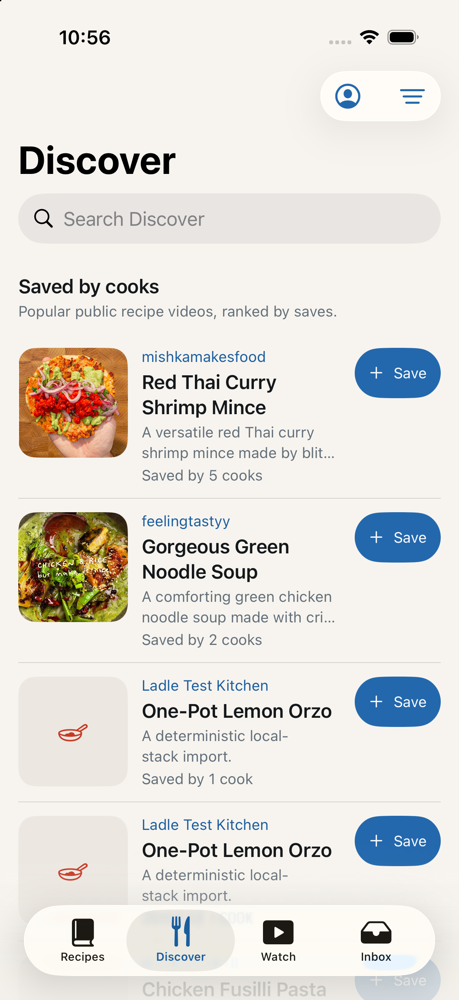
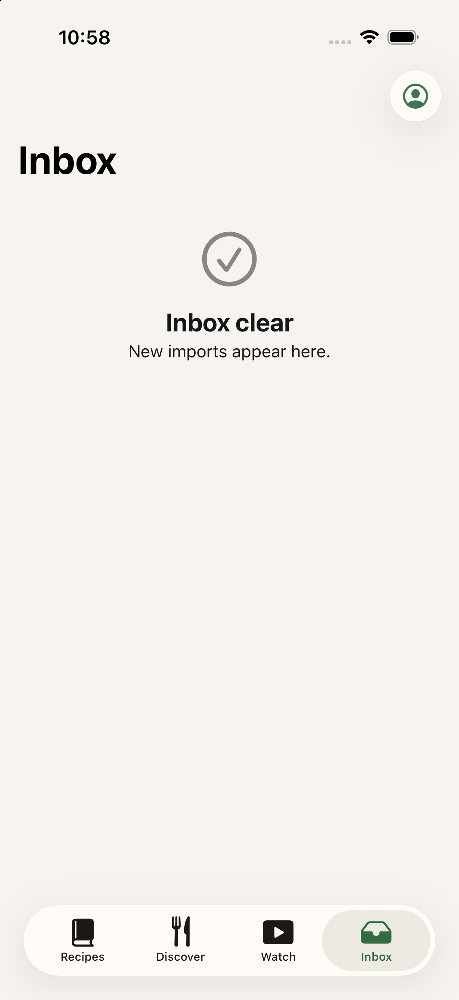
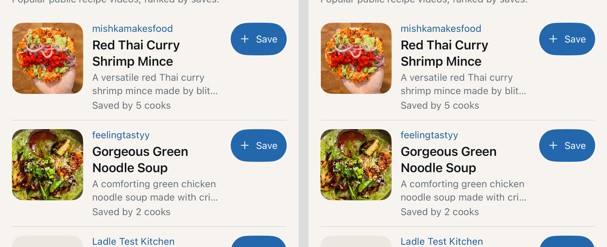
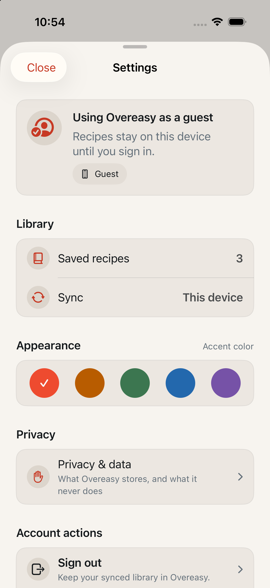
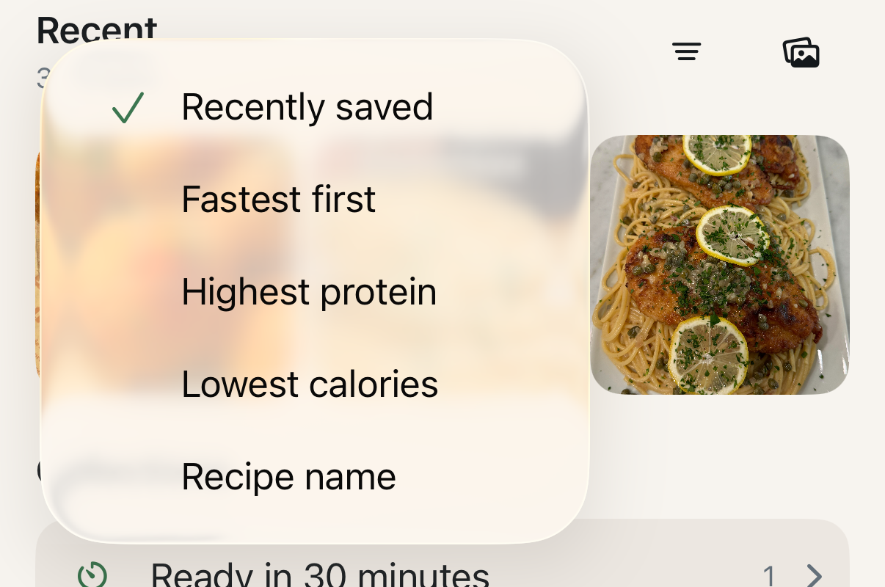

# UI feedback triage — Discover, Settings, Inbox, accent

Date: August 31, 2026
Status: **validated, nothing implemented.** This is the running list. Items
1–11 came from a spoken list on August 31; item 12 was added on September 1
from a reimport on the phone, after the VPS was brought up to date.

## Purpose

Chetan gave a spoken list of observations after using the app against the
live backend. This records each one in his words, says whether it holds up,
shows the evidence, names every file a fix would touch, and proposes a
direction. Two items need a product decision before any code is written; the
rest are ordinary defects or small additions.

Nothing here has been built. `main` is on the TestFlight build (`6d5806a`) and
should stay clean until this list is agreed.

## Summary

| # | Item | Verdict | Where the work is |
|---|------|---------|-------------------|
| 1 | Land on Discover by default | Confirmed | `LibraryView.swift` + ~12 UI tests |
| 2 | Discover at 1,000 recipes; featured | **Needs decision** | backend `repository.py` + `DiscoverView.swift` |
| 3 | Watch view is good | No action | — |
| 4 | Deprioritize Instagram in Discover | **Withdrawn** | — |
| 5 | Plus icon in Inbox; import from empty state | Confirmed | `LibraryView.swift`, `ImportInboxView.swift` |
| 6 | Does the accent apply app-wide? | **No** | `LadleTheme.swift` + 28 files |
| 7 | Settings sections off-HIG; Close button | Confirmed, measured | `AccountSheet.swift` + 10 sheet files |
| 8 | Settings/profile for a paid tier | **Needs decision** | `AccountSheet.swift`, `limits.py` |
| 9 | Sort menu looks jarring | Confirmed — the **Recipes** one | `AllRecipesView.swift` |
| 10 | Accent doesn't update behind the sheet | Same bug as #6 | see #6 |
| 11 | Pull-to-refresh should show new recipes | Partly | backend `repository.py` |
| 12 | Reimported recipe had no calorie information | **Fixed and deployed** | `usda.py`, `calculator.py` |
| 13 | Should we use a different calorie source? | **No — query layer fixed instead** | `normalization.py`, `calculator.py` |

Items 6 and 10 are one bug. Items 7 and 9 are the same class of problem as the
filter sheet that was already rewritten: hand-rolled chrome where a system
control belongs.

---

## 1. Land on Discover by default

> "I think we should land the user at the Discover page by default."

**Confirmed as a change, not a defect** — and it is bigger than it looks.

The app opens on Recipes today: `LibraryNavigationState.tab` defaults to
`.recipes` ([LibraryView.swift:21](../../Ladle/Library/LibraryView.swift:21)),
which a cold launch confirms.

Three things move with it:

- **The Add recipe button only exists on the Recipes tab.**
  `LibraryTab.toolbarActions`
  ([LibraryView.swift:793](../../Ladle/Library/LibraryView.swift:793)) gives
  `.addRecipe` to Recipes and nothing else. Landing on Discover means the app's
  primary action is not on the first screen a cook sees. This is the same gap
  as item 5, and doing them together is what makes Discover-first work.
- **Around a dozen UI tests launch straight into library assertions** without
  tapping a tab — either looking for recipe content (`"No recipes yet"`,
  `"80 recipes"`, `recipe.grid.*`) or tapping `app.buttons["Add recipe"]`, which
  would no longer be on screen. Each needs a `Recipes` tap first.
- **`reviewDidComplete(hasActionableImports:)`**
  ([LibraryView.swift:55](../../Ladle/Library/LibraryView.swift:55)) falls back
  to `.recipes` after a review. That is a *different* decision — after reviewing
  an import you belong with your own library — and should stay as it is.

One thing to decide before building it: opening a returning cook onto other
people's recipes rather than their own library is a product stance, not just a
default. It also puts a network request on the launch path, so a cold launch
with no signal lands on an error or empty state instead of the saved library.

### Files to change

| File | Change |
|------|--------|
| [`Ladle/Library/LibraryView.swift:21`](../../Ladle/Library/LibraryView.swift:21) | `var tab: LibraryTab = .discover` |
| [`Ladle/Library/LibraryView.swift:24`](../../Ladle/Library/LibraryView.swift:24) | `init(tab: LibraryTab = .discover, …)` |
| [`Ladle/Library/LibraryView.swift:793`](../../Ladle/Library/LibraryView.swift:793) | `toolbarActions` — give `.addRecipe` to every tab (see item 5) |
| [`LadleTests/LibraryNavigationStateTests.swift:7`](../../LadleTests/LibraryNavigationStateTests.swift:7) | `testLibraryStartsOnRecipesTab` → asserts `.discover` |
| [`LadleUITests/StateScenarioUITests.swift`](../../LadleUITests/StateScenarioUITests.swift) | ~8 tests: tap `Recipes` after launch |
| [`LadleUITests/DiscoverInteractionUITests.swift`](../../LadleUITests/DiscoverInteractionUITests.swift) | ~4 tests: same |

**Effort:** small in production code, a chore in the tests.

---

## 2. Discover at 1,000 recipes, and "featured"

> "I want to explore a couple more implementations of the Discover page because
> when we scale to 1,000 recipes, I think we might have to check out an
> alternate way of doing that. Maybe we have featured recipes too. I don't
> know."

**Needs a decision — no direction picked here.** The reachability problem is
already fixed: Discover pages with an integer cursor, 30 per page, prefetching
8 rows from the end, and search and sort both run on the server
([DiscoverService.swift](../../Ladle/Remote/DiscoverService.swift),
[repository.py:102](../../Backend/ladle/recipes/repository.py:102)). All 1,000
recipes are *reachable*. What is missing at that size is a reason to look past
the first page.

Today the feed is one flat ranked list with three orderings — Most saved, Most
liked, A to Z — under one static heading, "Saved by cooks".



Options, in rough order of cost:

1. **Sections instead of one list.** "New this week", "Most saved", "Quick
   dinners" as shelves with a flat list underneath. `published_at` is already
   stored (unexposed, and absent for Instagram) and so is total time, so two of
   those shelves are query changes, not new data.
2. **Featured.** A curated set pinned to the top. Needs a new column and a way
   to set it — there is no admin surface, so in practice a SQL update or a small
   script until one exists.
3. **Tags or cuisine facets.** The most useful at 1,000 items and the most
   expensive: nothing classifies recipes today, so it needs a classification
   pass over the corpus or new extraction output.
4. **Personalization.** Rank against what the cook has already saved. Most
   valuable, most work, and it needs enough history to be worth it.

My read: (1) has the best ratio of value to cost and forecloses none of the
others. Your call, not mine.

### Files a section-based feed would touch

| File | Change |
|------|--------|
| [`Backend/ladle/recipes/repository.py:102`](../../Backend/ladle/recipes/repository.py:102) | `discover()` — expose `published_at`, add per-section queries |
| [`Backend/ladle/contracts/recipes.py:249`](../../Backend/ladle/contracts/recipes.py:249) | `DiscoverRecipeDTO` / `DiscoverPageDTO` — section grouping, `publishedAt` |
| [`Backend/ladle/api/routes/recipes.py:108`](../../Backend/ladle/api/routes/recipes.py:108) | `GET /discover` — section parameter |
| [`Ladle/Remote/DiscoverService.swift`](../../Ladle/Remote/DiscoverService.swift) | matching wire model and fetch |
| [`Ladle/Library/DiscoverView.swift`](../../Ladle/Library/DiscoverView.swift) | shelves above the paged list |
| `Backend/alembic/versions/` | new migration, **only** for option 2 (featured column) |

**Effort:** small (1) to large (3, 4).

---

## 3. Watch view

> "The watch view is pretty good now, honestly."

No action requested. Noted so the list stays complete.

---

## 4. Deprioritizing Instagram in Discover

> "Maybe we deprioritize Instagram in Discover, but never mind. That sounds too
> complicated."

**Withdrawn by you in the same breath.** Recorded so it does not get
re-discovered later as an open idea. For what it's worth it would not be
especially complicated — a source weight in the ranking — but there is no reason
to do it unless Instagram results actually turn out worse.

---

## 5. A plus in the Inbox, and importing from its empty state

> "Can we add a plus icon in the inbox? Maybe if we say there are no imports,
> then we should be able to add imports from the inbox screen. It's intuitive,
> and it just makes sense."

**Confirmed, both halves.** The Inbox has one toolbar button — the account
circle — and its empty state is a dead end:



- The add button is built only into the Recipes tab: `recipesTab` puts
  `accountButton` **and** `addRecipeButton` in the toolbar
  ([LibraryView.swift:295](../../Ladle/Library/LibraryView.swift:295)); `inboxTab`
  puts only `accountButton`
  ([LibraryView.swift:389](../../Ladle/Library/LibraryView.swift:389)).
  `LibraryTab.toolbarActions` states the rule and a test locks it in.
- The empty state is a `ContentUnavailableView` with a title and description and
  **no action** ([ImportInboxView.swift:51](../../Ladle/Library/ImportInboxView.swift:51)).

Your instinct is right and it is cheap: `ContentUnavailableView` takes an
`actions:` closure, and `isAddSheetPresented` is already owned by `LibraryView`,
so both halves reuse the sheet that exists. `ImportInboxView` needs one new
closure parameter passed down from `inboxContent`.

This is also the thing that makes item 1 viable — if the app opens on Discover,
the plus needs to be on every tab, not just Recipes.

### Files to change

| File | Change |
|------|--------|
| [`Ladle/Library/LibraryView.swift:389`](../../Ladle/Library/LibraryView.swift:389) | `inboxTab` — add `addRecipeButton` to the toolbar group |
| [`Ladle/Library/LibraryView.swift:405`](../../Ladle/Library/LibraryView.swift:405) | `inboxContent` — pass `addRecipe: { presentAddRecipe() }` |
| [`Ladle/Library/LibraryView.swift:793`](../../Ladle/Library/LibraryView.swift:793) | `toolbarActions` — `.addRecipe` for `.inbox` (and `.discover`, per item 1) |
| [`Ladle/Library/ImportInboxView.swift:11`](../../Ladle/Library/ImportInboxView.swift:11) | new `let addRecipe: () -> Void` |
| [`Ladle/Library/ImportInboxView.swift:51`](../../Ladle/Library/ImportInboxView.swift:51) | `ContentUnavailableView { … } actions: { Button("Add recipe", action: addRecipe) }` |
| [`LadleTests/LibraryNavigationStateTests.swift:88`](../../LadleTests/LibraryNavigationStateTests.swift:88) | `toolbarActions` expectations |

**Effort:** small.

---

## 6 & 10. The accent colour does not reach the whole app

> "Changing the accent in the settings, can you confirm it works for the whole
> app?"
>
> "Changing the accent doesn't always change the current screen behind the
> full-screen sheet. It requires me to click in and out."

**It does not work for the whole app, and these are one bug.** Answering the
first question directly: no. The reactive part is only the root tint.

**Root cause.** `LadleTheme.Intent.accent`, `Label.accent` and `brick` are
computed properties that read `UserDefaults` at body-evaluation time
([LadleTheme.swift:203](../../Ladle/Design/LadleTheme.swift:203)). SwiftUI has no
dependency on `UserDefaults`, so changing the accent invalidates nothing. A view
picks up the new colour only when it re-renders for some unrelated reason —
which is exactly what "click in and out" does.

There are **76 such reads across 28 files.** The worst-placed one is
`LibraryView`'s own `.tint(LadleTheme.Intent.accent)`
([LibraryView.swift:112](../../Ladle/Library/LibraryView.swift:112)): a static
read that *overrides* the correctly reactive `.tint` the app root applies from
`@AppStorage` ([LadleApp.swift:108](../../Ladle/App/LadleApp.swift:108)). The one
part of the system that was wired properly is shadowed by a stale value for the
whole library.

**Reproduced on device, in both directions:**

- Opened Settings over Discover, chose Blue. The sheet itself turned blue
  immediately — it reads through `@AppStorage`, so its own body re-runs. Closed
  it: Discover was **entirely unchanged**, still Tomato — Save buttons, creator
  handles, toolbar icons, tab bar. *Observed live; this first pass was not
  written to a file.*
- Switched to Recipes and back: both tabs were now blue. The tab switch forces
  the re-render.
- Repeated it in the other direction and captured that one. Left: Discover in
  Blue. Right: Discover immediately after opening Settings, choosing **Sage**,
  and closing. **The two are identical — that is the bug.**



**Why this was never caught.** The one UI test that touches the accent
(`testSettingsAccentAndRecipeViewPreferencesAreReachable`,
[DiscoverInteractionUITests.swift:96](../../LadleUITests/DiscoverInteractionUITests.swift:96))
taps Blue and asserts the *swatch* reports "Selected". It never asserts the
accent reached anything. The
[2026-08-25 doc](../verification/2026-08-25-settings-discover-and-library-layout.md)
claims the accent "updates primary actions, active navigation, favorites, and
attention indicators" — that was the intent, and it was never verified.

**Direction.** Make the accent an observed value rather than a global function
call: publish it into the environment from the root, which already observes
`@AppStorage`, and have `LadleTheme`'s accent roles resolve from the
environment. Mechanical across 28 files, but it fixes every site at once and
makes the failure impossible to reintroduce — a static read would stop
compiling.

### Files to change

| File | Change |
|------|--------|
| [`Ladle/Design/LadleTheme.swift:203`](../../Ladle/Design/LadleTheme.swift:203) | `selectedAccent` — delete the `UserDefaults` read |
| [`Ladle/Design/LadleTheme.swift:108, 112`](../../Ladle/Design/LadleTheme.swift:108) | `brick`, `accentText` — resolve from an `EnvironmentKey` |
| [`Ladle/Design/LadleTheme.swift:166, 173`](../../Ladle/Design/LadleTheme.swift:166) | `Label.accent`, `Intent.accent` — same |
| [`Ladle/App/LadleApp.swift:108`](../../Ladle/App/LadleApp.swift:108) | publish the accent into the environment beside the existing `.tint` |
| [`Ladle/Library/LibraryView.swift:112`](../../Ladle/Library/LibraryView.swift:112) | **delete** the shadowing `.tint` — the root already sets it |
| [`LadleUITests/DiscoverInteractionUITests.swift:96`](../../LadleUITests/DiscoverInteractionUITests.swift:96) | assert the accent *outside* the sheet after a change |

The 28 files holding the 76 reads, all of which need their accent read to come
from the environment:

<details>
<summary>All 28 files</summary>

```
Ladle/Account/AccountSheet.swift            Ladle/Library/DiscoverView.swift
Ladle/Account/GuestLimitView.swift          Ladle/Library/LibraryView.swift
Ladle/Account/OnboardingWalkthroughView.swift  Ladle/Library/PendingImportCard.swift
Ladle/Account/WelcomeView.swift             Ladle/Library/RecipeContextMenu.swift
Ladle/App/AppBootstrap.swift                Ladle/Library/RecipeGridCard.swift
Ladle/Cooking/FullRecipeView.swift          Ladle/Library/RecipeListRow.swift
Ladle/Cooking/RecipeTimer.swift             Ladle/Library/WatchView.swift
Ladle/Design/LadleComponents.swift          Ladle/RecipeDetail/IngredientList.swift
Ladle/Design/LadleTheme.swift               Ladle/RecipeDetail/MethodList.swift
Ladle/Edit/RecipeEditorView.swift           Ladle/RecipeDetail/RecipeDetailView.swift
Ladle/Edit/ReimportSheet.swift              Ladle/RecipeDetail/RecipeMetadataBand.swift
Ladle/Health/HealthExportSheet.swift        Ladle/Remote/RecipeArtworkView.swift
Ladle/Import/AddRecipeSheet.swift           Ladle/Sync/SyncConflictReviewView.swift
Ladle/Import/FailedImportSheet.swift        Ladle/Library/AllRecipesView.swift
```

</details>

**Effort:** medium — the fix is mechanical but wide.

---

## 7. The Settings screen

> "Can you do a UI check on the settings screen? I don't think the different
> sections are very much in line with iOS design guidelines. It also looks like
> the close button on the top left has weird padding, and it's not centered in
> the button."

**Both parts confirmed.**



### The sections

The screen is a `ScrollView` of hand-built cards
([AccountSheet.swift:65](../../Ladle/Account/AccountSheet.swift:65)) — custom
`LadleSectionHeader`s, custom rows, hand-drawn dividers with a derived inset,
circular icon badges. It is not a `Form` or a `List`. Against the platform:

- Section headers render as large bold primary-colour text; a grouped list uses
  small secondary-colour headers.
- Rows are `minHeight: 64` and `Control.primary` (52); system rows are 44.
- "Accent color" hangs off the right of the "Appearance" header as a detail.
  There is no such affordance in iOS settings — that is a footer.
- Chevrons, dividers and row backgrounds are all re-implemented.

Same failure the filter sheet had, same fix: a grouped `Form`, as `FilterSheet`
now is ([FilterSheet.swift](../../Ladle/Library/FilterSheet.swift)). Rewriting it
that way would delete most of the 536 lines.

### The Close button


Measured from a 3× capture: the glass capsule is **8 points wider than the label
needs**, and the label sits **4 points right of the capsule's centre** — exactly
half of the 8-point inset, i.e. all of the padding lands on one side.

The cause is `.padding(.leading, LadleTheme.Layout.sheetToolbarInset)` applied to
the button *inside* the toolbar item
([AccountSheet.swift:89](../../Ladle/Account/AccountSheet.swift:89)). The inset
was introduced to move a toolbar control from the system's 16-point edge onto
the sheet's 24-point content margin — reasonable when a bar button was bare
text. Under iOS 26 the toolbar draws a glass capsule *around the padded label*,
so the padding now inflates the capsule and pushes the text off its centre.

**This is deliberate and test-enforced**, so it should be changed on purpose
rather than quietly: the inset is asserted to equal 8, and a test scans every
sheet's source for it
([DesignTokenTests.swift:329, 385](../../LadleTests/DesignTokenTests.swift:329)).
**Ten files use it across twelve call sites** — Settings plus nine others — so
the same off-centre capsule is on all of them. The fix is to retire the inset
app-wide and update the test, not to special-case Settings.

### Files to change

| File | Change |
|------|--------|
| [`Ladle/Account/AccountSheet.swift:65`](../../Ladle/Account/AccountSheet.swift:65) | rewrite the body as a grouped `Form` |
| [`Ladle/Account/AccountSheet.swift:89`](../../Ladle/Account/AccountSheet.swift:89) | drop the `.padding(.leading:)` on Close |
| [`Ladle/Design/LadleTheme.swift:234`](../../Ladle/Design/LadleTheme.swift:234) | retire `Layout.sheetToolbarInset` |
| [`LadleTests/DesignTokenTests.swift:329`](../../LadleTests/DesignTokenTests.swift:329) | drop the `== 8` assertion |
| [`LadleTests/DesignTokenTests.swift:385`](../../LadleTests/DesignTokenTests.swift:385) | invert the scan: assert sheets **don't** pad toolbar items |

The nine other sheets carrying the same inset:

| File | Call sites |
|------|-----------|
| [`Ladle/Edit/RecipeEditorView.swift:44, 62`](../../Ladle/Edit/RecipeEditorView.swift:44) | 2 |
| [`Ladle/Library/VideoEmbedSheet.swift:371, 381`](../../Ladle/Library/VideoEmbedSheet.swift:371) | 2 |
| [`Ladle/Edit/ReimportSheet.swift:25`](../../Ladle/Edit/ReimportSheet.swift:25) | 1 |
| [`Ladle/Health/HealthExportSheet.swift:50`](../../Ladle/Health/HealthExportSheet.swift:50) | 1 |
| [`Ladle/Import/AddRecipeSheet.swift:83`](../../Ladle/Import/AddRecipeSheet.swift:83) | 1 |
| [`Ladle/Import/CorrectionNotesView.swift:97`](../../Ladle/Import/CorrectionNotesView.swift:97) | 1 |
| [`Ladle/Import/FailedImportSheet.swift:26`](../../Ladle/Import/FailedImportSheet.swift:26) | 1 |
| [`Ladle/Nutrition/NutritionView.swift:51`](../../Ladle/Nutrition/NutritionView.swift:51) | 1 |
| [`Ladle/Sync/SyncConflictReviewView.swift:96`](../../Ladle/Sync/SyncConflictReviewView.swift:96) | 1 |

**Effort:** medium for the `Form` rewrite; small per file for the inset, but it
touches ten files and a test written to prevent exactly that change.

---

## 8. Settings/profile for a paid tier

> "Because I can see there being a paid version and limiting the number of
> recipes a user can add, maybe we work a little more on the settings/profile
> screen."

**Needs a decision, but the scaffolding is more real than you may remember.**

The backend already enforces a per-user recipe quota: `GUEST_RECIPE_LIMIT = 10`,
a `RecipeCapacity` counting saved recipes plus in-flight reservations, a
row-locked check, a `guestRecipeLimitReached` error code, and an app flow that
explains it ([limits.py](../../Backend/ladle/recipes/limits.py),
[GuestLimitView.swift](../../Ladle/Account/GuestLimitView.swift)). The limit is
keyed on `capacity.user.kind`, so a paid kind slots into the existing check
rather than needing a new mechanism. The app knows the number too —
`GuestPolicy.recipeLimit` in LadleCore.

What Settings does *not* do: it shows "Saved recipes — 3" with no notion of a
ceiling, even for guests who have one. A cook on 9 of 10 gets no warning until
the import fails.

So one thing is worth doing regardless of how tiers land, and needs no new
backend concept: **show the quota you already enforce.** "3 of 10 recipes" for
guests is honest and useful, and every value it needs already exists.

Beyond that — what a paid tier gates, what the free ceiling is, whether billing
is StoreKit — is a product decision and I have not assumed one.

### Files to change (surfacing the existing quota only)

| File | Change |
|------|--------|
| [`Ladle/Account/AccountSheet.swift:138`](../../Ladle/Account/AccountSheet.swift:138) | `librarySection` — "3 of 10" when `accountSession.state == .guest` |
| [`Packages/LadleCore/Sources/LadleCore/GuestPolicy.swift:10`](../../Packages/LadleCore/Sources/LadleCore/GuestPolicy.swift:10) | already has `recipeLimit = 10` — read, don't restate |
| `LadleTests/` | a test for the "N of M" string across guest and signed-in states |

A real tier would additionally touch `Backend/ladle/recipes/limits.py`, the
`User.kind` values, and a new migration — but not before the product decision.

**Effort:** small for the quota display; unknown for the tier itself.

---

## 9. The sort menu

> "Honestly, the sort button opens up a menu that really doesn't look like it
> belongs in the app. It's very jarring."

**Confirmed — and it is the Recipes menu, not Discover's.** There are two sort
buttons and they behave very differently, so both were captured.

**Recipes** — hand-rolled: a `Menu` of plain `Button`s where the selected row is
`Label(title, systemImage: "checkmark")` and unselected rows are bare `Text`
([AllRecipesView.swift:79](../../Ladle/Library/AllRecipesView.swift:79)):



- a **leading** checkmark, where iOS puts selection on the trailing edge;
- an empty icon gutter on every unselected row, because only the selected row
  has a symbol;
- a heavily translucent panel over the recipe photos, so the food shows through
  the menu text;
- anchored far to the left, running nearly to the screen edge while its button
  sits on the right.

**Discover** — a `Menu` wrapping a real `Picker`
([DiscoverView.swift:300](../../Ladle/Library/DiscoverView.swift:300)), and it
looks native: opaque, anchored under its button, proper checkmark column:


The fix is to make the Recipes menu what Discover's already is — a `Picker`
bound to `viewModel.sort` — and to do the same for the display-mode menu beside
it, which has the identical checkmark-instead-of-icon problem.

### Files to change

| File | Change |
|------|--------|
| [`Ladle/Library/AllRecipesView.swift:79`](../../Ladle/Library/AllRecipesView.swift:79) | sort `Menu` → `Menu { Picker(selection: $viewModel.sort) }` |
| [`Ladle/Library/AllRecipesView.swift:107`](../../Ladle/Library/AllRecipesView.swift:107) | display-mode `Menu` → `Picker`, keep real icons on every row |

**Effort:** small.

---

## 11. Pull to refresh should bring new recipes

> "Discover should refresh and show me a new list of recipes when I swipe and
> refresh."

**Partly true, and the interesting half is on the server.** The gesture already
works: `.refreshable { await viewModel.load() }`
([DiscoverView.swift:462](../../Ladle/Library/DiscoverView.swift:462)) re-fetches
page one and shows a refresh banner.

What it cannot do is show *different* recipes. The ranking is fully
deterministic by design — every sort ends in `Recipe.source_video_id` as a
tiebreak, specifically so an offset cursor cannot skip or repeat rows across ties
([repository.py:157](../../Backend/ladle/recipes/repository.py:157)). Pull to
refresh therefore returns exactly the same rows in exactly the same order unless
the corpus changed.

Making refresh feel like refresh is a backend change, and the choice matters
because it interacts with paging:

1. **Seeded shuffle** — the client sends a seed; the server orders by a hash of
   `(seed, source_video_id)` within rank bands. Paging stays stable within a
   session, each pull gives a new order. Cheapest.
2. **Exclude recently seen** — the server remembers what it served and demotes
   it. Genuinely new results, but needs per-user state and a decay rule.
3. **Recency mix** — blend "newest" into the top so a pull after new imports
   surfaces them. Uses `published_at`, stored but missing for Instagram.

These overlap with item 2: a "New this week" shelf would make refresh meaningful
without changing the ranking at all.

### Files to change (option 1, seeded shuffle)

| File | Change |
|------|--------|
| [`Backend/ladle/recipes/repository.py:157`](../../Backend/ladle/recipes/repository.py:157) | ordering — hash `(seed, source_video_id)` within rank bands |
| [`Backend/ladle/api/routes/recipes.py:108`](../../Backend/ladle/api/routes/recipes.py:108) | `GET /discover` — accept `seed` |
| [`Ladle/Remote/DiscoverService.swift`](../../Ladle/Remote/DiscoverService.swift) | carry the seed on the request |
| [`Ladle/Library/DiscoverView.swift:462`](../../Ladle/Library/DiscoverView.swift:462) | new seed per pull, held for the session's paging |

**Effort:** small (1) to medium (2).

---

## 12. A reimport came back with no calorie information — fixed

> "Look into the latest reimport I just did, no calorie information came with
> it."

**Confirmed, root cause found, and it is not what the earlier note in this
document guessed.** I previously attributed the one-in-five nutrition failures
to the coverage gate in `normalization.py`. That was wrong. Normalization
succeeds; the failure is in the calculator, and it is caused by **USDA search
ranking preferring branded junk records over the real ones.**

### What actually happened

The recipe is "Madras Curry" (Instagram, imported 2026-09-01 05:34 UTC). The
worker ran nutrition to completion: four USDA searches and fifteen food-detail
fetches, every one `HTTP 200`. The USDA key on the VPS works. Then the whole
block was discarded. The reason is persisted on the recipe:

```
Nutrition enrichment blocked: inconsistentNutrients at ingredient 2 (cumin seeds (jeera)).
```

Every nutrition failure in the database is the same check, and every offending
ingredient is a dried spice:

| Recipe | Blocked on |
|--------|-----------|
| Madras Curry | `inconsistentNutrients` — cumin seeds (jeera) |
| Shaved Tofu Wrap | `inconsistentNutrients` — cumin |
| Lasagna Soup | `inconsistentNutrients` — onion powder |
| Single-Serving Shakshuka | `inconsistentNutrients` — garlic powder |

### The chain

1. The normalizer resolves the ingredient to the search term `cumin seeds`.
2. `_search_rank` ([usda.py:180](../../Backend/ladle/nutrition/usda.py:180))
   sorts by **token-match count first** and data-type quality only second. The
   branded product literally named `CUMIN SEEDS GRINDER REFILL, CUMIN SEEDS`
   matches both query tokens; the real `Spices, cumin seed` matches only one,
   because "seeds" ≠ "seed". The junk record wins before data type is consulted.
3. That record (`fdcId 2427784`) reports **0 kcal, 0 g protein, 0 g fat and
   133 g carbohydrate per 100 g** — physically impossible, and exactly what the
   worker fetched in this run.
4. `_consistent` ([calculator.py:235](../../Backend/ladle/nutrition/calculator.py:235))
   correctly rejects it: the Atwater estimate is 533 kcal against a stated 0.
5. But `_food_required` ([calculator.py:144](../../Backend/ladle/nutrition/calculator.py:144))
   returns only `provider_ranked[0]` and the calculator raises immediately.
   **It never tries candidate 2**, even though all five were already fetched —
   and candidate 2 was `Spices, cumin seed` (`fdcId 170923`), which passes at a
   16.4% delta.
6. `enrich` catches the error and blocks nutrition for the **entire recipe**.

So one bad spice record costs the calories for every ingredient in the dish.
Almost every recipe has a spice, which is why this looks like a coin flip.

### Measured, not inferred

Reproducing the app's own ranking against the live USDA API:

```
cumin seeds    rank0 Branded   CUMIN SEEDS GRINDER REFILL   0 kcal / 133 g carb  REJECTED
               rank1 SR Legacy Spices, cumin seed         375 kcal              would pass
garlic powder  rank0..4 all Branded — four are junk, the fifth is all zeros
onion powder   rank0..4 all Branded
```

Restricting the same searches to Foundation / SR Legacy / Survey returns the
correct records immediately: `Spices, garlic powder` (171325), `Spices, onion
powder` (171327), `Spices, cumin seed` (170923).

One trap worth noting: garlic powder candidate `2104649` reports zero for
energy *and* every macro, so it **passes** the consistency check while
contributing nothing. Candidate fallback alone would silently zero that
ingredient.

### Files to change

| File | Change |
|------|--------|
| [`Backend/ladle/nutrition/usda.py:180`](../../Backend/ladle/nutrition/usda.py:180) | `_search_rank` — rank data type before token-match count, so Foundation/SR Legacy beat Branded |
| [`Backend/ladle/nutrition/usda.py:192`](../../Backend/ladle/nutrition/usda.py:192) | `_parse_food` — drop structurally impossible records: macros summing over 100 g per 100 g, or zero energy with non-zero macros, or all-zero |
| [`Backend/ladle/nutrition/calculator.py:144`](../../Backend/ladle/nutrition/calculator.py:144) | `_food_required` — walk candidates in rank order, return the first that passes consistency and yields a mass |
| [`Backend/ladle/nutrition/calculator.py:101`](../../Backend/ladle/nutrition/calculator.py:101) | move the consistency and mass checks into the candidate loop so a rejection advances instead of aborting |
| `Backend/tests/nutrition/` | fixtures for the three real junk records above, and a regression proving one bad candidate no longer voids the dish |

**Fixed and deployed** on September 1 — see
[the companion document](../verification/2026-09-01-usda-nutrition-fix-and-store.md)
for what changed, including two corrections that only surfaced when the
deployed code was probed. Raw USDA responses are now stored locally and
consulted before the network, as requested in the same message.

Verified against the deployed API: all three blocking ingredients resolve to
laboratory records — `Spices, cumin seed` (375 kcal), `Spices, garlic powder`
(331), `Spices, onion powder` (341) — and a curry-shaped ingredient list
including all three produces per-serving totals instead of blocking.

**Still open, and separate from this bug:** search-term match quality. A probe
using the bare term "paneer" matched *Palak Paneer*, a finished dish at
101 kcal/100g, rather than paneer cheese at roughly 265. The normalizer writes
better terms than that probe did, so this may not bite in practice — but
nothing currently stops a prepared dish answering for an ingredient.

**Open question, unanswered:** when *every* candidate for one ingredient is
unusable, should the recipe still lose all nutrition, or should that ingredient
be excluded with an uncertainty note and the rest be totalled?

---

## 13. Should we explore a different source for calorie matching?

> "Should we explore a different source for calorie matching?"

**Mostly no.** The measurements say the problem is the query we send, not the
database we send it to — and any new source inherits that same query layer.

### USDA already has the records we are failing to find

Every one of these was resolving to something absurd. Re-running the same
searches with USDA-style phrasing instead of culinary phrasing:

| What the pipeline asked | What it got | Better phrasing | What that gets |
|---|---|---|---|
| `cinnamon stick` | APPLEBEE'S, mozzarella sticks | `cinnamon ground` | **Spices, cinnamon, ground** |
| `black peppercorns` | Salad dressing, peppercorn | `pepper black` | **Spices, pepper, black** |
| `paneer` | Palak Paneer (101 kcal) | `cheese paneer` | **Cheese, paneer** |
| `carrot` | Carrot, dehydrated (341) | `carrot raw` | **Carrots, raw** |

`Cheese, paneer` was sitting at rank 1 of the original search the whole time.
The data was never missing.

### Why the phrasing is bad, and where it comes from

`usda_search_term` is generated by the normalizer, and the entire instruction
governing it is one sentence — "Use a short generic USDA search term"
([normalization.py:75](../../Backend/ladle/nutrition/normalization.py:75)).
No format, no examples, nothing about USDA's `Category, item, state`
convention. The store's own rows prove what that produces: the September 1
reimport searched `vegetable oil`, `cinnamon stick`, `cumin seed`,
`black peppercorns`, `cardamom`, `cloves` — culinary names, not descriptors.

### What a different source would and would not fix

Open Food Facts is the obvious free alternative and is the wrong shape: it is
crowd-sourced transcriptions of product labels, which is precisely the
category that produced the zero-calorie, 133g-of-carbohydrate panels that
took four fixes to reject. The one probe that returned anything —
`Curry leaves` — carried no energy value at all. (Three of four probes
returned nothing, which is a flaky probe rather than proof of absence; the
structural objection is the real one.)

### The genuine coverage gaps

Three ingredients are actually missing from USDA, and no phrasing fixes them.
All are composite or regional:

| Ingredient | Best USDA match | Verdict |
|---|---|---|
| `garam masala` | SMART SOUP, Indian Bean Masala | absent |
| `curry leaves` | Drumstick leaves, raw | absent |
| `ginger garlic paste` | Almond paste | absent |

### Options

**Tier 1 — fix the query layer. Recommended; addresses most of it.**

- Teach the normalizer to emit USDA descriptors, with examples. A prompt
  change at a known line, and the before/after table above is the evidence it
  works.
- Add relevance handling to the provider-ranked path, which today takes
  USDA's first result with no check at all. Two mechanisms, and they are not
  equivalent:
  - *Token-subset guard* (the fallback path already has one): cheap, kills
    mozzarella sticks and almond paste. **Measured misses:** `Palak Paneer`
    and `Carrot, dehydrated` both contain the query tokens and survive it.
  - *Let the model pick among the candidates.* Fixes those, and fixes the
    state-and-preparation problem phrasing alone did not — `coriander leaf,
    dried` at 279 kcal where the recipe means the fresh herb at ~23, and
    `Coconut cream, canned, sweetened` where it means canned coconut milk.
    Costs one small call per *new* search term; the store makes repeats free.

**Tier 2 — the three genuine gaps.**

- A curated table of a dozen composite staples. Boring, predictable, needs
  maintaining.
- Or have the normalizer decompose blends into components USDA does have —
  garam masala into its spices, ginger-garlic paste into ginger and garlic.
  Free and uses machinery already present, at the cost of inference error.

**Tier 3 — buy out of matching.** Nutritionix and Edamam sell natural-language
food lookup; matching is their product rather than their weak spot. They would
still sit behind the local store, so the caching work is not wasted. It is a
new paid external dependency, which the project already has precedent for.

### The decision this needs first

Any relevance guard makes more ingredients unmatchable, which finally forces
the question asked twice and still open:

**When no candidate works for one ingredient, should the recipe lose all its
nutrition, or should that ingredient drop out with an uncertainty note and the
rest total up?**

Tier 1 is not safe to build until that is answered — a guard on top of
block-the-recipe would send the cards back to empty.

### Outcome

Tier 1 was built on September 1 and is deployed. Measured on the same
twenty-one ingredients, asked with descriptor-style terms:

| Before | After |
|---|---|
| cinnamon stick → APPLEBEE'S mozzarella sticks (316) | **Spices, cinnamon, ground** (247) |
| black peppercorns → Salad dressing, peppercorn (564) | **Spices, pepper, black** (251) |
| ginger garlic paste → Almond paste (458) | **Ginger root, raw** (80) |
| paneer → Palak Paneer (101) | **Cheese, paneer** (299) |
| carrot → Carrot, dehydrated (341) | **Carrots, baby, raw** (38) |
| fresh coriander → Spices, coriander seed (298) | **Coriander (cilantro) leaves, raw** (23) |
| coconut milk → Beverages, coconut milk, sweetened (31) | **Nuts, coconut milk, canned** (197) |

**Nineteen of twenty-one now resolve correctly.** The two that do not —
`cumin ground` reaching flaxseed, and `curry leaf` reaching beef curry — are
recorded as weak matches and surfaced as `ingredients[n].nutritionMatch`
uncertainties rather than quietly costed. Curry leaves remain a genuine USDA
gap, which is Tier 2 and untouched.

Tier 3 was not needed. The source was never the problem.

---

## Incidental observation

Discover's demo fixture renders "One-Pot Lemon Orzo" twice as two separate rows
(visible in the Discover captures). Almost certainly a fixture artefact rather
than the dedupe logic, since the real feed groups by `source_video_id` — but
worth ten minutes to confirm it isn't masking a duplicate-source case.
Start at [`Ladle/Data/PreviewFixtures.swift`](../../Ladle/Data/PreviewFixtures.swift).

## How this was verified

Debug build of `6d5806a` on the "Overeast UI validation" simulator (iPhone 17,
iOS 26.5), `-demo-scenario standard`, driven by scripted taps. Captures are in
[`docs/verification/captures/2026-08-31-ui-feedback-triage/`](../verification/captures/2026-08-31-ui-feedback-triage/).
Everything else is read from source at the file and line cited. No code was
changed.

## Open questions

1. **Item 1** — Discover-first always, or only when the library is empty?
2. **Item 2** — which Discover shape? My suggestion is sections first.
3. **Item 8** — what does the paid tier gate, and what is the free ceiling?
   (Surfacing the existing guest quota can proceed without this.)
