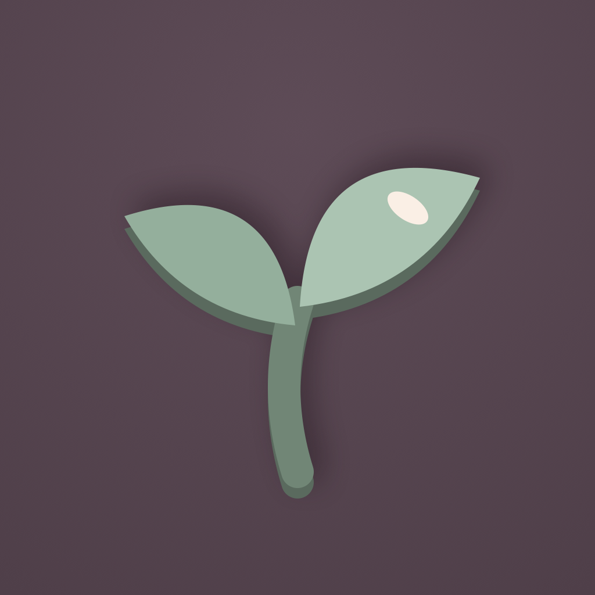
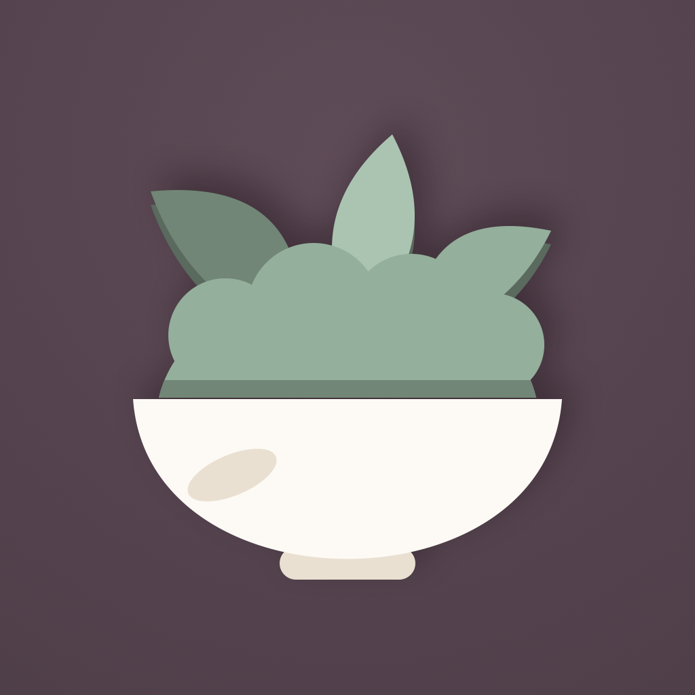
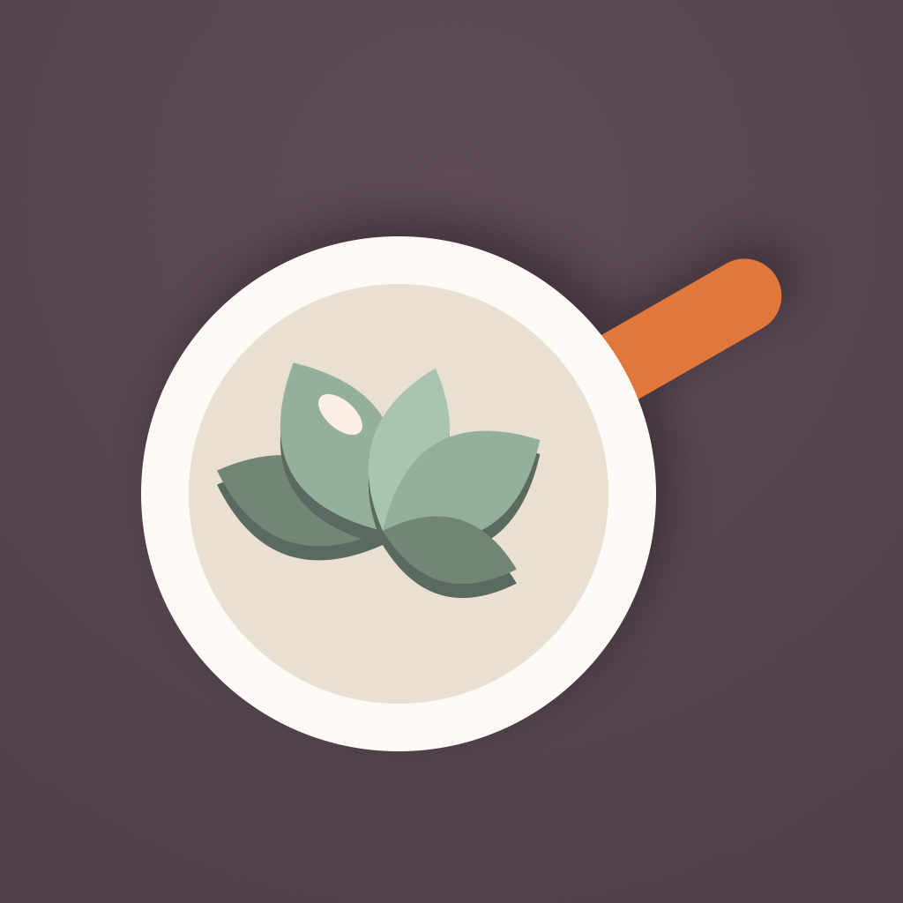
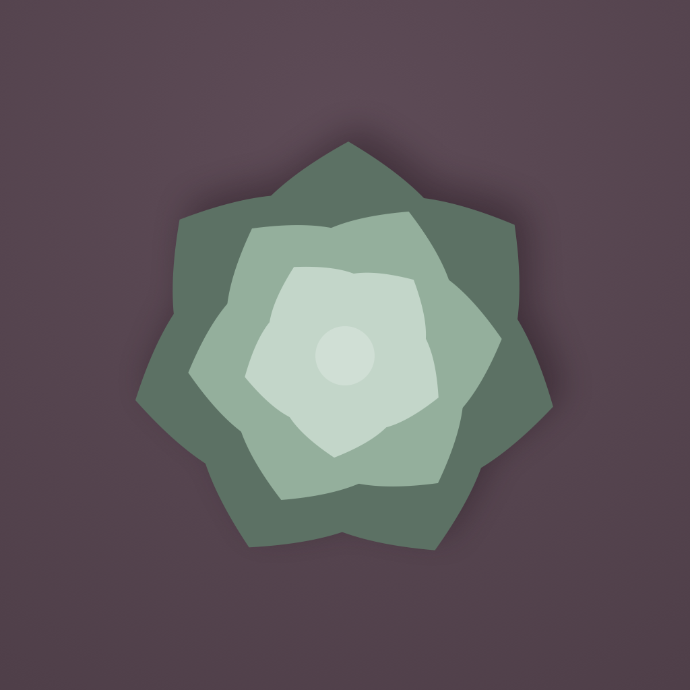
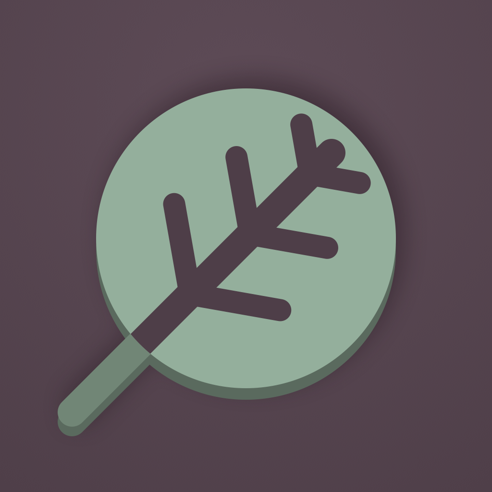
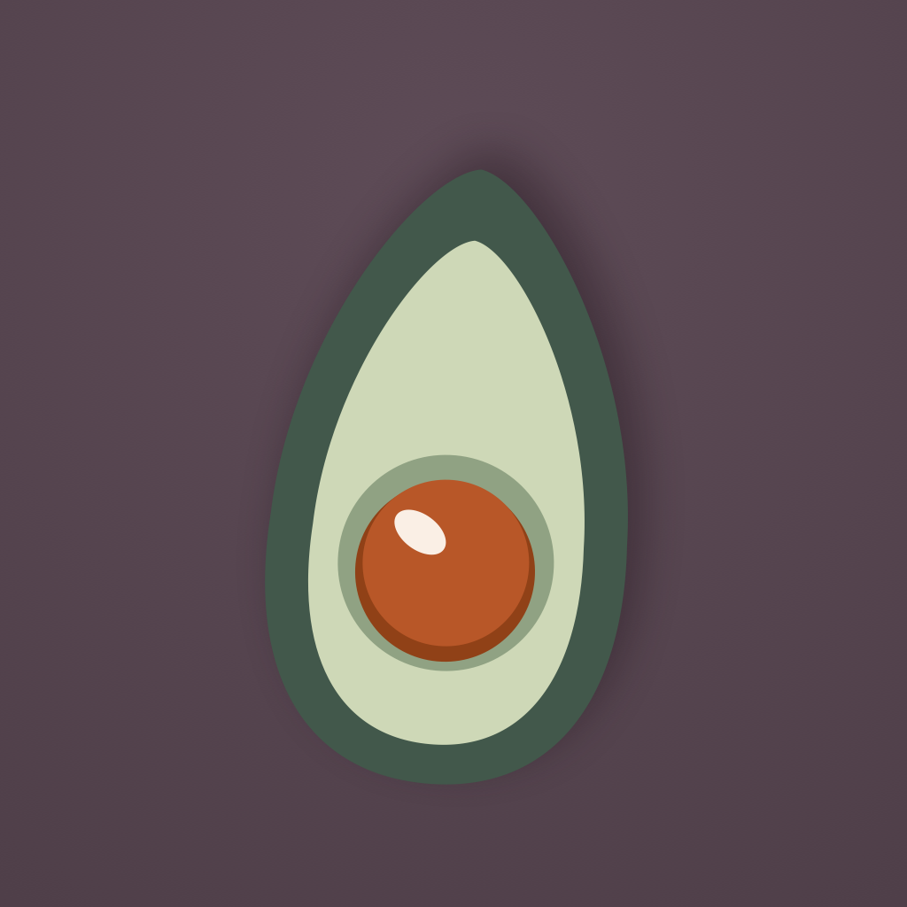

# Plant-based app icon — six candidates

Issue [#92](https://github.com/chetangoel01/overeasy/issues/92), decisions of
2026-09-07: the set is two icons, the default fried egg and **one plant-based
alternate with no egg in it**, and the artwork step is "generate candidates
first, then decide".

This document is the candidate-generation step. **Nothing here ships.** No
alternate appiconset is added, `Info.plist` is untouched, and
`UIApplication.setAlternateIconName` is still never called. What lands is a
drawing script, six renders, a contact sheet, and the measurements the
refinement step will need.

## What produced these

`Tools/app-icon/candidates.swift` — one CoreGraphics script, no dependency to
install, in the shape of `Tools/release/frame.swift`.

```
swift Tools/app-icon/candidates.swift [OUT_DIR]
```

It writes six 1024×1024 PNGs and the contact sheet into
`design/board/icon-candidates/`. Every mark is geometry — paths, fills and one
blur — not a picture. The direction that gets picked is refined by editing its
`draw…` function and re-running the script, which is the reason the candidates
were made this way rather than drawn: the chosen one goes through the same
pipeline into `Ladle/Resources/Assets.xcassets` instead of being redrawn
somewhere else and imported.

The rendering is done in a top-down 1024 square (y grows downward) so every
number in the file is directly comparable to the measurements below.

## The current icon, measured

`Ladle/Resources/Assets.xcassets/AppIcon.appiconset/AppIcon.png`, 1024×1024,
PNG colour type 2 — RGB with **no alpha channel**. `Contents.json` declares a
single `universal` / `ios` / `1024x1024` slot: one master, no per-size art, no
iOS 18 dark or tinted variants. The square is full-bleed; no corner rounding is
baked in, because iOS applies the home-screen mask itself.

| Element | Geometry | Fill |
| --- | --- | --- |
| Ground | Full bleed, radial lift centred about 22 % down from the top | `#4B3A45` at the lift → `#3D2F38` at the corners |
| Egg white | One organic blob, bounding box x 170–845, y 177–852 — 676 px, 66 % of the canvas | `#FCF9F2` |
| Blob shadow | Soft, offset down and to the right | blurred near-black |
| Yolk | Disc, diameter 323, centred (511.5, 492.5) — slightly above the blob's centre | `#D8622E` |
| Yolk contact | Disc, radius ≈ 174, pushed ≈ 8 px down | `#A8431F` |
| Highlight | One tilted pale ellipse at the yolk's upper left | `#F8EBDF` |

Three findings worth carrying forward.

**There is no stroke.** The dark ring around the yolk looks like an outline and
is not one: measured radially from the yolk's centre it is 5 px thick at the
top, 11 px at the sides and 19–21 px at the bottom. That is a second disc,
slightly larger and pushed down — a contact shadow. Nothing in the icon is
outlined, and the whole thing is five flat fills plus one blurred shadow. Every
candidate follows that rule: `contact()` for a shape resting on another shape,
`withDropShadow()` for the main mass against the ground, and no stroke anywhere.

**The icon predates DESIGN.md.** Its colours are not Porcelain & Graphite. The
ground is a plum-aubergine, but `Plum.colorset` in the asset catalog is
`#14181B` graphite; the yolk is `#D8622E`, but `Brick.colorset` is `#EE4B2F`;
the white is warm at `#FCF9F2`, where `Paper` is the cool `#F2F4F6`. This is a
real discrepancy and it is not fixed here. Two icons that sit next to each other
in a picker have to match **each other** first, so the candidates use the egg's
measured colours, and any decision to bring the app mark onto the design system
palette should move both icons at once, as its own change.

`design/board/ingredient-icon-directions.html` was read and not borrowed from.
It compares five *raster* art packs — sticker, pencil, watercolour, painted,
soft 3D — for the ingredient rows, and DESIGN.md makes that watercolour the sole
place illustration is allowed in this app. The app mark is flat vector and
belongs to a different vocabulary; the shared language between them is the
palette, not the rendering.

**Green comes from the catalog.** `Celery.colorset` (`#83A18A`) is the app's
only green and is what the candidates use, with `#5E7463` at 0.72× for the shade
— the same fill-to-shade ratio the yolk uses — and `#9CB9A3` for the lit face.
The contact colour is `#48584C`, 0.55×.

## The six

All are 1024×1024 in `design/board/icon-candidates/`.

### 1 · Sprout — `01-sprout.png`



Two cotyledons on a fat stem. The plainest available statement that this is the
same app with the egg taken out, and the one a cook will read correctly without
being told. Its weakness is the same thing: a sprout is the house style of every
wellness app there is, and it says "plant" without saying "Overeasy".

### 2 · Bowl — `02-bowl.png`



A porcelain bowl heaped with greens, three sprigs standing out of it at three
different heights. The only candidate built from the app's own design language
— the porcelain — rather than from an ingredient, and the only one besides the
skillet that keeps the egg's large warm-white mass, so the pair reads as a set
in the picker. Two symmetric sprigs made it read as a rabbit; the third,
off-centre one is what fixes that.

### 3 · Skillet — `03-skillet.png`



The pan the egg used to be cooked in, seen from above, with a heap of greens in
it and a brick handle. The most literal substitution of the six: same pan,
different contents, and the strongest continuity with the current icon because
it is the only candidate that keeps both the white mass *and* the orange. This
is the "whisk or pan" slot, and it is a pan: a whisk's wires are the one shape
in this vocabulary that cannot survive 1024 → 60. At that reduction a wire drawn
40 px wide is two pixels, and a whisk drawn fat enough to survive is no longer a
whisk.

### 4 · Lettuce — `04-lettuce.png`



A rosette of blunt overlapping lobes in three clearly separated tones. The most
purely vegetable of the six, and the one whose silhouette is most distinct from
the egg's. Its risk is legible in the render: a rosette wants to read as a
flower or a succulent, and the difference between "cabbage" and "rose" here is
about two shades of green.

### 5 · Roundel — `05-roundel.png`



The disc is the only geometric primitive in the current icon. This candidate
keeps it — same centre, scaled up to own the canvas — and turns it into a leaf
by cutting ground-coloured channels out of it: a midrib on the diagonal, three
pairs of veins, a stalk running out from under the disc. The most logo-like of
the six and the only one that would still work as a single-colour mark on a
website or a favicon. It is also the busiest; the vein count is three pairs
because five was texture rather than a leaf at 60 px.

### 6 · Avocado — `06-avocado.png`



The current icon's composition transposed exactly: one organic mass, one round
centre sitting slightly low, one tilted speck on it. Deliberately the closest of
the six to the egg, which is also the thing to check hardest. The first pass was
a plain teardrop with a rust-coloured centre and at 60 px it *was* a fried egg;
the pear neck, the thick dark rind band, the yellow-green flesh and the green
socket ring around the stone are all there to break that read, and the stone
keeps the yolk's own `#A8431F` because quoting the egg is the point of this one.

## Contact sheet

`design/board/icon-candidates/contact-sheet.png` — 1504 × 8196. Seven rows, the
shipping icon first, each shown at 1024, 180 and 60 px with the home-screen
corner mask applied.

The 180 and 60 cells are the 1024 master **resampled**, not redrawn small,
because resampling one master is exactly what iOS does with a single-size
appiconset — so the sheet is an honest legibility test rather than a flattering
one. All six survive the 17× reduction. Choices that came out of looking at it:
no bar narrower than about 40 units at 1024 (a whisk fails here), no more than
three tonal steps inside one mark, and no bright dot at the centre of a
symmetric mark, which at 60 px reads as an eye.

## What the implementation step will need

Verified in this checkout, not recalled:

- `Config/Ladle-Info.plist` has no `CFBundleIcons` key.
- `project.yml` sets no `ASSETCATALOG_COMPILER_ALTERNATE_APPICON_NAMES` and no
  `ASSETCATALOG_COMPILER_INCLUDE_ALL_APPICON_ASSETS`.

The asset-catalog route is the one to take, because this project generates its
Xcode project from `project.yml`:

1. Add a second set, e.g. `AppIconPlant.appiconset`, beside `AppIcon.appiconset`
   in `Ladle/Resources/Assets.xcassets`, with the same single 1024 universal
   slot and an alpha-free PNG.
2. In the `Ladle` target's settings in `project.yml`, set
   `ASSETCATALOG_COMPILER_ALTERNATE_APPICON_NAMES: AppIconPlant` and
   `ASSETCATALOG_COMPILER_INCLUDE_ALL_APPICON_ASSETS: YES`, then re-run
   `xcodegen generate`. The asset compiler synthesises `CFBundleIcons` and
   `CFBundleAlternateIcons` into the built Info.plist — the hand-written
   `Config/Ladle-Info.plist` does not get the keys and should not.
3. Runtime, from the main actor: `UIApplication.shared.setAlternateIconName("AppIconPlant")`,
   and `nil` to go back to the egg. `alternateIconName` is the current
   selection, and `supportsAlternateIcons` gates whether the picker appears at
   all. iOS shows its own confirmation alert on every change; that is why the
   diet-linked offer in #92 is an offer and never automatic.
4. The older route — keys written by hand into the plist and PNGs at the bundle
   root — is only for targets without an asset catalog. Not this one.

Two notes. The picker lives beside Appearance in
`Ladle/Account/AccountSheet.swift`, per the issue's decisions, and is
independent of the diet offer. And the iOS 18+ dark, tinted and clear icon
appearances are out of scope for both icons: the shipping set has only the one
universal slot, and the alternate should match it until the two are done
together.

## Verification

- `swift Tools/app-icon/candidates.swift` renders all seven artefacts clean.
- Every candidate was read at 1024 and at 60 px, and four were reworked on what
  that showed: the bowl's sprigs (two symmetric ones read as ears), the
  roundel's veins (reached the rim and notched the silhouette — now bounded by a
  ray/circle intersection so they cannot), the avocado's whole outline (read as
  an egg), and the lettuce's tones. The lettuce is the clearest case that the
  60 px check earns its place: at 1024 its three rings were legible one shade
  apart, and at 60 the whole head collapsed into a single green polygon.
- Output is `CGImageAlphaInfo.noneSkipLast`, so the PNGs carry no alpha channel,
  which is what both the asset catalog and App Store Connect want.
- No app or test target changed, so there is nothing to run beyond the script.
