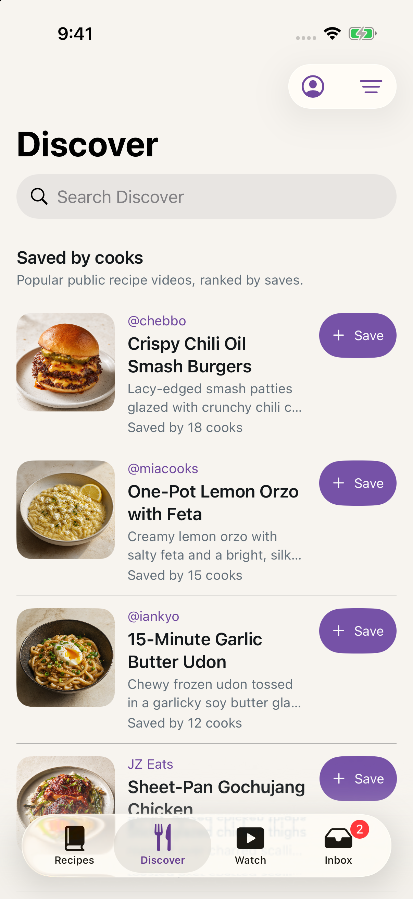
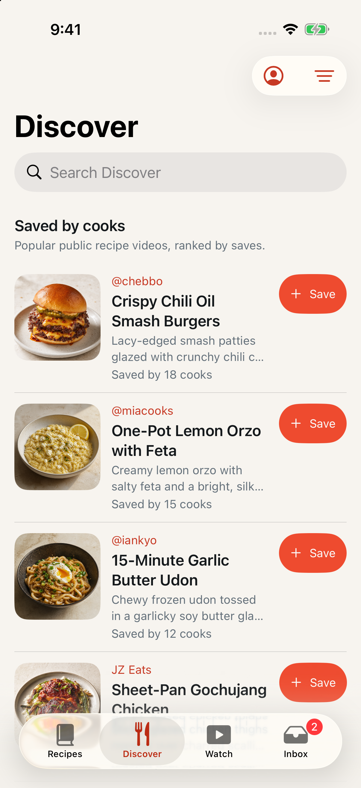

# The accent reaches the whole app

Date: September 1, 2026
Issue: [#30](https://github.com/chetangoel01/recipe-app/issues/30)
Status: **built and verified on device-class simulator.**

## What was wrong

`LadleTheme.Intent.accent`, `Label.accent`, `brick` and `accentText` were static
computed properties that read `UserDefaults` at body-evaluation time. SwiftUI
has no dependency on `UserDefaults`, so changing the accent invalidated
nothing. A view picked up the new colour only when it re-rendered for some
unrelated reason — which is exactly what "click in and out" did.

There were **68 such reads across 26 files**, plus a worse one:
`LibraryView`'s own `.tint(LadleTheme.Intent.accent)` was a static read that
*overrode* the correctly reactive `.tint` the app root applies from
`@AppStorage`. The one part of the system that was wired properly was shadowed
by a stale value for the entire library.

## The fix

The accent is now an environment value carrying the chosen
`LadleAccentColor`, published once at the root from the same `@AppStorage` the
root already observed:

```swift
content
    .environment(\.ladleAccent, resolvedAccent)
    .tint(resolvedAccent.label)
```

The four statics are **deleted**, not deprecated. That was the point of doing
it this way: after the deletion, every stale read was a compile error, so the
compiler produced the worklist rather than a grep. Call sites read
`@Environment(\.ladleAccent) private var accent` and use `accent.intent` or
`accent.label`, which preserve the Intent-versus-Label vocabulary the theme
file's semantic layer is built around.

### Two types could not read the environment

`LadleButtonRole` and `LadleIconButtonTone` are enums, not views, so they sit
outside the view graph. Their accent-bearing members became functions taking
the accent — `fill(_:)`, `label(_:)`, `background(_:)` — and the views that
draw them pass their own environment value. This is also what made them
testable: see below.

### A visible change that is deliberate

The root tints with the **`label`** role (`#C73924` for Tomato); the deleted
`LibraryView` tint used **`intent`** (`#EE4B2F`). Removing the shadow therefore
changes the library's control tint from the brighter fill-weight accent to the
darker contrast-safe one.

That is the correct direction and not an accident. A tint lands on bar buttons
and tab labels at small sizes, and `accentText`'s whole reason for existing is
that it "must still pass small-text contrast" where the fill-weight accent does
not. The library now matches every other screen rather than being the exception.

## Evidence

Reproducing the exact sequence from the triage document — open Settings over
Discover, choose a different accent, close, **do not switch tabs**:

| | |
|---|---|
|  |  |
| Discover in Purple | The same screen, immediately after choosing Tomato and closing |

Same scroll position, no tab switch. Creator handles, Save button fills,
toolbar icons and the tab bar all follow. Previously this pair was *identical* —
that was the bug.

## Tests

`LadleTests`: **362 executed, 1 skipped, 0 failures.**

Three test changes, and the second and third are the ones that matter:

- `testButtonRolesCarryDistinctFillAndLabelIntent` — updated for the new
  function signatures.
- `testAccentBearingRolesFollowTheChosenAccent` — **new.** Asserts that a
  primary fill, a tertiary label and an icon-button fill each differ between
  Tomato and every other accent, and that the neutral roles do not. This is the
  property the old implementation looked like it had and did not; taking the
  accent as an argument is what makes it assertable at all.
- `testAccentIsReadFromStorageOnlyWhereItIsPublishedOrChosen` — **new.** Scans
  production sources and asserts only `LadleApp.swift` (which publishes it) and
  `AccountSheet.swift` (which writes it) resolve the accent from storage. A
  third reader would reintroduce the bug, and this fails if one appears.

`testControlTintsUseIntentAndDecorativeBulletsStayNeutral` needed its scanned
string patterns updated to the new vocabulary; its intent is unchanged.

## What was not done

The issue proposed strengthening the UI test at
`DiscoverInteractionUITests.swift:96` to "assert the accent outside the sheet".
**XCUITest cannot assert a colour**, so that test can only ever check that a
swatch reports "Selected" — which is what it already did, and why the bug
survived it. Rather than write an assertion that looks like proof and is not,
the guarantee lives in the two unit tests above, and the visual claim rests on
the before/after captures.

## Files

29 changed. The substance is in four:

| File | Change |
|------|--------|
| `Ladle/Design/LadleTheme.swift` | `ladleAccent` environment key; `intent`/`label` roles on `LadleAccentColor`; four statics and the `UserDefaults` read deleted |
| `Ladle/App/LadleApp.swift` | publishes the accent beside the existing `.tint` |
| `Ladle/Library/LibraryView.swift` | the shadowing `.tint` deleted |
| `Ladle/Design/LadleComponents.swift` | two enums take the accent instead of reading it |

The other 25 are the mechanical sweep: an `@Environment` property and
`accent.intent` / `accent.label` at each call site.

## How this was verified

Debug build on the "Overeast UI validation" simulator (iPhone 17, iOS 26.5),
`-ui-testing -onboarding-complete -demo-scenario standard`, driven by scripted
taps. Captures are full-resolution PNGs written by `simctl io screenshot`.
