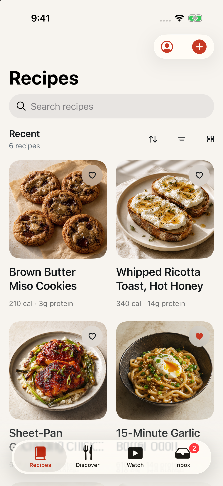

# A launch lands on Discover

Date: September 1, 2026
Issue: [#27](https://github.com/chetangoel01/recipe-app/issues/27)
Status: **built and verified on the review simulator.**

## What was wrong

`LibraryNavigationState.tab` defaulted to `.recipes`, so opening Overeasy put
a cook in front of their own shelf. That is the screen you want when you came
to fetch something, and the wrong one for the app the product is trying to
be — the owner's decision on the issue was *"discover always first tbh… makes
our app feel more like a place to land on and spend time in rather than come
and go."*

## The fix

`LibraryNavigationState.tab` and its `init` default to `.discover`. Three
things deliberately still go to Recipes, because each of them ends in the
cook's own library rather than starting a session:

- `select(_:)` — an explicit tab choice, including `openCollection`.
- `reviewDidComplete(hasActionableImports:)` — finishing a review returns to
  the Inbox if more work waits, otherwise to Recipes.
- `openNotificationRecipeIfNeeded()` — a notification names one saved recipe.

### The cold-launch failure path

Recipes is local and renders with no network. Discover is a server feed, so
Discover-first means **the first thing a cold launch does is a network
request**. On a plane or against a dead backend that request fails, and the
first screen would be an error — the exact opposite of "a place to spend
time". Per the owner's call on the issue, a failed first feed opens Recipes
instead, silently.

`DiscoverView` owns its `DiscoverViewModel` as `@State`, so `LibraryView`
cannot watch the feed. It gains one outbound report,
`onInitialLoadFailed: () -> Void`, fired from `.onChange(of: viewModel.state)`
by `reportInitialLoad(_:)`. `DiscoverLaunchFallback` — a small value type
beside `LibraryNavigationState` — decides whether to act on it:

1. **Once per process.** `didFallBack` is consumed by `claim(for:)`. Every
   later failure shows `failedContent`, which already offers Try again and
   says the saved library is still available.
2. **Only while the cook has not moved.** `claim(for:)` requires
   `navigation.tab == .discover` and `navigation.path.isEmpty`, and
   `didSelectTab` — set by `tabDidChange(from:to:)` off the existing
   `.onChange(of: navigation.tab)` — blocks the bounce once a tab has been
   chosen. Without that, a cook who tapped away from a slow Discover and then
   tapped back would be thrown out of the tab they just asked for.
3. **Only on failure, never on latency.** `.loading` is not a trigger; a slow
   feed keeps the skeleton `loadingContent` draws. An empty page is not a
   trigger either: `discover-empty` is a valid landing state that
   `testDiscoverEmptyScenario` asserts.
4. **Silently.** The bounce moves `navigation.tab`, which drives
   `.sensoryFeedback(.selection, trigger:)`. That now takes a condition,
   `isChosenTab`, which skips `isFallbackChange(from:to:)` — so a failed
   launch does not click like a tap.

`isFallbackChange` is deliberately shared by the haptic condition and the
`onChange` handler, so the two cannot disagree about which change was the
bounce regardless of the order SwiftUI runs them in.

### Why the report does not look at the previous state

The brief described the trigger as the `loading → failed` transition.
`reportInitialLoad(_:)` matches on `.failed` alone instead, for two reasons.

`DiscoverViewModel.load()` only ever writes `state = .failed` in the branch
where `cachedRecipes == nil`; a refresh that fails with rows on screen keeps
`.loaded` and moves `refreshState` instead. So `.failed` *is* "the first page
failed with nothing to show", by construction — the previous state adds
nothing.

And `DemoDiscoverService` throws synchronously for `discover-rate-limited`.
Whether SwiftUI ever observes the intervening `.loading` depends on whether
that `await` actually suspends, which is not something to build a launch
behaviour on. A `initialLoadSettled` flag keeps the report to the first load
either way: the first `.loaded` closes it just as a `.failed` does, so a
later failed search cannot be mistaken for a failed launch.

## Evidence

Cold launch, `-ui-testing -onboarding-complete`:

| | |
|---|---|
|  |  |
| The library opened on Recipes | The launch lands on Discover |

Cold launch with a failing feed, `-demo-scenario discover-rate-limited`:

| |
|---|
|  |
| No tap, no error screen: the app opens Recipes. Tapping Discover from here still shows its own "Too many requests" state |

## Tests

Red first — the renamed expectation went in before the default changed:

```
xcodebuild test -project Ladle.xcodeproj -scheme LadleAllTests \
  -destination 'platform=iOS Simulator,name=iPhone 17' \
  -only-testing:LadleTests/LibraryNavigationStateTests
Executed 12 tests, with 1 failure (0 unexpected) in 0.330 seconds
LibraryNavigationStateTests.swift:10: XCTAssertEqual failed: ("recipes") is not equal to ("discover")
```

Green, full unit suite:

```
xcodebuild test -project Ladle.xcodeproj -scheme LadleAllTests \
  -destination 'platform=iOS Simulator,name=iPhone 17' -only-testing:LadleTests
Executed 368 tests, with 1 test skipped and 0 failures (0 unexpected) in 3.724 seconds
```

Six of those are new, and they are the fallback rules rather than the view
that applies them: `DiscoverLaunchFallback` is a value type precisely so the
rules can be asserted without a running app.

The whole UI target, because roughly a dozen of its tests changed:

```
xcodebuild test -project Ladle.xcodeproj -scheme LadleAllTests \
  -destination 'platform=iOS Simulator,name=iPhone 17' -only-testing:LadleUITests
Executed 24 tests, with 0 failures (0 unexpected) in 313.030 seconds
```

### The UI tests that assumed Recipes

Both suites' launch helpers take `startingOn:` and tap that tab after launch,
waiting for the tab bar first — it does not exist during the pre-tabs load
state, and a bare `tap()` across a dozen tests in one run is where that turns
flaky. Twelve tests take it. Tests that already tap their own tab
(`testDiscoverEmptyScenario`, `testInboxEmptyStateStartsAnImport`,
`testPrimaryJourneyCapturesInboxDetailAndCooking`, the Watch tests) keep
doing that, as does `testInitialStoreFailureScenario`, which renders before
any tab bar exists.

Two of them would have passed on Discover for the wrong reason and now start
on Recipes anyway: `testOfflineContentScenarioPreservesRecipes` asserts a
recipe title that is also a Discover row, and
`testAuthenticationExpiredScenario` asserts banners that `tabStack` renders on
every tab.

`testDiscoverFailureOnLaunchFallsBackToRecipes` asserts the Recipes tab
becomes *selected* with no tap, not merely that `library.all-recipes` exists,
so it cannot pass on a hierarchy that happens to contain both tabs. It then
asserts Discover's failure copy rather than the `discover.initial-failure`
identifier: that identifier sits on a `ContentUnavailableView`, whose
identifier XCUITest does not surface as a queryable element — the same reason
`testDiscoverRateLimitedScenario` already asserts on "Too many requests".

### A test that was already red, repaired here

`testDiscoverRecipeSupportsTapAndLongPress` fails on this branch's base,
`8900bcb`, at lines 20, 21 and 23 — `Executed 1 test, with 3 failures (0
unexpected)`. Two pre-existing faults are stacked in it:

- Its row query matched `identifier BEGINSWITH 'discover.'`, and `firstMatch`
  resolved to the `discover.sort` toolbar button, not a row — so the long
  press never opened a context menu. It now matches `discover.http`, which
  only a row's identifier begins with, since a row is
  `discover.<original URL>`. Discover-first does not cause this, but it does
  make it permanent: `discover.sort` precedes the rows either way.
- Past that, it asserted a "Discover preview" badge that `46dd921` removed
  from `RecipeDetailView` on August 31, leaving the assertion orphaned. It now
  asserts what actually distinguishes the pushed Discover detail: the account
  control is present and the options menu — which only `allowsLibraryEdits`
  adds — is not.

Repaired rather than documented-and-left, because a UI suite that is red
before the change cannot be evidence that the change kept it green. Verified
alone afterwards: `Executed 1 test, with 0 failures (0 unexpected)`.

## Files

| File | Change |
|------|--------|
| `Ladle/Library/LibraryView.swift` | `.discover` default on `tab` and `init`; new `DiscoverLaunchFallback`; `discoverFallback` state; `tabDidChange` off the tab `onChange`; `isChosenTab` gating the selection haptic; `fallBackToRecipesIfNeeded` wired to `DiscoverView` |
| `Ladle/Library/DiscoverView.swift` | `onInitialLoadFailed` closure, `initialLoadSettled` state, `reportInitialLoad(_:)` |
| `LadleTests/LibraryNavigationStateTests.swift` | `testLibraryStartsOnDiscoverTab`; six `DiscoverLaunchFallback` tests; `testSelectingDiscoverDoesNotPushNavigation` now names `.recipes` explicitly so it still tests a switch |
| `LadleUITests/StateScenarioUITests.swift` | `launchApp(startingOn:)`; eight tests start on Recipes; `testLaunchLandsOnDiscover` and `testDiscoverFailureOnLaunchFallsBackToRecipes` |
| `LadleUITests/DiscoverInteractionUITests.swift` | `launchApp(startingOn:)`; four tests start on Recipes; `testDiscoverRecipeSupportsTapAndLongPress` repaired (see above) |
| `DESIGN.md` | "Navigation and library" — Discover is the default tab, with the failure fallback stated in the same sentence |

No file was added or removed, so `xcodegen generate` was not needed and
`Ladle.xcodeproj` is untouched. No wire change, so no contract fixtures moved.

## Known consequences

**The first screen has no import affordance.** #25 put the plus on Recipes and
Inbox only, so a cook who opens the app to paste a link lands on Discover and
switches tabs. That is recorded on the issue as a deliberate consequence, not
an oversight: Discover has per-row Save, and importing is a deliberate act you
go looking for.

**A cold launch now makes a Discover request.** `GET /v1/recipes/discover`
joins the sync poll on every launch. Both share the `sync:user` bucket at
120/min (`Backend/ladle/config.py`), so this has headroom even once #29 adds
its shelf requests.

## How this was verified

Debug builds of the `Ladle` scheme on the "Overeast UI validation" simulator
(iPhone 17, iOS 26.5, `614AF85D-84AF-4371-BF70-5D5DA2BBA683`), installed with
`simctl install` and launched with `simctl launch … -ui-testing
-onboarding-complete`, terminating the app first so each launch is genuinely
cold. The "before" capture came from a build of
`origin/feat/inbox-add-recipe`, this branch's base. Status bar frozen with
`simctl status_bar override --time "9:41" --wifiBars 3 --batteryState charged
--batteryLevel 100` for every capture and cleared afterwards; PNGs written by
`simctl io screenshot`.

`testDiscoverRecipeSupportsTapAndLongPress` was also run alone against a
detached checkout of `origin/feat/inbox-add-recipe` to establish that it was
already failing before this branch.

`xcodebuild test` prints its results and then never exits, so every run above
was taken under a watchdog and read from the log's `Executed N tests` line.

## Related

- #25 (`feat/inbox-add-recipe`) is this branch's base; the Inbox plus is what
  keeps importing reachable from the tab bar now that the landing screen has
  no plus of its own.
- #29's Discover shelves are what make the landing screen worth landing on,
  and should follow soon after this.
