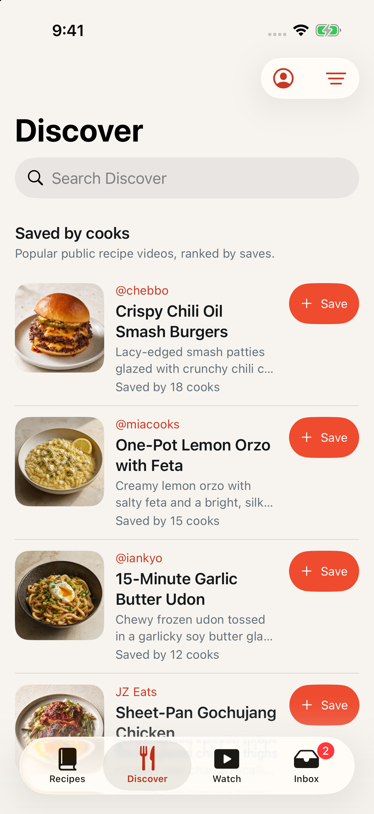
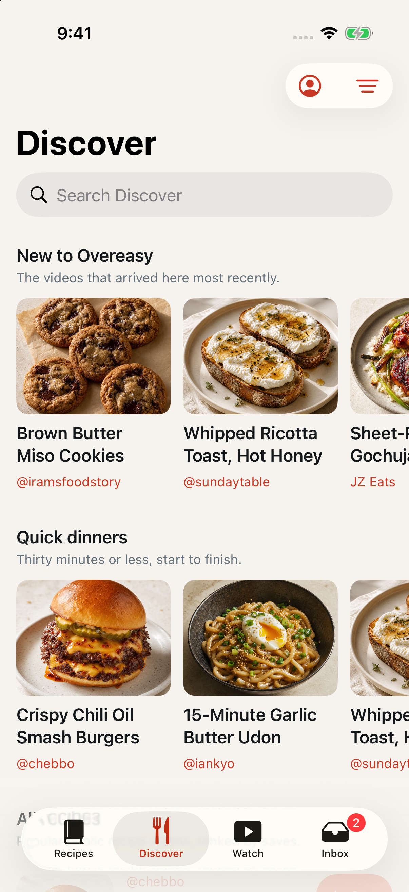
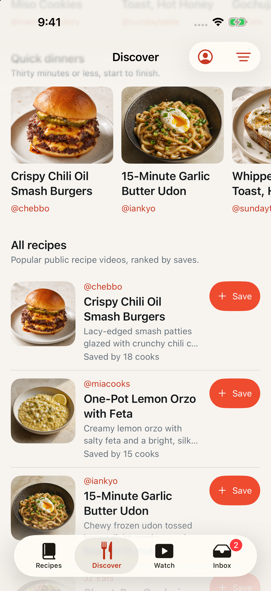
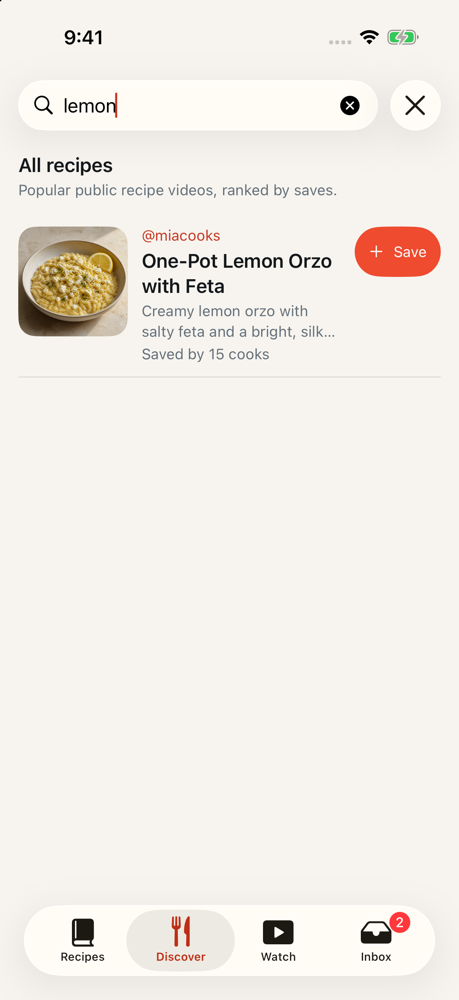

# Two shelves above the Discover list

Date: September 1, 2026
Issue: [#29](https://github.com/chetangoel01/recipe-app/issues/29)
Status: **built and verified on the review simulator and the local stack.**

## What was wrong

Since #27 Discover is the launch screen, so the first thing a cook sees on
every open is a flat list ordered by aggregate saves. That list only turns
over when somebody saves something, which is not a schedule — a cook who
opens the app twice in a day sees the same five rows twice. The owner's
decision on the issue, taken against three prototypes at forty rows each,
was shelves:

> "Yes, I like shelves. I think that's probably the most intuitive way of
> doing it."

Two shelves, not three. No "See all". No Featured while nobody is curating
one. The ranked list stays underneath.

## The shelves

**New to Overeasy** — ordered by `SourceVideo.created_at`, which is when the
source arrived *here*, not when its creator published it. The plan originally
said `published_at`; that column is nullable and absent for Instagram, so the
flagship shelf would have silently excluded an entire platform. `created_at`
is `nullable=False` with a server default, so it is populated on every row on
every platform — and it means the more useful thing anyway: "this is new to
you", not "the creator posted this recently".

**Quick dinners** — the popular ranking filtered to a total time of thirty
minutes or less. `Recipe.total_minutes` is the saver's own column, so the
filter takes the *minimum* across the savers of one source: one saver's padded
edit must not hide a source the rest call quick. A source nobody timed
aggregates to `NULL`, fails the comparison, and is left out. An unknown total
is not a fast one.

## No new DTO on the wire

Both shelves are the existing feed under a different order or filter, so they
are expressed that way rather than as a `section` parameter and a grouped
page. Nothing about `DiscoverPageDTO` changed, which is why every golden
fixture, `Backend/tests/contracts/`, `RemoteContractTests` and
`Contracts/Fixtures/*.json` are untouched by this branch.

| Shelf | Request |
|---|---|
| New to Overeasy | `GET /v1/recipes/discover?sort=newest&limit=10` |
| Quick dinners | `GET /v1/recipes/discover?sort=popular&max_total_minutes=30&limit=10` |

Two additions, both to things that already existed:

- `DiscoverSort.NEWEST = "newest"`, ordered by
  `func.max(SourceVideo.created_at).desc(), Recipe.source_video_id`.
  `SourceVideo` is already joined for `like_count`, so the ordering costs no
  new join; the timestamp is ordered by but not selected, so the row unpack
  below is unchanged. The source id breaks the ties a bulk import creates,
  without which an offset cursor skips and repeats rows. A cook gets "Newest"
  in Discover's own sort menu for free.
- `max_total_minutes`, a `Query(ge=1, le=MAX_RECIPE_MINUTES)` on the route,
  applied as `HAVING func.min(Recipe.total_minutes) <= n` on the grouped
  query.

No migration, and `expected_revision` in `health.py` is untouched.

`ordering` in `discover()` now carries an explicit
`list[SQLColumnExpression[Any]]` annotation. Without it mypy infers the list's
element type from whichever branch comes first and rejects the others; that
was already four errors on `main`, and a fifth branch would have added a
fifth. The annotation removes all four rather than adding one.

## The rails

`DiscoverViewModel` gains `shelves`, loaded inside `load()` beside page 1:

```swift
async let loadedShelves = fetchShelves()
let pageResult: Result<DiscoverPage, any Error> = ...
let shelves = await loadedShelves
```

The page result is captured into a `Result` rather than handled inside a
`do`/`catch` so that both halves are always awaited. That is the whole point
of the shape: **a shelf failure never reaches the feed, and a feed failure
never costs the reader the rails.** `fetchShelf` returns an optional and
swallows its error — a rail is decoration on top of the feed, so there is no
banner, no retry and nothing for the reader to act on. `loadMore` is
untouched; a rail has no cursor because there is no "See all" to page toward.

`visibleShelves` is what the screen draws, and applies two rules the raw
`shelves` does not:

- **Hidden entirely under a search.** Search replaces the feed, and a rail of
  unsearched cards beside the results would read as results. `fetchShelves`
  also declines to fetch while searching, so a debounced keystroke does not
  spend two requests on rails nothing will draw.
- **A rail with fewer than three cards is dropped.** Below that it reads as an
  accident rather than a shelf, and the full-width list underneath already
  carries the same rows. This is also what makes a save from a rail's context
  menu tidy: the card leaves the rail with the row, and a rail that falls
  under three disappears rather than sitting there half-empty.

`loadsShelves` defaults to `true` so every existing construction keeps
working. **`WatchView` passes `false`**: it builds its own `DiscoverViewModel`
for the same feed, is a full-screen video pager with nowhere to draw a rail,
and would otherwise spend two requests per launch on something nothing reads.

### The card

`DiscoverShelfCard` is 152 points wide with a 114-point thumbnail clipped to
`Corner.thumbnail`, a two-line `.bodyStrong` title with `reservesSpace` so
cards in a rail line up, and a one-line `.metadata` creator in the accent.
Those two sizes are points from the prototype; `LadleTheme` has no card-size
token and one component is not enough to justify naming a step, so they live
on the card as `@ScaledMetric` — scaled, so a large-type reader gets a bigger
card rather than four lines squeezed into two.

The rail is a horizontal `ScrollView` with `.scrollTargetBehavior(.viewAligned)`
and `.scrollClipDisabled()`. It is drawn inside the list's own horizontal
margin, so the cards are padded back out to `Layout.screenMargin` and the
scroll view is widened past it by the same amount — that is what lets the
next card bleed off the screen edge instead of stopping flush with the title.

Three deliberate omissions:

- **No Save on the card.** The list below carries it, and a 44-point capsule
  on a 152-point card would be the loudest thing in the rail. Saving from a
  rail happens through the long-press menu, which is the same menu the rows
  use — factored into one `discoverContextMenu` modifier precisely so a long
  press cannot come to mean two things on one screen.
- **No "See all".** A per-shelf destination is a new screen with its own
  paging and empty states. Ship the rails, see whether anyone wants past the
  end of one.
- **No Featured hero.** It composes fine above the shelves whenever there is
  someone curating it.

The card is one accessibility element with a composed label rather than three
static texts. That is right for VoiceOver — a card is one stop — and it also
keeps the recipe titles from appearing three times over in the hierarchy,
which is what would otherwise make
`testDiscoverRecipeSupportsTapAndLongPress`'s title query ambiguous.

### The demo service

`DemoDiscoverService` serves both rails, so the demo scenarios and the UI
tests exercise them rather than an empty screen. It filters `PreviewFixtures`
by `totalMinutes` before mapping — enumerated first, so a fixture's save and
like counts stay put whatever the filter removes — and orders `newest` by
reverse fixture index, which is the reverse of the save ranking, so the rail
is visibly not the list below it.

Three of the six fixtures come in at thirty minutes or less (25, 15, 10), so
"Quick dinners" lands exactly on the three-card minimum. That is deliberate
and worth knowing: adding a fixture over thirty minutes does nothing, and
raising a quick fixture's time above thirty would take the rail out of the
demo entirely.

## Evidence

Landing screen, `-ui-testing -onboarding-complete -demo-scenario large-library`:

| | |
|---|---|
|  |  |
| One ranked list under "Saved by cooks" | Two rails, then the list |

| | |
|---|---|
|  |  |
| The rails scroll away above "All recipes", which keeps the sort caption | A search hides both rails outright |

`before-discover-standard.png` and `after-discover-standard.png` are the same
pair under the standard scenario.

## Tests

### Backend

Red first. `sort=newest` was a 422 and `max_total_minutes` was silently
ignored, so neither assertion could pass vacuously:

```
uv run pytest tests/api/test_discover_paging.py -q -k "newest or max_total_minutes"
2 failed, 2 deselected in 7.15s
E       KeyError: 'items'                      # sort=newest rejected as an invalid enum
E       AssertionError: assert ['Lemon Orzo'...mash Burgers'] == ['Lemon Orzo'... Butter Udon']
```

`_seed` now sets `SourceVideo.created_at` per title — deliberately in an order
that is neither the save ranking, the like ranking nor A-to-Z, so a `newest`
assertion cannot pass by agreeing with an order the feed already had — and
gives three sources a `total_minutes`, with each later saver of a source a
slower copy than the last, so the time filter is exercised against the
minimum rather than any one saver's edit.

Green:

```
uv run pytest tests/api/test_discover_paging.py tests/unit -q
665 passed in 10.48s

uv run pytest tests/contracts tests/api -q
77 passed in 15.02s
```

Gates, compared against this branch's base:

| | Base `01f48ac` | This branch |
|---|---|---|
| `uv run ruff format --check .` | 1 file (`0019_*.py`) | 1 file (`0019_*.py`) |
| `uv run ruff check .` | 2 errors (`0020_*.py`, `0021_*.py`) | 2 errors (same) |
| `uv run mypy --strict ladle` | 9 errors in 3 files | 5 errors in 2 files |

All three are red on `main` for pre-existing reasons and were left that way.
The four mypy errors that went away are the `ordering` list in `discover()`,
removed by the annotation this change needed anyway.

### Client

Red first, by disabling `fetchShelves` with the new tests already in place:

```
xcodebuild test -project Ladle.xcodeproj -scheme LadleAllTests \
  -destination 'platform=iOS Simulator,name=iPhone 17' \
  -only-testing:LadleTests/DiscoverViewModelTests
Executed 25 tests, with 9 failures (0 unexpected) in 0.172 seconds
```

Five of the seven new tests fail without the behaviour; the two that still
pass are the ones that assert an *absence* (`loadsShelves: false`, and a
failed shelf leaving the feed alone), which is correct.

Green, the whole unit suite:

```
xcodebuild test -project Ladle.xcodeproj -scheme LadleAllTests \
  -destination 'platform=iOS Simulator,name=iPhone 17' -only-testing:LadleTests
Executed 390 tests, with 1 test skipped and 0 failures (0 unexpected) in 3.502 seconds
```

`DiscoverTestService` records shelf fetches in their own `shelfRequests` array
and never takes the feed's pause continuation or its paging overrides. Both
matter: without the split every existing assertion about the feed's cursor
walk would have picked up two shelf requests, and one shared
`CheckedContinuation` cannot serve three concurrent calls.

The whole UI target, because the rails changed what sits at the top of the
landing screen:

```
xcodebuild test -project Ladle.xcodeproj -scheme LadleAllTests \
  -destination 'platform=iOS Simulator,name=iPhone 17' -only-testing:LadleUITests
Executed 24 tests, with 0 failures (0 unexpected) in 320.884 seconds
```

No UI test needed changing. `testDiscoverRecipeSupportsTapAndLongPress` was
the one at risk — the rails push the first list row down, and a rail card
carries the same title as a row — and was run alone first to confirm it:
`Executed 1 test, with 0 failures (0 unexpected) in 16.922 seconds`.

### End to end

`docker compose up -d --build api worker` from this branch's `Backend/`,
against the local Compose Postgres, then both shelf queries with a guest
token. The local corpus has no public unsaved sources, so both return an
empty page — which is still the point: `sort=newest` is accepted rather than
rejected as an invalid enum, `max_total_minutes` is accepted rather than
ignored, and both return `DiscoverPageDTO` and not a new shape.

## Files

| File | Change |
|------|--------|
| `Backend/ladle/contracts/recipes.py` | `DiscoverSort.NEWEST` |
| `Backend/ladle/recipes/repository.py` | `discover()` takes `max_total_minutes`; newest ordering; `HAVING` on the grouped query; `ordering` annotated |
| `Backend/ladle/recipes/service.py` | threads `max_total_minutes` |
| `Backend/ladle/api/routes/recipes.py` | `max_total_minutes` query parameter |
| `Backend/ladle/api/openapi.py` | `_OPERATION_DESCRIPTIONS` — the two shelf queries on `GET /discover`, outside the numbered pipeline so it does not renumber |
| `Backend/docs/integration-reference.md` | route inventory row and the shelf section |
| `Backend/tests/api/test_discover_paging.py` | `created_at` and `total_minutes` in `_seed`; one test per shelf |
| `Ladle/Remote/DiscoverService.swift` | `.newest`; `DiscoverShelf`; `DiscoverPaging.shelfSize`; `fetchDiscoverPage` gains `maxTotalMinutes` and `limit` with defaults on a protocol extension; demo service serves both rails |
| `Ladle/Library/DiscoverView.swift` | `shelves`, `visibleShelves`, `isSearching`, `loadsShelves`, `fetchShelves`; rails above an "All recipes" header; `DiscoverShelfView`, `DiscoverShelfCard`, `discoverContextMenu` |
| `Ladle/Library/WatchView.swift` | `loadsShelves: false` |
| `LadleTests/DiscoverViewModelTests.swift` | seven shelf tests; `DiscoverTestService` on the new protocol shape |
| `DESIGN.md` | "Discover and account" — the two shelves and the hide-under-search rule |

No file was added or removed, so `xcodegen generate` was not needed and
`Ladle.xcodeproj` is untouched. No wire model changed, so no contract fixture
moved.

## Known consequences

**A launch now makes three Discover requests, not one.** Page 1 plus two
shelves, concurrently. All three land in the `sync:user` bucket at 120/min
(`Backend/ladle/config.py`), so there is still ample headroom, but it is
three times what #27 costed when it made Discover the landing screen. Watch's
own view model is exempt for exactly this reason.

**"Quick dinners" depends on savers filling in a total time.** The column is
nullable and a source nobody timed never appears. On a young corpus the rail
can therefore be short or absent, which is why fewer than three cards hides
it rather than drawing a two-card shelf.

**A source can appear in both rails and in the list.** Nothing deduplicates
across them, and nothing should: a rail is an entry point, not an inventory.

## Related

- #27 made Discover the landing screen, which is what raises a shelf from
  nice-to-have to the thing that makes the screen worth landing on.
- #26 also touches `discover()`; this landed first so the two changes to the
  same query do not collide.
