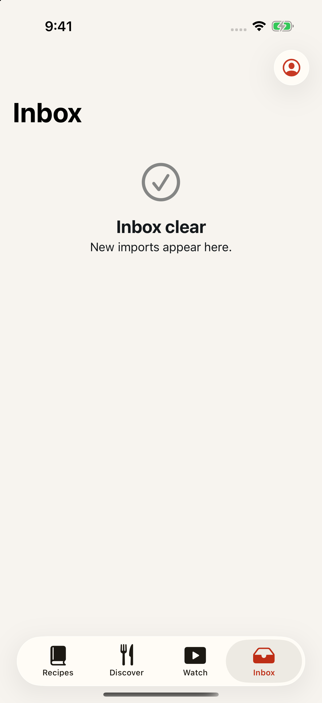
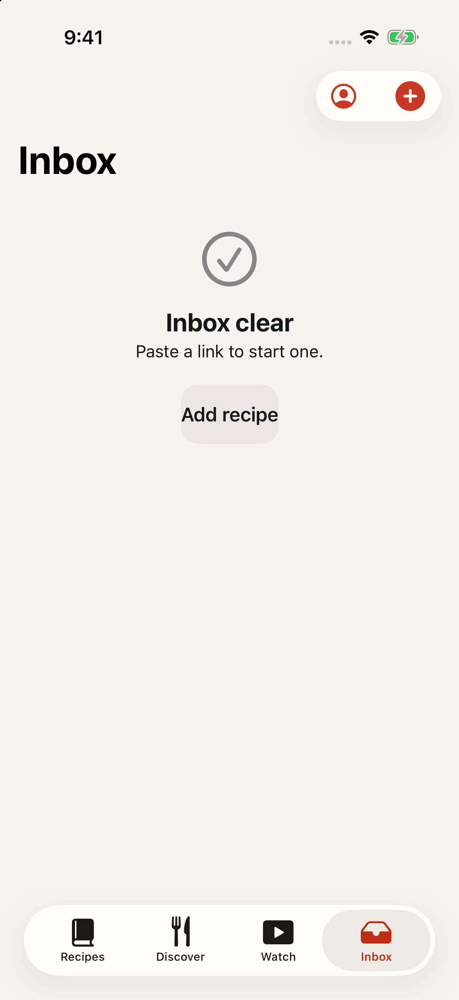
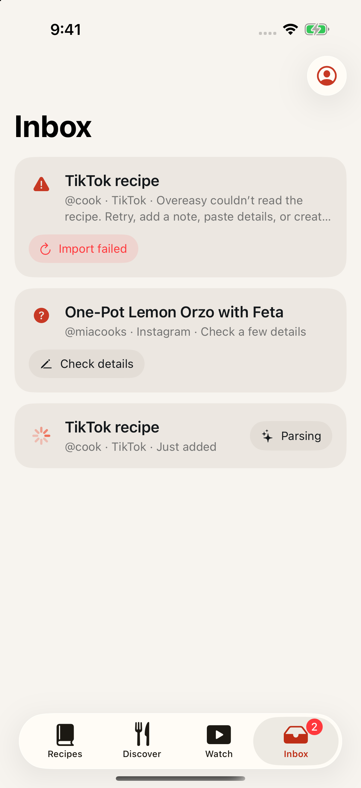
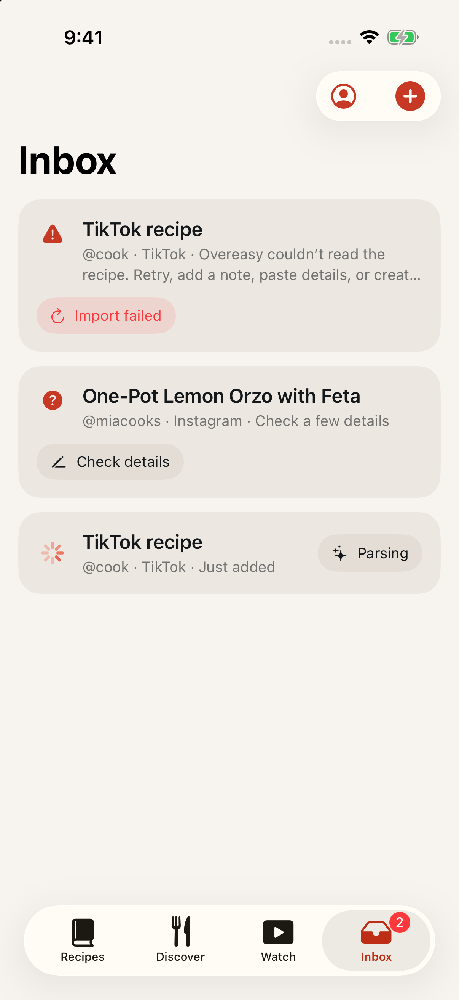

# The Inbox can start an import

Date: September 1, 2026
Issue: [#25](https://github.com/chetangoel01/recipe-app/issues/25)
Status: **built and verified on the review simulator.**

## What was wrong

Two halves of the same gap, both confirmed in the August 31 UI feedback
triage (§ 5).

`LibraryTab.toolbarActions` read `self == .recipes ? [.account, .addRecipe] :
[.account]`, so the plus lived on exactly one tab. And the Inbox empty state
was a `ContentUnavailableView` with a title and a description and no action
at all — "Inbox clear / New imports appear here." and nowhere to go. A cook
looking at an empty Inbox, which is precisely the moment they want to add
something, had to leave the tab to do it.

## The fix

`toolbarActions` now grants `.addRecipe` to `[.recipes, .inbox]`. `inboxTab`
promotes its `ToolbarItem` to a `ToolbarItemGroup` and adds the existing
`addRecipeButton` beside `accountButton` — the shape `recipesTab` already
uses. No second button was built; the toolbar plus is the same view on both
tabs, so it keeps the `canImport` gate for free.

The empty state moves to `ContentUnavailableView`'s closure form and gains an
`actions:` block holding one secondary button that calls the same
`presentAddRecipe`. `ImportInboxView` takes two new members for this: the
`addRecipe` closure and a defaulted `canImport` flag that `LibraryView`
forwards from `RootView`, so the empty-state button is disabled before the
remote session is ready exactly as the toolbar button is.

### Scope: Recipes and Inbox, not every tab

The issue body said "every tab"; the owner narrowed it in the comments and
that narrower rule is what shipped. Discover already has a per-row **Save**,
and Watch is a consumption surface. Neither is where a URL arrives, so
neither gains an import affordance. `DESIGN.md`'s "Navigation and library"
sentence — *"Add Recipe remains specific to Recipes"* — is updated to match,
and states the reason so the next reader does not re-litigate it.

### Two deliberate visible changes

**The description copy changes** from "New imports appear here." to "Paste a
link to start one." DESIGN.md holds Inbox empty copy to one short sentence,
and it still is one; it now explains the button beneath it rather than
narrating a state the user can already see.

**The empty-state button is secondary, not primary.** `LadleButtonRole`
reserves primary for the one action a screen exists to perform, and the Inbox
exists to show a list. `DiscoverView.failedContent`'s "Try again" is the
precedent.

## Evidence

Empty Inbox, `-demo-scenario empty`:

| | |
|---|---|
|  |  |
| Account button alone; the empty state is a dead end | The plus joins the toolbar, and the empty state offers the same action inline |

Tapping the empty state's button opens the sheet that already existed
(`captures/2026-09-01-inbox-add/after-inbox-empty-sheet.png`) — no second
import path was introduced, so `isAddSheetPresented`'s existing `onDismiss`
reload and pending-navigation handling apply unchanged. A finished import now
lands in the Inbox, which is the tab the cook is already on.

Inbox with jobs, `-demo-scenario standard`:

| | |
|---|---|
|  |  |
| Toolbar carries only the account control | The plus is available whether or not the list is empty |

## Tests

Red first: `LibraryNavigationStateTests.testEveryWorkspaceTabKeepsAccountInItsToolbar`
gained an `.inbox` expectation of `[.account, .addRecipe]` before the
production change.

```
xcodebuild test -project Ladle.xcodeproj -scheme LadleAllTests \
  -destination 'platform=iOS Simulator,name=iPhone 17' \
  -only-testing:LadleTests/LibraryNavigationStateTests
Executed 12 tests, with 1 failure (0 unexpected)
```

Green, full unit suite:

```
xcodebuild test -project Ladle.xcodeproj -scheme LadleAllTests \
  -destination 'platform=iOS Simulator,name=iPhone 17' -only-testing:LadleTests
Executed 362 tests, with 1 test skipped and 0 failures (0 unexpected)
```

UI, the new test plus the two that exercise the existing `submitImport`
helper:

```
-only-testing:LadleUITests/StateScenarioUITests/testInboxEmptyStateStartsAnImport
-only-testing:LadleUITests/StateScenarioUITests/testPrimaryJourneyCapturesInboxDetailAndCooking
-only-testing:LadleUITests/StateScenarioUITests/testImportQuotaScenario
Executed 3 tests, with 0 failures (0 unexpected)
```

### The identifier, and why those two other tests are in the list

The Inbox now holds two elements labelled "Add recipe" at the same time, and
`app.buttons["Add recipe"]` matches on identifier **or** label — an XCUITest
tap that resolves to more than one element fails. The empty-state button
therefore carries `accessibilityIdentifier("inbox.empty.add-recipe")`, which
is what the new test taps.

That identifier does not stop the button matching by label, so the two
existing tests that call `submitImport` were run as part of the same
invocation to prove the helper still resolves a single button. They pass
because both run on Recipes, and their scenarios (`standard`, `import-quota`)
seed import jobs, so the Inbox empty state is never in the hierarchy. Should
a future test need `submitImport` from the Inbox tab, it must target
`app.navigationBars.buttons["Add recipe"]`.

## Files

| File | Change |
|------|--------|
| `Ladle/Library/LibraryView.swift` | `toolbarActions` covers `.inbox`; `inboxTab` gains the toolbar plus; `inboxContent` forwards `addRecipe` and `canImport` |
| `Ladle/Library/ImportInboxView.swift` | `addRecipe` closure and `canImport` flag; empty state gains its action |
| `LadleTests/LibraryNavigationStateTests.swift` | the `.inbox` toolbar expectation |
| `LadleUITests/StateScenarioUITests.swift` | `testInboxEmptyStateStartsAnImport` |
| `DESIGN.md` | "Navigation and library" — Add Recipe covers Recipes and Inbox |

No file was added or removed, so `xcodegen generate` was not needed and
`Ladle.xcodeproj` is untouched.

## How this was verified

Debug builds of the `Ladle` scheme on the "Overeast UI validation" simulator
(iPhone 17, iOS 26.5, `614AF85D-84AF-4371-BF70-5D5DA2BBA683`), installed with
`simctl install` and launched with `-ui-testing -onboarding-complete
-reset-library-preferences -demo-scenario <name>`. The "before" pair was
captured from a build of `origin/main` before any file in this branch was
edited. Status bar frozen with `simctl status_bar override` for every capture
and cleared afterwards; PNGs written by `simctl io screenshot`.

## Related

Issue #27 (Discover as the landing tab) builds on this branch. The new UI test
taps the Inbox tab explicitly rather than assuming it starts on Recipes, so it
survives that change.
