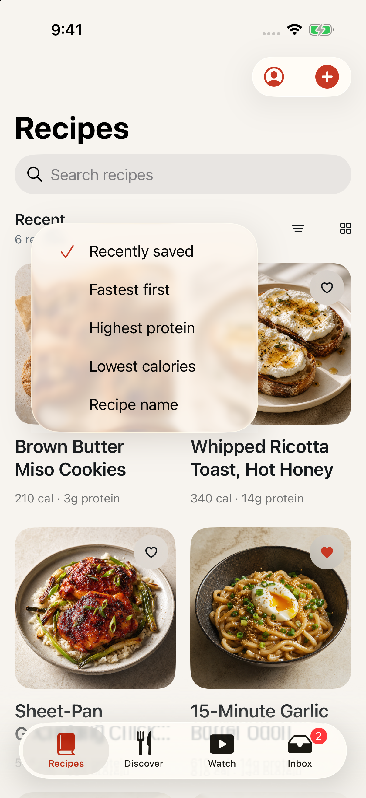
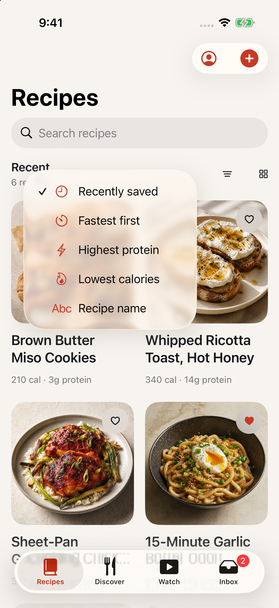
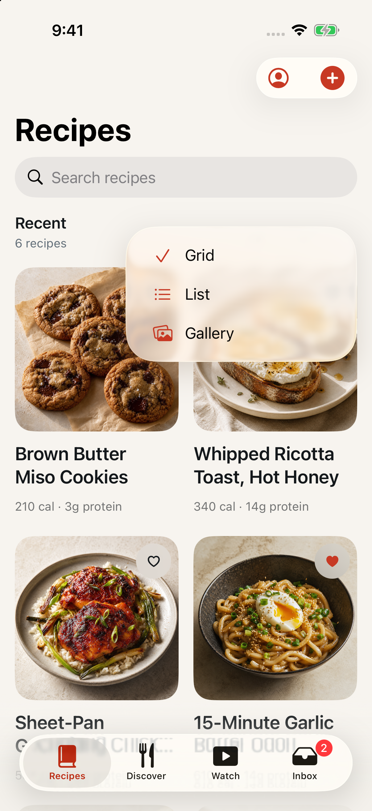
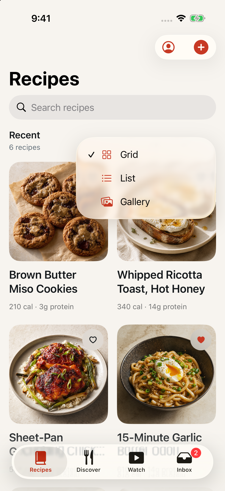

# The Recipes sort and view menus are pickers

Date: September 1, 2026
Issue: [#33](https://github.com/chetangoel01/recipe-app/issues/33)
Status: **built and verified on the review simulator.**

## Purpose

The Recipes header's two menus were hand-rolled out of plain `Button`s, and
they did not look like the rest of the app. Discover's sort menu had already
been built the native way — a `Menu` wrapping a real `Picker` — so this makes
the Recipes pair the same thing.

## What was wrong

Both menus drew their own selection:

- **Sort.** The selected row was `Label(title, systemImage: "checkmark")` and
  every other row was a bare `Text`. That put the checkmark on the *leading*
  edge of the only row that had one and left the icon column empty on the
  other four, so the panel had a ragged gutter down its left side.
- **Recipe view.** Each row had a real symbol (`square.grid.2x2`,
  `list.bullet`, `photo.on.rectangle.angled`) until it was selected, at which
  point its symbol was *replaced* by a checkmark. Selecting a row therefore
  destroyed the one piece of information the row existed to carry.

## The fix

Both are now `Menu { Picker … }`, copied from `DiscoverView.swift:299`:

```swift
Menu {
    Picker("Sort recipes", selection: $viewModel.sort) {
        ForEach(RecipeSort.allCases, id: \.self) { sort in
            Label(sort.libraryTitle, systemImage: sort.librarySystemImage)
                .tag(sort)
        }
    }
} label: {
    controlIcon("arrow.up.arrow.down")
}
.menuOrder(.fixed)
```

iOS draws the checkmark column itself, so every row keeps its own symbol and
the selected one gains a checkmark beside it rather than in place of it.
`.menuOrder(.fixed)` keeps declaration order whether the menu pops upward or
downward.

## Decisions

- **The display picker binds through a closure, not `$viewModel.displayMode`.**
  Writing the value directly would bypass `setDisplayMode`, which is what wraps
  the change in `withAnimation(.snappy)` unless Reduce Motion is on. The
  binding preserves that path, and `.sensoryFeedback(.selection, trigger:)`
  still fires off the resulting state change.
- **That closure is `{ setDisplayMode($0) }`, not `setDisplayMode`.** Passing
  the method reference bare crashes `swift-frontend` 6.3.3 in IRGen while it
  emits the reabstraction thunk for
  `@$s5Ladle18LibraryDisplayModeOScA_pSgIeAghyg_ACIeAghn_TR`. The explicit
  closure compiles. There is a comment at the call site so nobody "simplifies"
  it back.
- **Sort icons live in the app-side extension.** `RecipeSort` is a LadleCore
  query value with no presentation, and it stays that way; `librarySystemImage`
  sits beside `libraryTitle` at the bottom of `AllRecipesView.swift`. The
  chosen symbols are `clock`, `timer`, `bolt`, `flame`, `textformat.abc`.
- **`LibraryDisplayMode` gained `title` and `systemImage`.** The picker needs a
  per-case mapping to iterate `allCases`, and the view already had both
  mappings written as switches over `viewModel.displayMode`. Moving them onto
  the enum deletes the duplication; the view's `displayModeTitle` and
  `displayModeSystemImage` remain as one-line forwards because the
  accessibility contract below is expressed in terms of them.
- **`controlOpticalInset` stays.** The issue asked for it to be folded in, and
  its own comment promised this issue would remove it. Neither holds. The inset
  corrects the 44-point hit frames of the menus' *labels*, and this rebuild
  changed only what the menus contain — the labels and their alignment are
  untouched. Removing it would re-open the misalignment the September 1 spacing
  pass fixed. The comment is rewritten to say so, and to record that the inset
  would only retire if the three controls moved into the navigation bar as
  `ToolbarItem`s, which is a different header from the one DESIGN.md specifies.

## Accessibility

Unchanged and asserted. `accessibilityLabel("Sort recipes")`,
`accessibilityLabel("Recipe view")` and `accessibilityValue(displayModeTitle)`
all survive, and `DiscoverInteractionUITests` still reaches a picker row inside
the menu as `app.buttons["List"]`.

## Evidence

Sort menu:

| Before | After |
|---|---|
|  |  |
| One leading checkmark, four empty gutters | Five tinted symbols, checkmark in its own column |

Recipe view menu:

| Before | After |
|---|---|
|  |  |
| Grid's symbol replaced by a checkmark | Grid keeps `square.grid.2x2` *and* gets a checkmark |

Discover's menu from the same build, as the reference the issue named:
[after-discover-sort-menu-reference.png](captures/2026-09-01-recipes-pickers/after-discover-sort-menu-reference.png).
Row for row it is now the same construction as both Recipes menus — checkmark
column, tinted symbol, label.

### What the captures do not show changing

The issue also read the Recipes panel as "heavily translucent" and "anchored
far to the left". Both are unchanged, and neither was caused by the hand-rolled
rows:

- The translucency is the system menu material. It looks heavier on Recipes
  than on Discover only because Recipes has food photography behind it and
  Discover has porcelain.
- The anchoring is where SwiftUI puts a `Menu` that lives in scroll content
  rather than in the navigation bar. Discover's sits under its button because
  it is a `ToolbarItem`. Moving these three controls into the toolbar would
  change the header DESIGN.md describes, so it was left alone.

## Files

| File | Change |
|------|--------|
| `Ladle/Library/AllRecipesView.swift` | both menus rebuilt as `Menu { Picker … }`; `.menuOrder(.fixed)`; `RecipeSort.librarySystemImage` and `LibraryDisplayMode.title`/`systemImage` added; `controlOpticalInset` comment rewritten |
| `LadleTests/DesignTokenTests.swift` | two new tests (below) |

## Verification

```
xcodebuild test -project Ladle.xcodeproj -scheme LadleAllTests \
  -destination 'platform=iOS Simulator,name=iPhone 17' -only-testing:LadleTests
```
`Executed 364 tests, with 1 test skipped and 0 failures (0 unexpected) in 3.652 (3.777) seconds`

```
xcodebuild test -project Ladle.xcodeproj -scheme LadleAllTests \
  -destination 'platform=iOS Simulator,name=iPhone 17' \
  -only-testing:LadleUITests/DiscoverInteractionUITests/testSettingsAccentAndRecipeViewPreferencesAreReachable
```
`Executed 1 test, with 0 failures (0 unexpected) in 21.338 (21.346) seconds`

Both run under a watchdog: `xcodebuild test` prints its results and then never
exits on this machine, so the `Executed …` line is read from the log rather
than waited for. `** BUILD INTERRUPTED **` at the tail of such a log is the
watchdog, not a failure.

`swift test --package-path Packages/LadleCore` was not run: the package is
untouched. `xcodegen generate` was not run: no source file was added or
removed.

### The two new tests

Both were written first and both failed — the second did not compile, because
`librarySystemImage`, `LibraryDisplayMode.title` and
`LibraryDisplayMode.systemImage` did not exist yet.

- `testRecipesHeaderMenusAreNativePickers` — scans `AllRecipesView.swift` for
  the two `Picker` calls, asserts the file contains no `"checkmark"` literal
  and exactly two `.menuOrder(.fixed)`, and pins the three accessibility
  strings the UI test drives. A future hand-rolled menu fails this.
- `testEveryPickerRowCarriesItsOwnSymbol` — asserts every `RecipeSort` and
  every `LibraryDisplayMode` maps to a distinct, non-empty symbol that is not
  `checkmark`, so no row can regress to an empty gutter or to a checkmark
  standing in for its icon.

## How this was verified

Debug builds of the pre- and post-change trees on the "Overeast UI validation"
simulator (`614AF85D-84AF-4371-BF70-5D5DA2BBA683`, iPhone 17, iOS 26.5),
each installed into a freshly uninstalled container so the accent and view
preferences start at their defaults, launched with
`-ui-testing -onboarding-complete`, driven by scripted taps. The status bar was
frozen with `simctl status_bar override` for the captures and cleared
afterwards. Captures are full-resolution PNGs written by `simctl io screenshot`.
