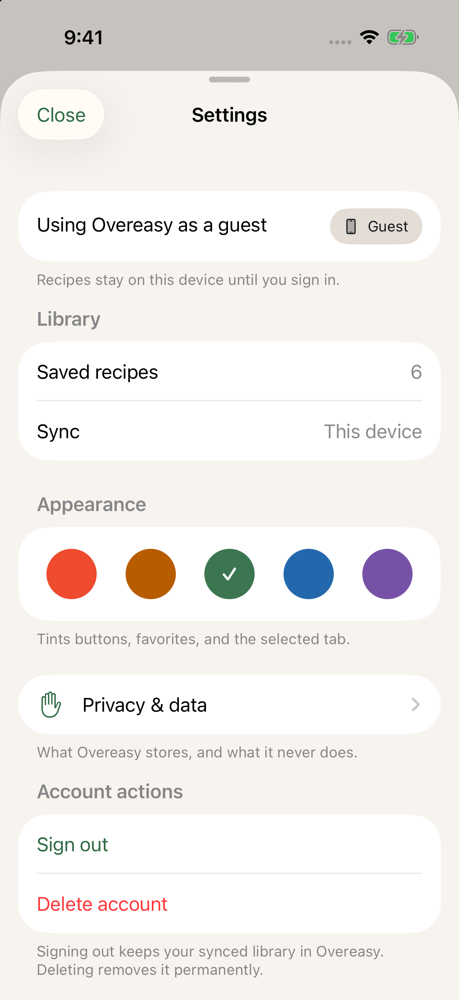

# Settings as a grouped form, and the toolbar inset retired

Date: September 1, 2026
Issue: [#31](https://github.com/chetangoel01/recipe-app/issues/31)
Status: **built and verified.**

Two changes, kept as two commits because the first stands alone.

## 1. Sheets no longer inset their own toolbar controls

`Layout.sheetToolbarInset` moved a bar button from the system's 16-point edge
onto the sheet's 24-point content margin. That was right when a bar button was
bare text. Under iOS 26 the toolbar draws a glass capsule **around the padded
label**, so the padding inflated the capsule by 8 points and pushed the label
4 points off its own centre.

Settings is where it was noticed. The same twelve call sites across **ten
sheets** all carried it, so all ten had the same defect — which is why the
token is retired rather than the one screen special-cased.

### Measured, at 3×

The triage document measured the defect by pixel; this measures the fix the
same way. Values in points, read off the captures.

**Settings — the Close button**

| | Before | After |
|---|---:|---:|
| capsule width | 8pt wider than the label needs | 75.0pt |
| leading padding | — | 17.00pt |
| trailing padding | — | 16.33pt |
| **label offset from capsule centre** | **+4.0pt** | **+0.33pt** |
| **padding asymmetry** | **8.0pt** | **0.67pt** |

The residual third of a point is glyph bearing — the word "Close" does not
have symmetric ink — not layout.

**Add a recipe — the close control**, included to show the retirement reached
past the screen that prompted it:

| | After |
|---|---:|
| capsule | 53.7pt wide |
| leading / trailing padding | 18.67pt / 18.67pt |
| **label offset from capsule centre** | **0.00pt** |
| **padding asymmetry** | **0.00pt** |

Exactly zero, because the X is a symmetric glyph with no bearing to leave over.

### The test was inverted, not deleted

`testSheetToolbarControlsUseTheSemanticInset` asserted that nine hand-listed
sheets **did** contain the token. It is now
`testSheetToolbarControlsAreNotInset` and scans **every** production source for
the name, so a new sheet cannot reintroduce the padding by being absent from a
list. The token's own equality test went with the token.

## 2. Settings is a grouped `Form`

It was a `ScrollView` of hand-built cards: custom section headers in large bold
primary text where a grouped list uses small secondary ones, 64-point rows
where the system uses 44, hand-drawn dividers with a derived inset, and
circular icon badges. All of it re-implemented what `Form` already does.

**537 lines → 366.** `FilterSheet` made the same move for the same reason and
is the shape this follows.

What moved:

- **"Accent color" was a detail hanging off the right of the "Appearance"
  header.** iOS has no such affordance — what a section does is explained in
  its footer, so the swatch section now carries the footer "Tints buttons,
  favorites, and the selected tab."
- **Rows are `LabeledContent` and `Label`.** Saved recipes, Sync, and Privacy
  are system rows now, with system heights, dividers and Dynamic Type
  behaviour. The circular icon badges are gone, which is why
  `testRaisedCardBadgesUseTheDistinctBadgeSurface` no longer lists this file.
- **The account summary's explanation became a section footer**, which is where
  a grouped list puts prose about the section above it.

### Two things found by looking, that the tests could not see

**The Delete account row had a green trash can.** `Button(role: .destructive)`
colours the *label text* red, but an SF Symbol inside it still takes the app
tint — so the row read as red text beside a sage-green icon. Both account
action rows are text-only now, which is also what iOS Settings does with
sign-out and delete rows.

**A plain `Form` is cool grey.** `systemGroupedBackground` is `#F2F2F7`-ish and
read as a different app against Overeasy's warm paper. The form keeps its
native structure but sits on the app's own ground:
`.scrollContentBackground(.hidden)`, `.background(Surface.porcelain)`, and
`.listRowBackground(Surface.raised)`. Three modifiers — sections, headers,
footers, row heights, dividers and Dynamic Type all still come from the system.
This is the one deliberate departure from `FilterSheet`, which takes the system
background; a sheet that fills the screen shows far more of it than a filter
sheet does.

## What was preserved

Everything under test, checked before the rewrite rather than discovered after:

- `AccountSheet.accountTitle` / `accountDetail` / `syncValue` — `ProjectSmokeTests` calls them.
- `LadleAccentColor.resolve(storedValue:)` — the guard added in #30 requires this file to keep it.
- Accessibility identifiers `account.privacy`, `account.sign-out`, `account.delete`.
- Swatch `accessibilityLabel` (the accent's title) and `accessibilityValue` ("Selected") — `DiscoverInteractionUITests` keys on both.
- The button reads **"Close"**, and the navigation bar is titled **"Settings"** — both are looked up by string.
- Both confirmation dialogs, the deletion failure alert, and the loading states.

`LadleSectionHeader` and `dividerInset` are untouched; this deletes two of
their callers, not the helpers, which six other screens still use.

## Tests

`LadleTests`: **361 executed, 1 skipped, 0 failures.**

One expectation changed: `testRaisedCardBadgesUseTheDistinctBadgeSurface` no
longer lists `AccountSheet.swift`, because a grouped form's rows are system
`Label`s and draw no badge.

## How this was verified

Debug build on the "Overeast UI validation" simulator (iPhone 17, iOS 26.5),
`-ui-testing -onboarding-complete -demo-scenario standard`. Measurements are
read out of the PNGs by pixel at 3× — capsule bounds by fill luminance, label
bounds by ink hue — not estimated by eye.
