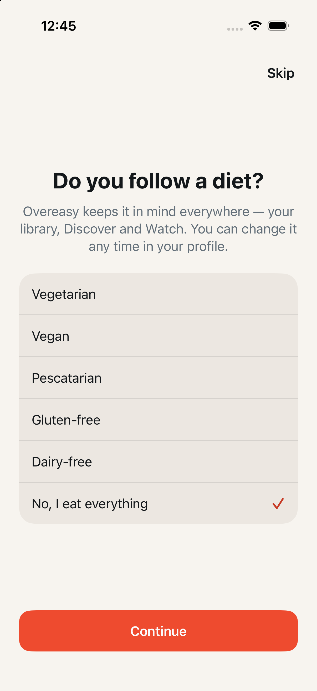
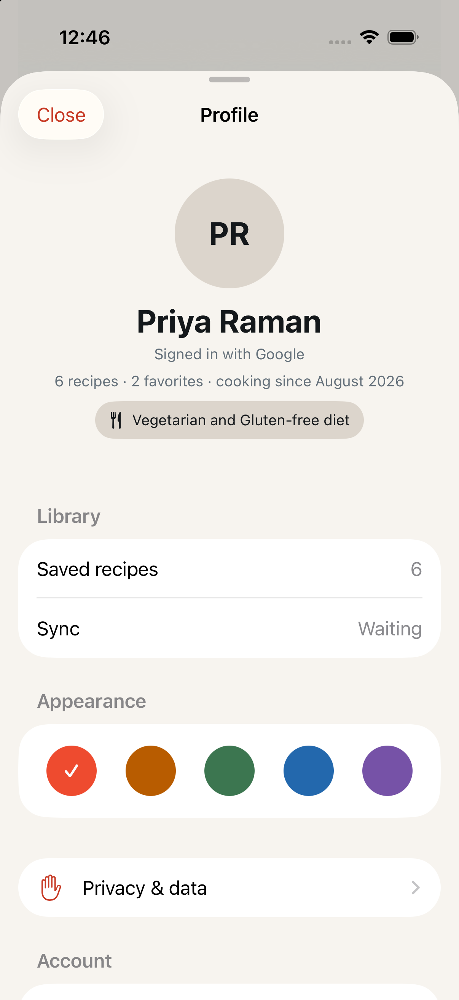

# The diet is asked for, not filtered for

Date: September 7, 2026
Branch: `feat/diet-at-onboarding`, on top of
[#126](https://github.com/chetangoel01/recipe-app/pull/126)
(`feat/filter-model`)
Status: **built and verified on a simulator created for the run.**

Companion to [2026-09-07-filter-model.md](2026-09-07-filter-model.md), which
this revises. Everything about the shared `RecipeFilter`, the three tabs and
the query parameters still holds; what changes is where a diet comes from.

## Purpose

The review of #126 was one sentence: *"Diet is something we ASK DURING
onboarding. Remove it from the filter menu as a choice. The filter can
temporarily disable it, but it should be a pretty permanent thing."*

Five diet toggles in a filter menu made a cook's diet the same kind of thing
as "Japanese, this evening". It could be turned on by a cook who did not
know what it meant, lost to a stray tap, and — because it persisted — read
for weeks afterwards as an app with recipes missing. A diet is not a browse.
It is a fact about the person, and the app should ask for it the way it asks
for their name.

## What the cook sees

- **A second question during onboarding**, straight after the name and in
  the same register: "Do you follow a diet?", the five the backend knows
  (vegetarian, vegan, pescatarian, gluten-free, dairy-free) and **"No, I eat
  everything" already selected**. More than one may be chosen — gluten-free
  vegetarians exist. Skip sits in the header where the name step's does, and
  the question is asked once whichever way it is answered.
- **Everybody is asked, guests included.** A guest eats the same way a
  signed-in cook does, and the answer lives on the device rather than on an
  account. This is the one place the diet step differs from the name step,
  which only an Apple or Google sign-up sees.
- **The diet is changed in Profile, under the name.** One control below the
  facts line, in the header where the name and the avatar are edited, saying
  the whole diet — "Vegetarian diet", "Vegetarian and gluten-free diet" — or
  "Add a diet" when there is none, so a cook who skipped can see the
  question is still open. Guests have it too.
- **The filter menu can only put it down.** Where five toggles were, there
  is one row: "Vegetarian diet · On", which turns into "Vegetarian diet ·
  Off, showing everything". With no diet, the row is absent — there is
  nothing to pause and no second place to go looking for the choice.
- **The pause dies with the launch.** Cuisines and keywords reset because
  they were this evening's browsing; the pause resets because the cook did
  not set the diet in the menu and should not have to remember to put it
  back. Next launch the diet is on.
- **The pill pauses, and says so.** The diet is one pill however many diets
  it holds, and its ✕ turns the diet off for the launch rather than deleting
  it. Its VoiceOver hint is "Turns your diet off until the next launch. Your
  diet is set in Profile." — the place a cook would otherwise have no way of
  finding.

## The shape of it

`RecipeFilterStore` now holds the diet apart from the browse:

| | What it is | How long it lives |
| --- | --- | --- |
| `diets` | The cook's diet. Onboarding and the Profile control write it; nothing else does | `ladle.filter.diets`, across launches |
| `isDietPaused` | The diet, set down for the evening | In memory, this launch |
| `browsingFilter` | Cuisines, keywords, ingredient terms. The filter menu writes it | This launch |
| `filter` | Computed: `browsingFilter` plus the diet unless paused | — |

`filter` is what every tab reads, so nothing downstream changed: Recipes
still filters its decoded tags locally, Discover and Watch still mirror it
into `DiscoverViewModel.filter` and send it on every fetch. A pause reads to
them as a filter change and starts a new first page, which is what it is.

`AccountSession` gains `shouldPresentDietStep` and `completeDietStep()` on
the name step's pattern — a pending flag that survives a relaunch and a
completion flag that ends the question for good — under
`ladle.dietStep.pending` / `ladle.dietStep.complete`. `RootView` draws
`DietStepView` between the name step and the walkthrough.

## Decisions

- **Everybody is asked, and only on the way in.** `completeWelcome` keeps
  the name step's `isNewSignIn || pending` guard, minus the account-kind
  gate. Without that guard a cook who has been using Overeasy since before
  this shipped would be stopped by a diet question on their next cold
  launch, because a cold launch re-asserts the account they are already in.
  A restore hands back the kind it was given; a sign-in changes it. Only the
  second asks.
- **Signing out asks the next cook their own.** Both flags are cleared, the
  way the name step's are: whoever signs in next is a different person and
  eats their own way. The diet *value* is not cleared, which is the smaller
  of two wrongs — the alternative is a cook signing back in to a library
  quietly full of food they cannot eat while the question is being asked.
- **"Clear filters" pauses the diet rather than deleting it.** Clear is how
  a cook empties a screen that a filter emptied, and the diet may well be
  what emptied it, so it has to lift — but deleting it there would make the
  filter menu a second place the diet is set, which is the thing this
  replaces. `LibraryViewModel.resetFilters` and the empty-state buttons on
  all three tabs go through `RecipeFilterStore.clearFilters()`.
- **Opening a collection still keeps the diet**, unchanged from #126, and
  now cannot do anything else: `showCollection` clears `browsingFilter`,
  which has no diet in it to clear.
- **The "set in Profile" note is the menu section's header** — "Diet · set
  in Profile". A SwiftUI `Menu` renders buttons, toggles, pickers and
  sections; a plain `Text` row is not something to gamble a note on, and a
  menu has no footers. The pill carries the same sentence as a VoiceOver
  hint. *This is the loosest part of the brief and the most likely thing to
  want moving.*
- **Choosing a diet lifts a pause.** A cook who paused their diet at six and
  changed it in Profile at seven means the new one to apply; a Profile
  control that appeared to do nothing would read as broken.
- **The pause is not persisted, deliberately.** It is the only piece of
  filter state that is neither stored nor cleared by
  `-reset-library-preferences`, because there is nothing to clear.
- **The step's separators are drawn, not `Divider()`.** Six rows of a
  fractional height put the hairlines on subpixel boundaries and three of
  the five survived while two vanished — visible in the first capture, and
  read as a grouping nobody had meant. A one-point rectangle is the same
  weight at every position.
- **A diet counts as one filter however many diets it holds.** The button
  label is "Filters 1" for a vegetarian gluten-free cook, because that is
  one pill and one row in the menu; counting it twice promised a control
  that is not there.

## `-reset-library-preferences` and the UI-test launches

Unchanged: the diet still lives under `ladle.filter.diets` and
`RecipeFilterStore.resetPreferences` still **writes** the empty value rather
than removing the key, for the reason
[2026-09-07-reset-preferences-accent.md](2026-09-07-reset-preferences-accent.md)
gives — a value seeded into the simulator's device-level domain is read
through but cannot be deleted.

`-onboarding-complete` now finishes the diet step along with the name step
and the walkthrough, so no seeded UI-test launch is ever stopped by the
question, and no run leaves the next one stranded behind it.
`-diet-step-pending` and `-diet-step-complete` force and skip it, read in the
same order as the name step's pair so pending wins.

## Verification

`swift test --package-path Packages/LadleCore`:

```
Test run with 77 tests in 11 suites passed after 0.021 seconds.
```

Nothing in `Packages/LadleCore` changed — `RecipeFilter` is the same value
type it was — and the run is here to prove it.

`xcodebuild test -scheme LadleAllTests` on a simulator created for the run
(`iPhone 17 Pro`, iOS 26.5), unit bundle and the three UI classes this
touches:

```
Test Suite 'All tests' passed at 2026-09-08 00:47:39.586.
     Executed 514 tests, with 1 test skipped and 0 failures (0 unexpected)

Test Suite 'ProfileSheetUITests' passed         8 tests, 0 failures (78.357s)
Test Suite 'RecipesFilterMenuUITests' passed    5 tests, 0 failures (123.350s)
Test Suite 'StateScenarioUITests' passed       14 tests, 0 failures (172.373s)
Test Suite 'LadleUITests.xctest' passed        27 tests, 0 failures (374.080s)
```

New unit cases: `testPausingTheDietHidesItFromTheFilterButKeepsIt`,
`testAPausedDietIsBackOnTheNextLaunch`,
`testClearingTheFiltersPausesTheDietRatherThanDeletingIt` and
`testChangingTheDietLiftsAPause` in `RecipeFilterStoreTests`; five diet-step
cases in `AccountSessionTests`, including
`testACookWhoAlreadyFinishedOnboardingIsNotAskedOnUpgrade`, which is the
nag this must not become.

New UI cases:

- `testADietChosenDuringOnboardingIsAlreadyOnEveryTab` — the old
  `testADietChosenOnRecipesIsAlreadyAppliedOnDiscover`, rewritten from the
  other end: the diet is now given during onboarding rather than picked in
  the menu, and the launch lands on a Discover feed that has already asked
  the server for it and a library of four.
- `testPausingTheDietShowsEverythingAndItIsBackNextLaunch` — six recipes
  when the row is turned off, the meat dish back on Discover a moment later
  because a pause is a filter change and the feed refetched without it, four
  when the row is turned back on, and four again after a relaunch that
  deliberately omits `-reset-library-preferences`.
- `testTheDietIsChangedBesideTheNameAndTheLibraryFollows` — the Profile
  control, from "Add a diet" to Vegetarian, with the library narrowed behind
  the closed sheet.

The whitespace check is clean on every commit.

## Known gaps

- **The diet is a device preference, not an account one.** It does not
  travel to a second phone and does not survive a reinstall, and signing out
  leaves the value on the device while asking the next cook the question
  again. Putting it on the profile the server already stores is the obvious
  next move and is not in this branch.
- **The pause is per launch, not per tab.** Pausing on Recipes pauses on
  Discover and Watch, which is the shared-filter behaviour and is intended,
  but it means there is no way to browse everything on Discover while
  keeping the library narrowed.
- **Nothing explains the diet on a recipe.** Unchanged from #126: a Discover
  card still cannot say why it matched.

## Captures

| The question, during onboarding | The control, in Profile |
| --- | --- |
|  |  |
