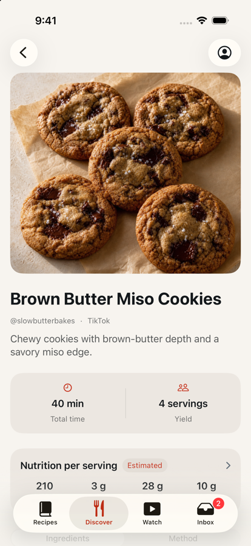
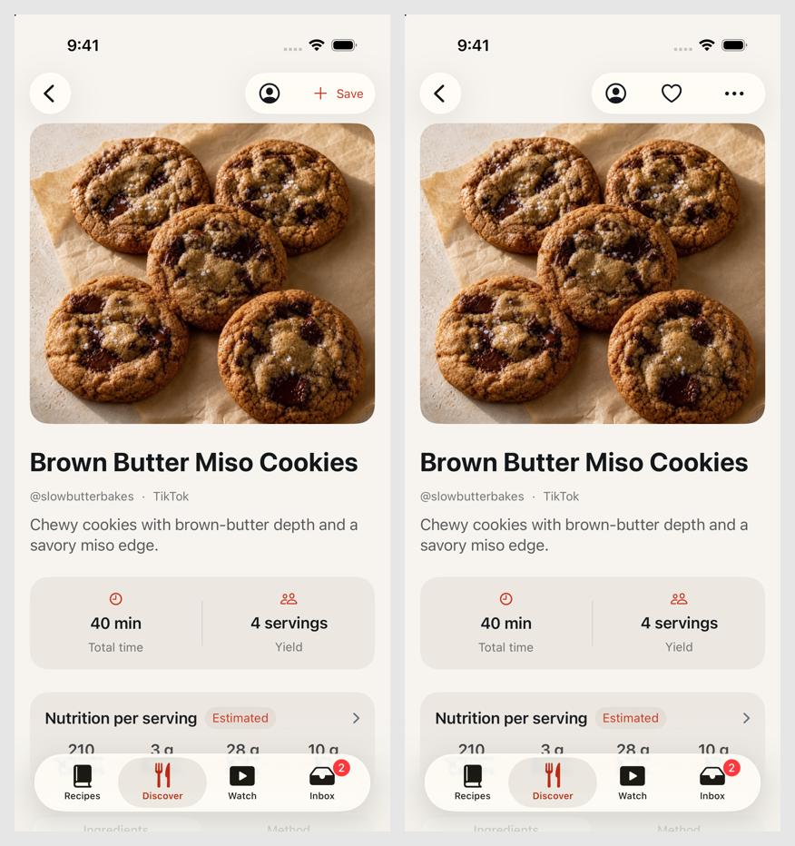

# Saving a Discover Recipe From Its Own Page

Issue #88. TestFlight feedback from Sagrika Sethi on build `20260902.1`:
"Can you please add the ability to add a recipe to my library from this?
Discover view."

## Purpose

Save existed on the Discover card and in the Watch feed, but not on the recipe
page those two open. That page is where a cook has finished deciding — it
showed the ingredients, the method and the creator's notes, and offered nothing
to do about them. `RecipeDetailView` opened with `access: .discover` was
read-only, because `allowsLibraryEdits` is `access == .saved`.

## User-visible behaviour

- A page opened from a Discover card or a Watch page carries a Save capsule at
  the trailing edge of its header, next to the title. It is the card's control:
  the same two words, the same `plus` and `checkmark` glyphs, the same accent
  fill, the same spinner while the request is out.
- **Save, then stay.** On success the control reads Saved on a sage fill and
  goes inert, the favourite and options controls appear in the toolbar, and the
  cook carries on reading. Nothing is dismissed and nothing navigates.
- On failure the page is still a preview and the report the card would have
  shown appears under the header: `Save: <title>. <message>`.
- A page opened for a source the feed already saved reads Saved from the start.
  This is a Watch case: Watch runs its feed with
  `removesSavedRecipeImmediately: false`, so a page saved from the overlay
  stays in the feed and can be tapped through to.
- Going back later lands on a Discover feed without the row. That is what the
  card does today — the feed filters anything with a `savedRecipeID` — and it
  needed no handling.

## Decisions

### The page uses the feed's save path, not a copy of it

`DiscoverViewModel.save` is the one implementation: same endpoint, same
optimistic `savedSourceIDs`, same `saveFailures` bookkeeping. The difficulty is
that the page is not inside the feed. `DiscoverView` and `WatchView` each own a
`DiscoverViewModel` privately, while the page is pushed by `LibraryView`
through a `navigationDestination` on a `Hashable` value — which a live view
model can never be part of.

So the feed hands the path up with the recipe. `openRecipe` and
`openDiscoverRecipe` became `(Recipe, DiscoverSaveModel) -> Void`, and
`DiscoverSaveModel` (in `DiscoverView.swift`, beside the path it wraps) holds
the feed's view model, the `DiscoverRecipe` the page was opened from, and the
`saveRecipe` closure the library already threads down.

`LibraryRecipeDestination` then carries the model to the page. That is not
where it started: the first version kept it in a `@State` on `LibraryView` and
matched it to the destination by id, and the UI test failed once against it —
a Discover page on screen for five seconds with no Save control on it.

**What that failure was is not settled.** The accessibility snapshot it left
(Account, Start Cooking, Ingredients, Method, no Save) is exactly what
`main`'s Discover page looks like, so it cannot tell "my app with a nil state"
from "another agent's build installed over mine on the shared simulator" — and
the run before it proved cross-installs were happening (see below). It was
never reproduced on a private simulator: one iteration passed there before the
machine killed the loop, and the code changed after that.

The design changed anyway, because carrying the model in the pushed value
makes the question moot. The page and the path it saves through arrive in one
piece, so there is no window in which the page can be built without it, whether
or not a stale destination closure was ever the cause. It also deleted the
`@State`, the state write, and the id guard: the mechanism is smaller than the
one it replaced, which would be reason enough on its own.

`LibraryRecipeDestination` is a navigation value and must stay `Hashable`, so
the model takes no part in `==` or `hash(into:)`. A destination names a page,
and the same page reached twice is the same destination.

### Flipping means becoming the saved copy, not just changing a flag

`DiscoverSaveModel.access` starts `.discover` and becomes `.saved` once the
request lands; the page reads that rather than the access it was pushed with,
for both `allowsLibraryEdits` and `artworkOwner`.

That alone would be a bug. In production the saved copy is a different row with
a different id, and every affordance the flip reveals works off the id —
favourite, delete, the editor, and the hero image's re-signing owner, which
answers 404 for a preview id. So the page adopts `saved.recipe` as its
displayed recipe at the same moment. (The demo service used under `-ui-testing`
returns the fixture unchanged, so the UI test cannot see this; the unit test
saves a fixture with a different id and the flip is asserted against it.)

The library is told before the flip: `storeDiscoveredRecipe` runs `load()`
synchronously, and `toggleFavorite(recipeID:)` looks the id up in `recipes`, so
the heart has to work the instant it appears.

### Left alone

- A failed local store after a successful server save. `storeDiscoveredRecipe`
  returns false and shows its own banner; the card does not treat that as a
  failed save, and neither does the page.
- The Save control's placement is the header, not the toolbar. After the flip
  the trailing toolbar would carry four items, and a failure raised from a nav
  bar has nowhere in view to be reported. Header placement puts the report
  directly under the control that caused it.

## Affected components

- `Ladle/Library/DiscoverView.swift` — `DiscoverSaveModel`; `openRecipe` gains
  the model.
- `Ladle/Library/WatchView.swift` — `openDiscoverRecipe` gains the model.
- `Ladle/Library/LibraryView.swift` — `LibraryRecipeDestination` carries the
  model to the page.
- `Ladle/RecipeDetail/RecipeDetailView.swift` — `discoverSave`, the header Save
  capsule, the failure notice, `currentAccess`.
- `LadleTests/DiscoverViewModelTests.swift`,
  `LadleUITests/DiscoverInteractionUITests.swift`.

## Verification

Red first: the three unit tests were written against a `DiscoverSaveModel` that
did not exist, and the run failed to compile —
`error: cannot find 'DiscoverSaveModel' in scope`, `** TEST FAILED **`.

The tests drive a real `DiscoverViewModel` over the existing
`DiscoverTestService`, so "calls the shared path" is asserted on the service's
recorded `savedSourceIDs` rather than on a fake of the path itself.
`RemoteImageCacheTests` is run beside them deliberately: it is what pins
`artworkOwner` to the access, and that decision now reads `currentAccess`.

The UI test extends the existing Discover long-press test rather than paying a
second launch: after `View Recipe` it taps the header Save, then asserts the
control's label goes from `Save <title>` to `<title> saved`, that it is
disabled, that `Recipe options` has appeared, and that the account control is
still on screen — the cook did not go anywhere. It then leaves for the Recipes
tab and comes back, and the page is still the saved copy. Each tab owns its own
navigation stack and the `TabView` binds `navigation.tab` directly rather than
through `select`, so the stack survives; this was observed rather than assumed,
and the assertion records it.

### Running the suite on a contended machine

`xcodebuild test` prints its results and then never exits here, so every run
was wrapped in a watchdog — `perl -e 'alarm shift; exec @ARGV' <seconds>
xcodebuild …` — and read from its log.

Several agents were building this repository at once while this branch was
written. The load average passed 500 and two watchdogged runs were killed
mid-build. Two things follow, and both cost time to work out:

- **The simulator is shared state.** The first full run reported a failure in
  `StateScenarioUITests.testReviewedImportLeavesTheInbox` — a test that does not
  exist on this branch, quoting another worktree's path. XCUITest launches
  `com.ladle.ios` by bundle id, whatever build is installed, so a concurrent
  run on the same device drives its app with your runner. Later runs used
  `-derivedDataPath /tmp/ladle-dd-88` and a private clone,
  `xcrun simctl create Ladle-88 "iPhone 17 Pro" …iOS-26-5`
  (`6311CC5C-18FD-499D-AE3D-77D8162ADB41`) — still the iOS 26.5 iPhone 17 Pro
  this project tests on, just one no other run knows the id of.
- **One failure could not be attributed either way.** The single missing-Save
  failure described under Decisions happened on the shared simulator, and a
  cross-installed `main` build produces exactly the same screen. It was not
  reproduced on the private clone. The plumbing was changed to a shape where
  the failure is impossible rather than left resting on that distinction.

The `Ladle-88` clone and `/tmp/ladle-dd-88` are both still on this machine.
Neither is needed once this branch lands: `xcrun simctl delete Ladle-88` and
`rm -rf /tmp/ladle-dd-88`.

### Results

Simulator `Ladle-88`, iPhone 17 Pro on iOS 26.5,
`6311CC5C-18FD-499D-AE3D-77D8162ADB41`.

| Suite | Result |
| --- | --- |
| `LadleTests/DiscoverViewModelTests` + `RemoteImageCacheTests` | 54 tests, 0 failures |
| `LadleTests` | 464 tests, 1 skipped, 0 failures |
| `LadleUITests` | 28 tests, 0 failures |

```bash
xcodebuild test -project Ladle.xcodeproj -scheme LadleAllTests \
  -destination 'id=6311CC5C-18FD-499D-AE3D-77D8162ADB41' \
  -derivedDataPath /tmp/ladle-dd-88 -only-testing:LadleTests

xcodebuild test -project Ladle.xcodeproj -scheme LadleAllTests \
  -destination 'id=6311CC5C-18FD-499D-AE3D-77D8162ADB41' \
  -derivedDataPath /tmp/ladle-dd-88 -only-testing:LadleUITests
```

The UI row is two runs: the machine killed the first one 15 tests in, after
`DiscoverInteractionUITests` (7), `ProfileSheetUITests` (7) and
`RecipesFilterMenuUITests` (1) had all passed, and `StateScenarioUITests` (13)
was run on its own straight after. Nothing failed in either.

## Captures

Left is `main`, right is this branch, on the seeded library.

| Before | After |
| --- | --- |
|  |  |
