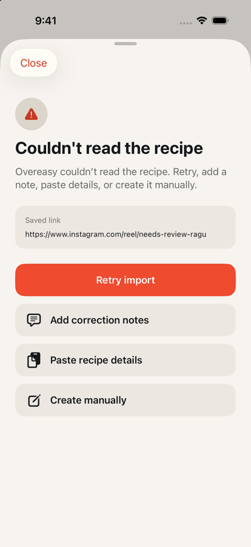
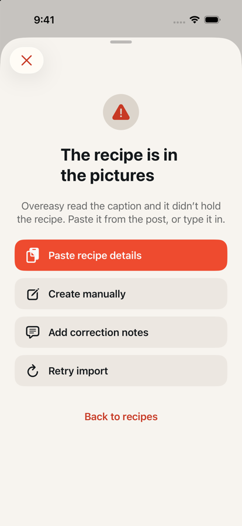

# Photo posts on the client: an unknown failure code, and copy that asks the cook

Date: 2026-09-07 · Branch: `feat/photo-post-failure-copy` · Issue:
[#39](https://github.com/chetangoel01/overeasy/issues/39)
Scope: iOS only. The backend half is
[#112](https://github.com/chetangoel01/overeasy/pull/112) —
`docs/verification/2026-09-07-photo-post-imports.md`.

Updated 2026-09-08: missing instructions in video imports now use the same
paste-first recovery order. The current copy is recorded below; the original
wire compatibility and deployment notes remain historical context.

## Why

The decision recorded on #39 on 2026-09-07 is that a photo post whose caption
carries no recipe lands in the failure sheet with copy of its own: the recipe
is in the pictures, we could not read it, here is where to type it. #112 adds
the wire code `photoPostNeedsManualEntry` for that state.

Underneath that is the reason this ships first. `RemoteImportJobDTO.failureReason`
is an `ImportFailure?` decoded strictly, and the reason travels inside the
import **poll** response. A code the build did not know threw a `DecodingError`
on the whole payload — every job in the response stuck parsing, not just the one
that failed. So the fallback lands before the case that would have triggered it,
and before this class of failure can happen again.

## What changed

### 1. An unknown code decodes instead of throwing

`ImportFailure` (`Packages/LadleCore/Sources/LadleCore/ImportJob.swift`) is no
longer a `String`-backed enum with synthesized `Codable`. It keeps a `rawValue`
and gains `case unrecognized(String)`, with `init(from:)` and `encode(to:)`
written by hand so the value stays the same bare string on the wire.

**Why the string is carried rather than dropped.** An import job is persisted as
encoded JSON in `StoredImportJob.payload`. A payload-less `.unknown` would
re-encode as something else and lose the server's real reason for good; carrying
it means the row still holds `photoPostNeedsManualEntry` after an upgrade, and
the build that finally knows the code reads it correctly. It is a diagnostic, not
copy — an unrecognised code wears the generic failure's title, message and
recovery options, and no wire code is ever shown to a cook.

`{"failed":{"_0":"parserUnavailable"}}` is asserted in a test, because that is
the JSON already sitting in every stored failed job and a change to it would make
those rows undecodable.

### 2. `photoPostNeedsManualEntry`

The case, the `Contracts/Fixtures/import-failures.json` entry, and coverage in
`RemoteContractTests` and `ImportJobTests` beside the existing
`insufficientTextEvidence` ones.

### 3. Failure sheet copy and action order

| | Missing instructions (`insufficientTextEvidence`) | Photo post |
| --- | --- | --- |
| Title | No recipe instructions found | The recipe is in the pictures |
| Message | We couldn’t find cooking instructions in the post’s caption, audio, or linked pages. Paste the recipe, or create it manually. | Overeasy read the caption and it didn’t hold the recipe. Paste it from the post, or type it in. |
| Leads with | Paste recipe details | Paste recipe details |
| Inbox label | Needs recipe text | Type it in |

`ImportRecoveryLayout` (`Ladle/Import/ImportCoordinator.swift`) is the whole
mechanism: `.retryFirst` for every failure that might not happen twice,
`.manualEntryFirst` when the import already read everything the post holds.
Retrying a caption that had nothing in it will have nothing in it again, so
**Paste recipe details** takes the primary role and **Create manually** follows
it. Retry stays on the sheet, and stays enabled — a demoted action, not a
removed one — as a secondary row with the icon-and-label shape the other
recovery rows already use. **Add correction notes** stays where it was.

Both sheets that offer recovery read the layout off the failure:
`FailedImportSheet` and `AddRecipeSheet`'s failed state, which is where a photo
post fails while the add sheet is still open.

### 4. The Inbox row

`PendingImportCard`'s status pill says **Type it in** rather than "Import
failed", in the register of the other short labels on that row ("Sign in again",
"Limit reached"). It is the same string VoiceOver reads, and the byline beneath
carries the message above. Video imports missing a cooking method instead say
**Needs recipe text**, including in their VoiceOver label.

## Deploy order

**This must ship before #112 deploys.** That is the whole point of splitting it
out. Until this build is in cooks' hands, a `photoPostNeedsManualEntry` on the
wire breaks import polling for them.

One consequence to know about, recorded because it is invisible from this side:
`Contracts/Fixtures/import-failures.json` is validated against the **backend's**
`ImportFailure` StrEnum by `Backend/tests/contracts/test_golden_fixtures.py`, and
`main`'s backend does not know the new code yet. With this branch's fixture on
`main` and #112 not yet merged, that test fails:

```
FAILED tests/contracts/test_golden_fixtures.py::test_golden_fixture_round_trips_canonically[import-failures.json-adapter2]
  Input should be 'parserUnavailable', … [input_value='photoPostNeedsManualEntry']
```

`.github/workflows/backend-ci.yml` only runs on `Backend/**`, so neither this PR
nor its merge triggers it. Two things still can, until #112 lands: a backend PR
opened in the window, which would go red on `main`'s account rather than its
own, and the workflow's weekly `schedule` (`17 5 * * 1`, next 2026-09-14), which
needs no PR at all. Merge #112 promptly after this one.

## Verification

```
swift test --package-path Packages/LadleCore
  ✔ Test run with 62 tests in 10 suites passed

xcodebuild test -project Ladle.xcodeproj -scheme LadleAllTests \
  -destination 'platform=iOS Simulator,name=iPhone 17 Pro'
  Executed 465 tests, with 1 test skipped and 0 failures (0 unexpected)   # LadleTests
  Executed 28 tests, with 0 failures (0 unexpected)                        # LadleUITests
  ** TEST SUCCEEDED **
```

Throwaway iPhone 17 Pro / iOS 26.5 simulators, deleted after. `Backend/` is
untouched by this branch.

`testFailedImportRecoveryActionsShareLabelOrigin` is the one to watch on any
future change here: it drives the `.retryFirst` sheet and measures that the
recovery labels share a left edge, which is what the restructured
`ImportRecoveryActions` had to preserve.

Tests added:

- a made-up failure code decodes as `.unrecognized` and the job reads as
  `.failed`, through `RemoteImportJobDTO.importStatus()` — the poll path that
  used to throw;
- that code survives a round trip through the encoded job payload;
- `{"failed":{"_0":"parserUnavailable"}}` is still the stored shape, and every
  known code round-trips through its wire value;
- the new code in the fixture list and its stable raw value;
- the photo-post title, message and `.manualEntryFirst` layout, each against the
  generic `insufficientTextEvidence` failure, so a regression that flattened the
  two would fail;
- the Inbox label for the new code and for a failure that is not it.

`DemoImportService` fails any link whose URL contains `photo` with the new code,
so the sheet can be opened in the UI-review simulator without a server.

## Captures

Left is `main`, right is this branch, on the seeded library.

| Before | After |
| --- | --- |
|  |  |

## 2026-09-08: missing instructions in a YouTube Short

The reported [YouTube Short](https://www.youtube.com/shorts/OIwC6Jv55Hk) was
accepted and canonicalized correctly. Its live job failed with
`insufficientTextEvidence`. A bounded diagnostic check confirmed that YouTube
blocked the server's free yt-dlp request, but Supadata successfully supplied
metadata and six transcript segments. The 13-second clip introduces a series
of quick healthy recipes; the returned narration gives no cooking method, and
its description contains a creator homepage and hashtags. This case does not
show that Shorts links or transcription are unsupported.

The approved change is to explain that outcome in the existing UI. Previously,
the video failure said “More recipe detail needed”, led with Retry, and appeared
as “Import failed” in Inbox. Both `AddRecipeSheet` and `FailedImportSheet` now
read the copy and `.manualEntryFirst` layout from `ImportOperationFailure`.
`ImportRecoveryActions` already implements that layout, so no new screen or
control is needed. Connection, parser, and unknown failures still lead with
Retry. The backend evidence gate and API contract are unchanged.

`DemoImportService` recognizes a `no-instructions` URL for deterministic UI
verification; it returns the same failure until recipe text is supplied.
`ImportCoordinatorTests` covers the message, action order, available secondary
retry, and Inbox label. The UI test
`testMissingInstructionsExplainsFailureAndRecoversFromInbox` checks both sheets,
the Inbox label, and recovery through the existing pasted-text editor.

Verification on the iOS 26.5 simulator:

- Two focused regression tests failed on the old copy, Inbox label, and action
  order before implementation. The assertions completed; the red run's runner
  was stopped after it remained open following test completion.
- 103 app tests passed across `ImportCoordinatorTests`, `DemoImportServiceTests`,
  and `ProjectSmokeTests`.
- Both UI tests passed: the existing recovery-label alignment check and the new
  missing-instructions flow through Inbox and pasted-text recovery.
- The new recovery flow also passed at extra-large text in light mode and
  accessibility-medium text in dark mode. Captures were inspected for wrapping
  and reachable actions. The Add recipe heading now centers when it wraps.
- 53 backend URL, evidence-gate, and coverage tests passed during diagnosis.
- The full Ladle app and embedded Share Extension build passed, along with
  `git diff --check` and the edited documents' relative-link check.

Current captures:
[Add recipe, extra-large text](captures/2026-09-08-missing-recipe-instructions/add-recipe-extra-large.png),
[Inbox](captures/2026-09-08-missing-recipe-instructions/inbox.png),
[recovery](captures/2026-09-08-missing-recipe-instructions/recovery.png), and
[dark accessibility recovery](captures/2026-09-08-missing-recipe-instructions/recovery-dark-accessibility.png).
