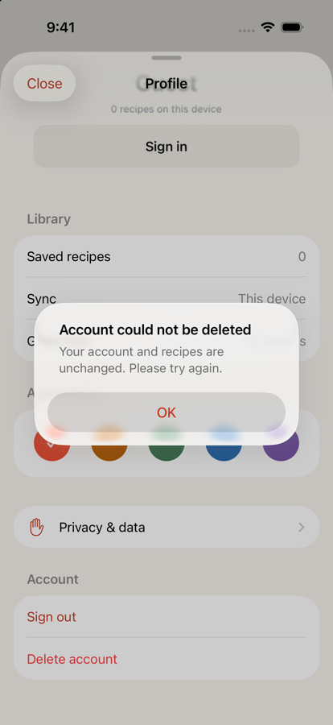
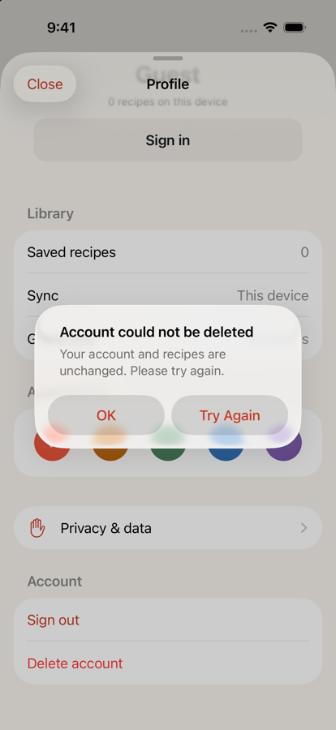

# One sentence for a 5xx, and a way to send the request again

Date: September 7, 2026
Status: **done.** Closes [#89](https://github.com/chetangoel01/overeasy/issues/89).

Sagrika hit "Overeasy is temporarily unavailable. Try again in a moment." on
2026-09-02 and had nowhere to go from it. The investigation recorded on the
issue rules out the gateway: `RemoteFailure` only becomes `.serviceUnavailable`
from a *parsed* API error whose code is `providerUnavailable` (503) or
`internalError` (500) (`Ladle/Remote/RemoteFailure.swift:31-34`). A gateway 404
carries no error body and lands in `.invalidResponse`; a dropped connection is
`.offline`. The application answered her.

## What the copy says now

That fact decides the wording, and it is the one place this diverges from the
issue's own "Decisions, 2026-09-07" comment, which proposed "Couldn't reach
Overeasy. Check your connection and try again." The server was reached. Sending
a cook to look at their Wi-Fi for a fault that is ours wastes the one thing they
can act on.

| | Before | After |
| --- | --- | --- |
| `.serviceUnavailable` title | Service unavailable | **Overeasy had a problem** |
| `.serviceUnavailable` message | The service is temporarily unavailable. Try again in a moment. | **Overeasy hit a problem on our side. Try again in a moment.** |
| `.offline` message | *(unchanged)* Your saved recipes are still available. Reconnect to refresh. | same |

`.offline` stays about the connection and `.serviceUnavailable` stays about us:
neither may borrow the other's excuse. `.rateLimited(retryAt:)` already carries
a time and is untouched.

The three Account surfaces stop writing their own version of the sentence and
quote `failure.message`. Their opening clause — the one naming what did *not*
change — is theirs and stays, because it is the part that differs:

- `AccountSignInFlow.swift:53-55` — "Overeasy hit a problem on our side. Try
  again in a moment."
- `AccountHeaderView.swift:64-66` (`ProfileEditFailure`) — "Your name is
  unchanged. Overeasy hit a problem…" / "Your photo is unchanged. …"
- `AccountSheet.swift:31-32` (`AccountDeletionFailure`) — "Your account and
  recipes are unchanged. Overeasy hit a problem…"

`ImportOperationFailure.message` (`ImportCoordinator.swift:90-101`) already
quoted `failure.message`, so the import sheet picked up the new sentence for
free: "Overeasy hit a problem on our side. Try again in a moment. The saved link
is safe."

## What Retry does on each surface

The brief for this issue described the three surfaces as sign-in, "header load"
and "sheet load". Two of those are not loads. What actually fails there is a
*write*, and that is what Retry re-issues:

| Surface | The request that failed | How Retry re-issues it |
| --- | --- | --- |
| Sign-in (`SignInOptionsView`, on the welcome screen, the guest-limit sheet and Profile's sign-in sheet) | `POST /v1/auth/apple` or `/v1/auth/google` | `AccountSignInFlow.retry()` replays the stored backend exchange |
| Profile name and photo (`AccountHeaderView`) | `PATCH /v1/auth/profile`, `PUT`/`DELETE /v1/auth/avatar` | `ProfileEditor.Failure.retry` re-runs the same save |
| Account deletion (`AccountSheet`) | `DELETE /v1/auth/account` | `AccountDeleter.retry()` re-runs the injected closure |

Three decisions inside that:

**Retry replays the exchange, not the ceremony.** `AccountSignInFlow.run` now
takes a `prepare` step that does whatever cannot be replayed — presenting
Google's sheet — and returns the exchange with our backend. Only the exchange is
remembered. A cook who has already proved who they are is not asked to do it
again because our server returned a 500, and a cancelled provider sheet leaves
nothing to retry, which is right: it never sent a request. The idempotency key
is captured outside the exchange, so the retry re-sends the key the failed
attempt used — which is what an idempotency key is for after a 500.

**Retry is offered only where repeating could change the answer.** Everything
gates on `RemoteFailure.canRetry()`: no button for a quota, an expired session,
a refused identity claim, a build without Google configured, or a picture the
phone could not open (that one never reached the network).

**The button does not move the screen.** `24b440c` fixed a failed sign-in
shoving the centred welcome screen upward by giving the message a fixed-height
slot. Try Again sits *inside* that slot, beside the message rather than under
it, and the slot grew from 46 points to a tertiary control's own height
(`LadleTheme.Control.primary`, 52). The subtree's height still cannot change.

## Audit of the other `.serviceUnavailable` consumers

Checked and deliberately left alone — all three are one-word status, not prose,
and the shared sentence would not fit:

- `PendingImportCard.swift:126` — "Unavailable", a status word on an import row.
- `SyncStatus.swift:84` (`shortLabel`) — "Unavailable", the value of the Sync
  row in Profile.
- `ImportCoordinator.swift:1184` (`durableReason`) — maps to
  `ImportFailure.parserUnavailable`, a persisted enum case, not a string a cook
  reads.

Out of scope but noted: `ImportFailure.parserUnavailable`'s own recovery copy
("Overeasy couldn't read the recipe…", `ImportCoordinator.swift:1287`) is about
a parse that produced nothing, not about a 5xx, and is only shown when there is
no `RemoteFailureReport` at all. `NameStepView` shows `ProfileEditFailure.name`
during onboarding and does not get a Retry button — its Continue button is the
retry, one tap away and already on screen.

## Verification

Simulator: a throwaway `Ladle-copyfix` iPhone 17 Pro on iOS 26.5, deleted after
the run, so a shared simulator could not be pulled out from under the UI tests.

Red before green, and each retry test was re-run with the behaviour neutered to
prove it was testing the retry rather than the API's existence:

- `RemoteFailureTests` — red 5 failures on the copy, then green.
- `AccountSignInFlowTests.testRetryReissuesTheFailedExchangeWithoutTheProviderSheet`
  — with `retry()` stubbed to return early: red, "Retry must re-issue the
  request, not only clear the message". Restored: green.
- `AccountRetryTests` — with both retry closures forced to nil: red, 6 failures.
  Restored: green.

Final full run of the `LadleAllTests` scheme:

```
Executed 470 tests, with 1 test skipped and 0 failures (0 unexpected)   # LadleTests
Executed 28 tests, with 0 failures (0 unexpected)                       # LadleUITests
** TEST SUCCEEDED **
```

New tests: `RemoteFailureTests.testEveryFailureNamesTheRightCulprit` (every case
has its own title and message; a 5xx never mentions the connection and an
offline never mentions our side),
`RemoteFailureTests.testAccountSurfacesQuoteTheSharedUnavailableSentence`,
two in `AccountSignInFlowTests`, and `LadleTests/AccountRetryTests.swift`
covering the name save, the photo upload, account deletion, and the failures
that must *not* offer Retry.

`Ladle.xcodeproj` is regenerated by `xcodegen generate` for the one new test
file; the checked-in project was already byte-identical to what XcodeGen
produces, so the diff is the file reference and nothing else.

## The one thing that could still surprise a cook

Retrying an **Apple** sign-in replays `POST /v1/auth/apple` with the same
authorization code, and the backend exchanges that code with Apple
(`Backend/ladle/auth/apple.py:217-223`). If the 500 happened *after* the
exchange succeeded, Apple will refuse the second use of the code and the retry
surfaces as "That sign-in session expired. Start sign-in again." That is an
honest instruction and the cook can act on it, so it ships — but it is the
reason Retry is not presented as a guarantee. Google's token has no such
one-shot property, and the profile and deletion retries are plain idempotent
writes.

## Captures

Left is `main`, right is this branch, on the seeded library.

| Before | After |
| --- | --- |
|  |  |
