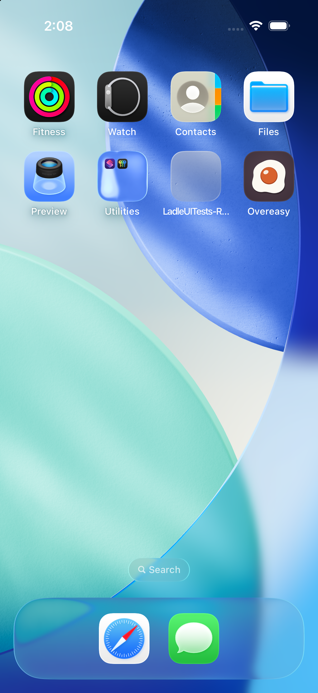
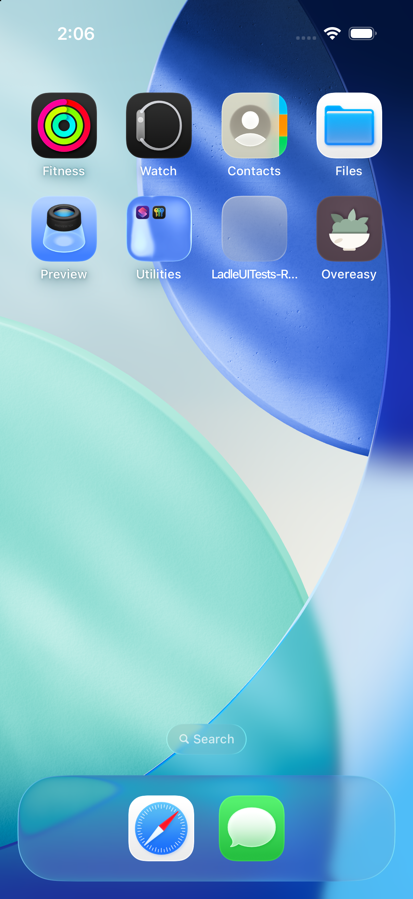

# App icons, chosen in Profile

Updated: September 10, 2026

Branch: `codex/liquid-glass-icons`

Original issue: [#92](https://github.com/chetangoel01/overeasy/issues/92)

## Purpose and approved artwork

Every cook can choose the app icon they want to carry on their home screen.
The original egg remains the default. On September 10, Chetan approved all six
new ImageGen food icons as options: avocado, tomato, strawberry, cherries,
carrot, and mushroom. The bowl was explicitly rejected and is replaced.
These are the generated images approved in the conversation, not the older
code-drawn candidates in draft [PR #114](https://github.com/chetangoel01/overeasy/pull/114).

| Option | Native icon name | Picker image |
| --- | --- | --- |
| Egg | `AppIcon` | `OvereasyMark` |
| Avocado | `AppIcon-PlantBased` | `OvereasyMarkPlantBased` |
| Tomato | `AppIcon-Tomato` | `OvereasyMarkTomato` |
| Strawberry | `AppIcon-Strawberry` | `OvereasyMarkStrawberry` |
| Cherries | `AppIcon-Cherries` | `OvereasyMarkCherries` |
| Carrot | `AppIcon-Carrot` | `OvereasyMarkCarrot` |
| Mushroom | `AppIcon-Mushroom` | `OvereasyMarkMushroom` |

The six originals were generated on September 8 with the built-in ImageGen
tool. The [generation prompts](../../Tools/app-icon/generation-prompts.json) record
the source images and exact prompt assembly. Avocado and tomato used the egg as a style reference; the other four
used the approved avocado and tomato. All share a plum ground, a large food
silhouette, a small cream highlight, and restrained shadows. No faces, text,
ornamental borders, or rounded corners are baked into the files.

The approved 1254 × 1254 RGB PNGs were downsampled to 1024 × 1024 with `sips`.
Those original exports are preserved byte-for-byte in
[`Tools/app-icon/originals`](../../Tools/app-icon/originals). They are source
artwork, not the installed icons. The first release used flattened PNGs; the
current version separates the original food shapes from the plum background
so iOS can apply its native Liquid Glass materials.

## What the cook sees

- Profile has an **App icon** section below Appearance. A grid shows all
  seven named options, with a ring and checkmark on the installed icon.
- Columns adapt to the screen width and Dynamic Type. Icons stay 60 points
  square, labels use the app's footnote style, and each choice has a named
  VoiceOver button with a selected value.
- Every icon is available to everyone, regardless of diet. Tapping switches
  the home-screen icon through the existing iOS API. iOS owns its confirmation
  notice and persists the selection across launches.
- The app reads the actual installed name after a switch. A refused switch
  leaves the picker showing the previous icon.

## Existing bowl selections become avocado

The avocado deliberately keeps the installed alternate name
`AppIcon-PlantBased` and its drawable twin `OvereasyMarkPlantBased`. A cook
who already selected the temporary bowl stays on the alternate when updating,
with the approved avocado artwork replacing the placeholder. The Swift case
and visible label are now `avocado` and **Avocado**. This requires no migration
flag or extra persisted setting.

## The one-time diet offer

A cook on the egg who first chooses a vegetarian or vegan diet is asked
**Prefer an icon without the egg?**, with **Use avocado** and **Keep the egg**.
The message identifies the avocado and points to Profile for all other choices.
Accepting selects avocado. Nothing changes before the cook accepts.

The existing gate remains in `AppIconStore.offerIfNeeded(for:)`:

| Condition | Reason |
| --- | --- |
| iOS supports alternate icons | Unsupported devices have no picker or offer |
| The installed icon is egg | Any alternate already satisfies the choice |
| Diet includes vegetarian or vegan | Other diets do not trigger the offer |
| `ladle.appearance.plant-based-icon-offered` is false | The offer appears once |

The flag is written when the question is shown, not when answered. Choosing
another icon does not reset it. `-reset-library-preferences` writes it false;
the installed icon belongs to iOS and is not reset. Profile presents the offer
when diet changes there; Library presents it after onboarding and stands down
while Profile is open. No second presentation flow was introduced.

## Asset declarations and affected components

`project.yml` names the primary `AppIcon` and lists all six alternates under
`ASSETCATALOG_COMPILER_ALTERNATE_APPICON_NAMES`. XcodeGen updates the project,
and the asset compiler synthesizes `CFBundleAlternateIcons` into the built
Info.plist. The hand-written plist needs no icon entries. The Share Extension
has no home-screen icon of its own.

Each icon is a native `.icon` package in
[`Ladle/Resources/AppIcons`](../../Ladle/Resources/AppIcons), with a separate
background and two or three transparent foreground groups. Xcode compiles
these into the asset catalog, including Default, Dark, Clear Light, Clear
Dark, Tinted Light, and Tinted Dark appearances. The minimum OS remains iOS 26.
Existing installed names are unchanged, so selections survive an update.

The picker and onboarding use ordinary `imageset` assets rendered from these
same packages by Apple's `ictool`. Default and Dark previews are 512 pixels,
covering the largest 96-point in-app mark on a 3x display. The Home Screen
uses the compiled native layers, including for alternates.

### Rebuild the artwork through code

From the repository root on a Mac with Xcode 26 and Icon Composer installed:

```sh
uv run Tools/app-icon/build_icons.py
# Optional: inspect all six native appearances for every icon.
uv run Tools/app-icon/build_icons.py --gallery .artifacts/glass-gallery
xcodegen generate
```

The script pins its Python dependencies through `uv`, extracts color regions
from the approved originals, and preserves their silhouettes and placement.
It removes baked lighting, separates meaningful food parts, and writes flat
color layers with antialiased transparent edges. Small seed, groove, and leaf
details remain. Each foreground PNG is 1024 pixels; groups are stored front to
back as Icon Composer requires. Native materials supply highlights, shadows,
and appearance adaptation. The script's masks are specific to this seven-icon
family; this is not a general image tracing framework.

Generated packages and previews are checked in. Normal app builds do not run
Python or need an image-generation service. Icon Composer is optional for
interactive editing and inspection. No regenerated conversion prototypes are
shipped. Chetan explicitly requested this code-based conversion workflow.

Apple references: [Icon Composer](https://developer.apple.com/icon-composer/),
[creating icons](https://developer.apple.com/documentation/xcode/creating-your-app-icon-using-icon-composer),
and [alternate icon configuration](https://developer.apple.com/documentation/xcode/configuring-your-app-to-use-alternate-app-icons).

- `Ladle/Design/AppIconStore.swift`: seven choices, stable installed avocado
  name, image names, and explicit avocado offer text.
- `Ladle/Account/AccountSheet.swift`: adaptive named icon grid.
- `Ladle/Resources/AppIcons`: seven native layered icon packages.
- `Ladle/Resources/Assets.xcassets`: native Default and Dark picker previews.
- `Tools/app-icon/build_icons.py`, `originals`, and `generation-prompts.json`: repeatable conversion and original artwork provenance.
- `project.yml`, `Ladle.xcodeproj`: six alternate icon declarations.
- `AppIconStoreTests`: complete selection/restoration mapping and offer gate.
- `ProjectSmokeTests`: compiled declarations, drawable previews, separate
  backgrounds, visible 1024-pixel foreground layers, and transparent exteriors.
- `ProfileSheetUITests`: actual switching through all seven choices, relaunch
  persistence, reachable tap targets, and restoration of the original icon.

## September 10 Liquid Glass verification

The new layer contract failed before native packages existed, in
`/tmp/overeasy-glass-red-retry.xcresult`. XCTest reported the missing
`AppIcon.icon/icon.json`; the runner was subsequently stopped after stalling
while collecting failure diagnostics. Later runs disable that optional
collection. The first conversion run passed all seven real icon switches and
relaunch persistence, but its 32-pixel alpha sample missed the small strawberry
seeds. The check now inspects original-resolution pixels.

The [native appearance matrix](captures/2026-09-10-liquid-glass-icons/all-appearances.png)
shows all seven icons in all six appearances. These are Apple's renderer
exports, not screenshots of the Home Screen. The carrot grooves, cherry
boundary, and mushroom underside were checked and refined against the original
artwork. Final verification:

- **37 app tests and the real seven-icon switching UI test passed** on
  iPhone 17 / iOS 26.5: `/tmp/overeasy-glass-final.xcresult`.
- The seven-icon switching/relaunch test also passed on **iPhone 13 mini**,
  in dark mode at the existing accessibility text size:
  `/tmp/overeasy-glass-small.xcresult`. The
  [captured picker](captures/2026-09-10-liquid-glass-icons/profile-small-dark.png)
  shows all seven native Dark previews with readable labels. Both dedicated
  test simulators were left on the original egg and shut down.
- The **full Release archive with Share Extension and App Store export passed**
  for **1.0 (20260910.2)**. Both bundles use the matching build number; all six
  alternate names are present. Deep signature verification passed.
- `assetutil` inspection of the exported IPA confirms an `IconImageStack` for
  every option in each of the three compiled appearance families, plus native
  foreground groups. This checks the shipping binary, not just source files.
- The appearance matrix covers all six native renderer appearances. Actual
  Home Screen captures are listed below; Clear and Tinted are renderer checks.
- The small simulator initially displayed placeholder icons for several Apple
  apps and Overeasy. Restarting that dedicated simulator resolved its cache;
  the installed egg then rendered normally.
- Original artwork checksums, documentation links, and `git diff --check` pass.
  No backend or shared-domain changes require their suites.

[Installed egg, Default appearance](captures/2026-09-10-liquid-glass-icons/home-egg-default.png)
was captured on iPhone 13 mini / iOS 26.5 after the simulator restart.

[PR #138](https://github.com/chetangoel01/overeasy/pull/138) is merged. Build
**1.0 (20260910.2)** uploaded successfully at **22:37:59 UTC**; Apple reported
that processing had started. See the
[release record](2026-09-02-testflight-release.md#september-10-native-liquid-glass-icons).

The archive and export are preserved under `build/release-liquid-glass`,
separate from the previously uploaded flattened-icon build in `build/release`.
The new exported IPA is 52,940,029 bytes (previously 38,161,551); the native
appearance resources account for additional packaging. Picker exports were
reduced to 512 pixels to avoid unnecessary source image weight.

## Historical verification: September 10, flattened icon options

The selection test was added before production changes. It failed on the old
`Egg, Plant-based` list and each missing approved icon. The first run is
recorded in `/tmp/overeasy-icons-red.xcresult` (one test, seven expected failures).

- **37 app tests and 9 Profile UI tests passed** in
  `/tmp/overeasy-icons-green.xcresult` on iPhone 17 / iOS 26.5. This includes
  actual switching through every icon, persistence after relaunch, and return
  to the original selection.
- The icon-switching and onboarding-diet tests both passed again in dark mode
  with accessibility-medium text on **iPhone 17 and iPhone 13 mini**. Results:
  `/tmp/overeasy-icons-accessibility.xcresult` and
  `/tmp/overeasy-icons-small-accessibility-retry.xcresult`. The first small-phone
  run was stopped during simulator startup, before any test ran; restarting
  the simulator allowed its initial data migration to finish and the retry
  passed without code changes.
- The full **Release archive with Share Extension passed**, version
  **1.0 (20260910.1)**. Both bundles have matching build numbers. The archive
  contains all six alternate declarations and the configured Google sign-in
  identifiers.
- The **App Store distribution export passed**, signed as Apple Distribution
  for team `P48VDW72LU`; deep signature verification passed. Initial export
  reported `No Accounts`; Chetan signed in to Xcode and the retry succeeded.
- `git diff --check` and local documentation links passed. Existing unrelated
  warnings remain for an unused `WatchView.viewport` and skipped App Intents
  metadata extraction.

Screenshots were inspected at normal and accessibility text sizes. Every choice
is reachable and at least 44 points in both dimensions, with readable labels
and no horizontal overflow. The existing simulator's light/large settings and
original icon were restored; the new small-phone simulator was shut down.

| Screenshot | Coverage |
| --- | --- |
| [Profile, light](captures/2026-09-10-icon-options/profile-light.png) | All seven options and selected state |
| [Profile, dark accessibility](captures/2026-09-10-icon-options/profile-dark-accessibility.png) | Two-column layout and larger labels |
| [iPhone 13 mini, dark accessibility](captures/2026-09-10-icon-options/profile-small-dark-accessibility.png) | Smaller screen with all choices reachable |

The signed archive is at `build/release/Ladle.xcarchive`; the exported package
is `build/release/export/Ladle.ipa` in the icon-options checkout. Distribution status is recorded in the
[September 10 release entry](2026-09-02-testflight-release.md#september-10-icon-options).

## Historical verification: September 8, two-icon placeholder

### The tests, red first

`ProjectSmokeTests.testPlantBasedAlternateIconIsDeclaredInTheBundle` before
the declaration existed:

```
ProjectSmokeTests.swift:241: error: … XCTUnwrap failed: expected non-nil value of type "Dictionary<String, Any>"
```

and after the set was added but before the tiles had anything to draw:

```
ProjectSmokeTests.swift:254: error: … XCTAssertNotNil failed - The egg tile has nothing to draw
ProjectSmokeTests.swift:258: error: … XCTAssertNotNil failed - The plant-based tile has nothing to draw
```

`AppIconStoreTests` against a store whose methods were still empty — 12 of
13 red, for the right reasons:

```
AppIconStoreTests.swift:22:  … XCTAssertEqual failed: ("[]") is not equal to ("[Optional("AppIcon-PlantBased")]")
AppIconStoreTests.swift:110: … XCTAssertEqual failed: ("false") is not equal to ("true") - vegetarian was handled the wrong way
AppIconStoreTests.swift:220: … XCTAssertEqual failed: ("Optional(true)") is not equal to ("Optional(false)") - The flag has to be written false, not taken away
```

### Green

```
xcodebuild test -scheme LadleAllTests \
  -destination 'id=1653956E-76A4-46CB-ADF2-833DAA8CBA76'
```

The whole scheme, not only the suites this touches — the picker changed the
shape of the Profile form, and the offer now interrupts two flows that were
about the diet.

- LadleTests: `Executed 543 tests, with 1 test skipped and 0 failures (0 unexpected) in 7.586 (7.854) seconds`
- LadleUITests: `Executed 36 tests, with 0 failures (0 unexpected) in 600.577 (600.628) seconds`
- `** TEST SUCCEEDED **`

One existing UI test went red on the way and was fixed rather than
loosened: `testProfileHasNoExplanatoryFooters` asserted that the Privacy
and Account footers were absent, and the icon picker pushed both sections
below the fold, where a `Form` renders nothing at all. It scrolls to them
now.

The two diet UI tests that now walk through the offer were run on their own
first — `ProfileSheetUITests.testTheDietIsChangedBesideTheNameAndTheLibraryFollows`
and `RecipesFilterMenuUITests.testADietChosenDuringOnboardingIsAlreadyOnEveryTab`:
`Executed 2 tests, with 0 failures (0 unexpected) in 35.095 seconds`.

`xcodebuild build -scheme Ladle` (app plus share extension): `** BUILD SUCCEEDED **`.

`swift test --package-path Packages/LadleCore` was not run: the package is
untouched.

### On the simulator

`Ladle-icon-92` (`1653956E-76A4-46CB-ADF2-833DAA8CBA76`, iPhone 17 Pro,
iOS 26.5), created for this run and deleted after it.

| | |
|---|---|
| [offer.png](captures/2026-09-08-plant-based-icon/offer.png) | the question, once, after answering "vegetarian" at onboarding |
| [picker.png](captures/2026-09-08-plant-based-icon/picker.png) | the picker in Profile, under Appearance, with the plant-based icon installed |

The home screen, before and after the switch — the same device, the same
install, photographed with `xcrun simctl io <udid> screenshot` after the app
was terminated:

| Egg | Plant-based |
| --- | --- |
|  |  |

## Two traps for whoever works on this next

**The icon-change notice belongs to SpringBoard, and it blocks the app.**
`XCUIApplication().alerts` does not see it; `XCUIApplication(bundleIdentifier:
"com.apple.springboard").alerts` does. While it is up the app's main thread
is busy, so a UI test that leaves it there will fail its next tap with
"process main thread busy for 30.0s" — which is exactly how accepting the
offer failed in a first capture run. It arrives on its own schedule, so a
test dismisses it when it is there and does not wait for it when it is not;
what proves the switch is the picker's selection, read back from iOS.

**The installed icon outlives the app's container.** `-reset-library-preferences`
cannot put it back — it is not a preference of ours — and neither does
reinstalling from a test run. A simulator left on the plant-based icon makes
the two diet UI tests fail, because a cook already carrying an alternate is not
offered it: `xcrun simctl uninstall <udid> com.ladle.ios` is the reset. The
picker's own UI test therefore reads which icon it started on and puts that
one back.
