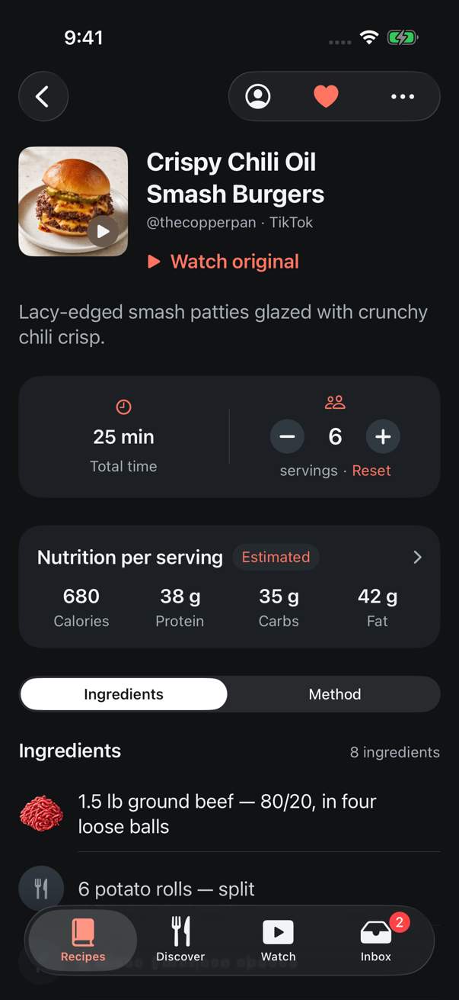
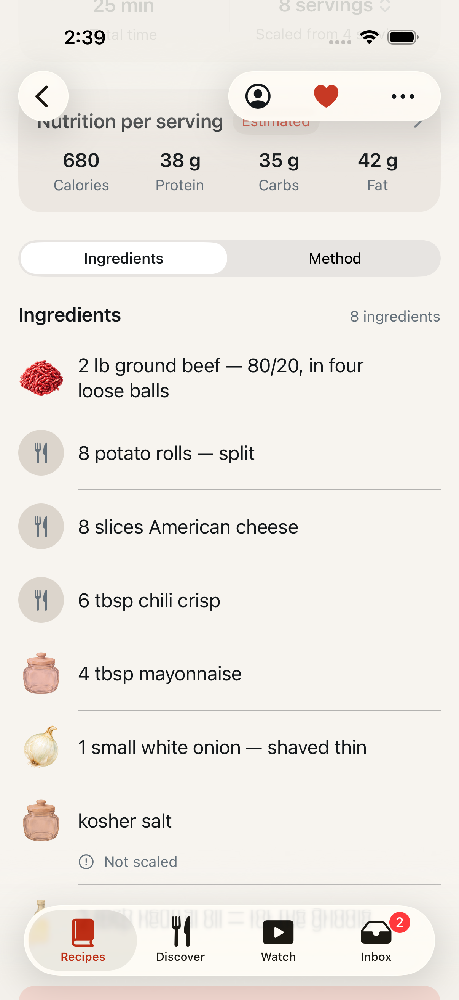

# Cook for a different number of people

Date: September 8, 2026
Issue: [#100](https://github.com/chetangoel01/recipe-app/issues/100)
Supersedes: [#115](https://github.com/chetangoel01/recipe-app/pull/115), which
was built on the closed #103 and is rebased here onto the strict ingredient
model from [#131](https://github.com/chetangoel01/recipe-app/pull/131).
Status: **built, unit- and UI-tested on a simulator created for the task.**
Revised: September 17, 2026, for
[#148](https://github.com/chetangoel01/overeasy/issues/148) — the servings
sheet is gone and the control is inline on the band. What follows describes
the control as it is now; the model, the scaled rows and Cook mode are
unchanged. The layout record for that change is
[recipe details layout](2026-09-17-recipe-details-layout.md).

## Purpose

A TestFlight tester asked to "edit the recipe size". The servings field in the
editor already existed; what did not is **scaling**. Changing that number moved
the nutrition — `Nutrition.perServing` divides by the serving basis — and left
every ingredient exactly as imported, so the recipe became internally
inconsistent rather than resized.

The decisions on the issue (2026-09-07) settled the reading: a cook-time
multiplier, held in view state, that nothing writes and nothing syncs.

## What the cook sees

- **The yield is the control, in place.** The right-hand half of the metadata
  band — the "4" a cook is looking at when they think "I need six" — sits
  between a round minus and plus, with the word "servings" beneath. One press
  steps the count; there is no sheet to open and no Done. The range is 1 to
  `RecipeContractLimits.maximumServings`, and each button disables itself at
  its end.
- **A scaled band says so.** The line under the count becomes
  "servings · Reset", and Reset returns to the recipe as written. The line
  keeps its height, so nothing moves when Reset arrives. VoiceOver reads the
  control as "Servings, 6 servings, scaled from 4 servings", so the band never
  claims the recipe yields something it does not.
- **Every row with an amount is recomputed**, `normalizedQuantity × chosen ÷
  stored`, rendered through `Ingredient.cookingDetailText(scaledBy:)` — the
  seam #131 left for exactly this. "1 lb ground beef" at eight servings reads
  "2 lb ground beef".
- **A row with no amount reads as its name** and carries a quiet "Not scaled"
  marker, on the same origin as the uncertainty note the list already shows.
  Since #131 that is one honest case: an ingredient flagged `isToTaste`, the
  salt a cook seasons by eye.
- **Cook mode cooks the scaled amounts**, and says "Scaled to 8 servings"
  under the title, because the control is not on that screen.
- **Closing the recipe is the undo**, and Reset is the quicker one. There is
  no save, no confirmation, and nothing the control does writes to the recipe.
- **Nutrition does not move.** It is already stated per serving, which is true
  at any count.

## Captures

The band, scaled from four to six: the count between its buttons, and the way
back beside the word.

The list at eight servings. Every amount has doubled — and the kosher salt,
which has no amount to double, reads as its name and says so.

The sheet this replaced, for the record:
[servings-stepper.png](captures/2026-09-08-recipe-scaling/servings-stepper.png),
[scaled-band.png](captures/2026-09-08-recipe-scaling/scaled-band.png).

## Decisions

- **State lives in `RecipeDetailView`, not in a detail view model — there is
  no such object.** The issue assumed one and assumed Cook mode shared it.
  In fact `RecipeDetailView` holds `@State`, and `CookingViewModel` is a
  separate object constructed at "Start Cooking" from `displayedRecipe`. So
  the multiplier reaches Cook mode by being passed at construction:
  `CookingViewModel(recipe:scaling:)`, stored as a `let`, read by
  `FullRecipeView` through `viewModel.multiplier`. It is a snapshot rather
  than a shared object because the control is not on the cooking screen and
  the page underneath is covered while it is open. `WatchView`, which also
  starts a session, passes nothing and cooks the recipe as written.
- **`multiplier` is `nil` until a cook picks a different number**, and that is
  no longer about the arithmetic. Since #131 a row is a number, a unit and a
  name, so a factor of one renders it identically to no factor at all. What
  the optional carries is whether the page should *say* it is scaled: the
  band's "Scaled from", the line in Cook mode, and the marker on the row a
  multiplier could not reach. The views multiply by `scaledBy ?? 1`.
- **"Cannot be scaled" follows the render rule rather than restating it.**
  `Ingredient.isScalable` is `amountText != nil`, so the marker lands on
  exactly the rows that print no amount: an ingredient flagged `isToTaste`,
  and — for a library stored before #131 guaranteed the split — a row holding
  a unit and no number.
- **Plain decimals, two places, no unit cleverness.** Twice 1½ tsp is "3 tsp",
  not "1 tbsp". A third of a cup is "0.33 cup". Converting units is a second
  feature with its own failure modes, and the issue explicitly started here.
  The precision is `measuredAmount`'s, so a scaled row and an unscaled one
  are rounded by the same rule.
- **The spoken "scaled from" phrase is built from the number, not from
  `ladleYieldText`.** That property hedges an uncertain yield with "About" and
  replaces a lone serving with "Yield unknown", and "scaled from Yield
  unknown" is not a sentence. `RecipeScaling.baseYieldText` says "4 servings"
  plainly. The control is still offered on a recipe whose yield is flagged
  uncertain: the stored number is the basis the rest of the app already
  divides nutrition by, so scaling from it is no more of a guess than the
  nutrition panel already is. At the recipe's own count the word under it
  carries the hedge — "servings, estimated", or "Yield unknown" — and the
  reason is in the estimates note; once scaled, the count is the cook's own
  choice and the word is plain.
- **`servings <= 0` withholds the control** rather than showing one that
  cannot mean anything — the ratio would divide by zero. The band falls back
  to the read-only yield it renders today.
- **The "Not scaled" marker is quieter than the uncertainty note beside it.**
  Both are a `Label` with `exclamationmark.circle` on the row's origin, but
  the marker uses `Label.secondary` where uncertainty uses the accent. An
  unquantified line is an aside about one row, not a warning about the recipe.
- **The scaled state is announced once, when the count settles.** The
  stepper is one adjustable element and reads its own value on every step, so
  announcing on each change made a cook stepping four to eight hear each count
  twice. The announcement waits a second after the last change — "Scaled to 8
  servings. Ingredient amounts updated.", or "Back to the recipe as written."
  — and a newer change replaces a pending one. The element also carries a
  label, value and hint, so a VoiceOver user who missed it can read the state
  off the control.
- **An edit re-bases the scaling.** `applyChangedRecipe` rebuilds it from the
  recipe's new `servings`, because a ratio against a yield the recipe no
  longer claims is meaningless.
- **The reimport sheet's band stays read-only.** It draws the same component
  over a candidate the cook is comparing, not cooking from, so it passes no
  binding and its yield is the plain fact it is today.
- **The demo library's smash burgers now season with salt rather than with a
  teaspoon of it.** `PreviewFixtures` gives that row no amount, which is what
  the step already said — "season with salt" — and what the backend sends for
  an ingredient a creator never quantified. #131 had already given the demo
  library unquantified rows (ricotta toast's flaky salt and black pepper,
  udon's chili flakes), so the marker was reachable; what it was not was
  *asserted*, because none of those recipes is the one the scaling UI test
  drives. Now the marker and the doubled beef row are on the same screen in
  the same flow. #115 listed that as its one untested visual.

### Left alone, on purpose

- **Nutrition.** `RecipeNutritionSummary` and `NutritionView` are both headed
  "per serving" and show no recipe total, so there is nothing on the page for a
  multiplier to change. The issue's rule — a total would become
  `perServing × chosen` — has no call site to apply to yet.
- **Focus mode** lists the ingredient *names* for the current step and no
  amounts, so it has nothing to scale.
- **The editor.** Its Servings field keeps its meaning: the yield the recipe
  claims. Scaling never writes to it.
- **Timers and method text** are not scaled. Doubling a batch does not double a
  bake, and no step's prose is rewritten.

## Affected files

- `Ladle/RecipeDetail/RecipeScaling.swift` — new. The value: base, chosen,
  availability, clamped range, multiplier, yield phrases.
- `Ladle/Design/RecipePresentation.swift` — `Ingredient.isScalable`. The
  scaling seam, `cookingDetailText(scaledBy:)`, is already there from #131.
- `Ladle/RecipeDetail/RecipeMetadataBand.swift` — the inline stepper, the
  label line with Reset, and the settled VoiceOver announcement.
  (`ServingsSheet` lived here until #148.)
- `Ladle/Design/LadleComponents.swift` — `LadleIconButton` gained `diameter`
  and the `onCard` tone for the stepper's buttons.
- `Ladle/RecipeDetail/IngredientList.swift` — `scaledBy` and the "Not scaled"
  marker.
- `Ladle/RecipeDetail/RecipeDetailView.swift` — the `@State`, re-based on an
  edit, passed to the band, the list and the cooking session.
- `Ladle/Cooking/CookingViewModel.swift` — `scaling`, `multiplier`,
  `scaledYieldText`.
- `Ladle/Cooking/FullRecipeView.swift` — scaled checklist rows, the marker, and
  the line under the title.
- `Ladle/Data/PreviewFixtures.swift` — the smash burgers' salt has no amount.
- Tests: `LadleTests/RecipeScalingTests.swift` (new),
  `LadleTests/IngredientRowTextTests.swift` (scaled rows and `isScalable`),
  `LadleTests/CookingViewModelTests.swift` (the snapshot),
  `LadleUITests/RecipeScalingUITests.swift` (new).

## Verification

On a simulator created for this task and deleted after
(`Ladle-Scaling-Rebase`, iPhone 17 Pro, iOS 26.5), with a private
`-derivedDataPath`.

- **Red first, on the pre-rebase branch.** `RecipeScaling` and the scaled row
  were written as shells — the type and the method existed, with the
  *unscaled* behaviour — so the red was assertions rather than a compile
  break: "Executed 23 tests, with 11 failures (0 unexpected)". That run is
  #115's, before this rebase; what is re-run here is the green, against the
  strict ingredient model rather than against #103.
- **Whole unit suite,** `-only-testing:LadleTests` — "Executed 563 tests,
  with 1 test skipped and 0 failures (0 unexpected)", "** TEST SUCCEEDED **".
  That is main's 545 plus the 18 this change adds, and it is the run that
  checks the demo fixture edit moved no other rendered string.
- **`swift test --package-path Packages/LadleCore`** — "Test run with 89 tests
  in 11 suites passed".
- **UI,** `-only-testing:LadleUITests/RecipeScalingUITests
  -only-testing:LadleUITests/StateScenarioUITests` — "Executed 15 tests, with
  0 failures (0 unexpected)", "** TEST SUCCEEDED **".
  `StateScenarioUITests` is worth running rather than reasoning about: it
  drives card → detail → Start Cooking → Focus mode, which is the flow this
  change rebuilt.
- **What the UI test asserts, since #148.** On the seeded demo library it
  presses the band's plus four times, 4 → 8, with no sheet in between, and
  asserts the ground-beef row moves from "1 lb" to "2 lb", that the unscaled
  row is gone, that the control's value is "8 servings, scaled from 4
  servings", and that the salt row — which reads "kosher salt" at every count
  — carries the "Not scaled" marker afterwards and not before. It then presses
  Reset and asserts the "1 lb" row and the plain "4 servings" are back and
  Reset has left. The stepper is one adjustable element to VoiceOver, so the
  test presses the control's trailing end, where a finger presses the plus.
  The counts above are the original run's; #148's own runs are in the
  [layout record](2026-09-17-recipe-details-layout.md).

### Notes from the rebase

- The four conflicts resolved to main in every case: `RecipePresentation.swift`
  keeps #131's one formatter and gains only `isScalable`; `PreviewFixtures` and
  `DemoImportService` keep #131's writers, and #115's `demoNormalizedQuantity`
  helper is deleted, because main now sets `normalizedQuantity` on every demo
  row and flags the ones with no amount; `project.pbxproj` is main's,
  regenerated with `xcodegen generate` for the three new files.
- Three of #115's unit tests went with the conflict rather than through it.
  `testNoMultiplierLeavesTheRowVerbatim`, `testAScaledRowIsRenderedFromTheSplit`
  and `testARowWithoutASplitIsUntouchedByScaling` all asserted the old
  verbatim-phrase rule or duplicate a test #131 already wrote
  (`testScalingMultipliesTheAmountAndKeepsTheUnit`,
  `testScalingLeavesAnIngredientWithNoQuantityAlone`). What replaces them is
  `testOnlyARowWithAnAmountIsScalable` and `testARowWithNoNumberIsNotScalable`,
  which pin the marker to the render rule.

### Large type

Captured with #148 rather than reasoned about: at accessibility sizes the band
stacks, the stepper keeps its 44-point targets, and "servings · Reset" fits
the full-width cell. `HIGRegressionUITests
.testServingsResetIsReachableAtLargestTextSize` steps once at AX5 and asserts
Reset is hittable and inside the screen. The sheet's own large-type worry —
Reset below the detent — went with the sheet.
