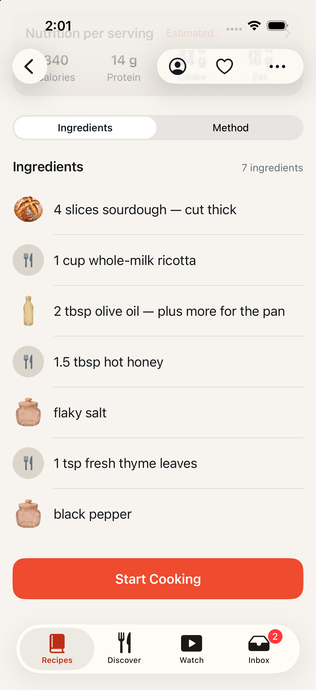
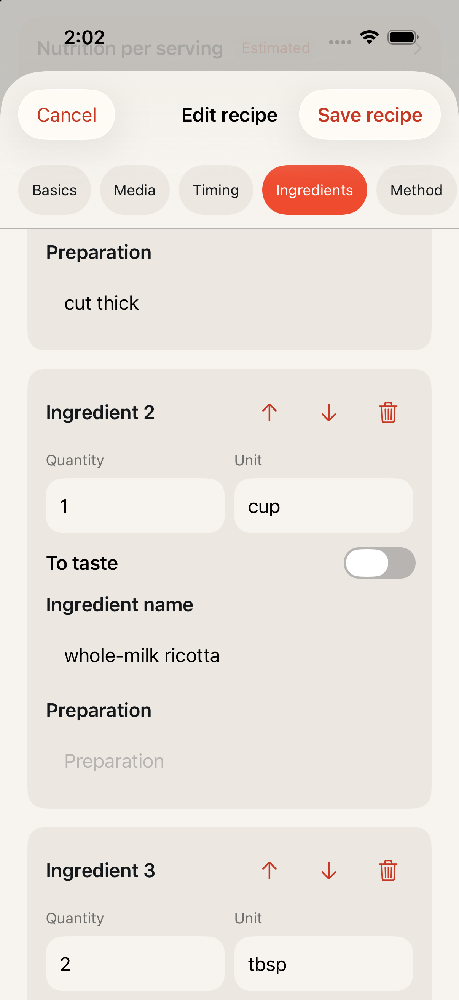
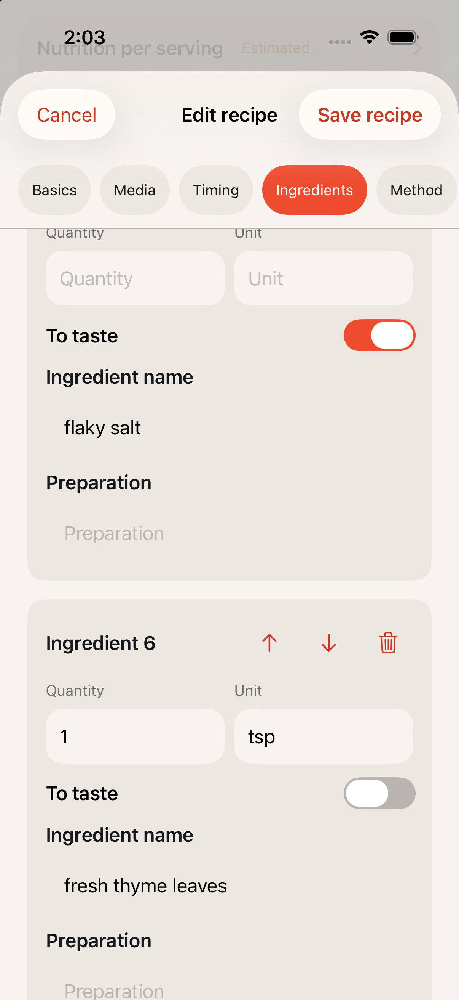

# An ingredient is a quantity, a unit and a name

Date: September 8, 2026
Issue: [#90](https://github.com/chetangoel01/overeasy/issues/90)
Status: **built and verified on `feat/strict-ingredient-model`, red-green on
a simulator and against the local stack. Not deployed.**

## What this is

A TestFlight tester read a row saying "100 g g flour". PR #103 fixed the
display — print the creator's phrase, never the unit beside it — and was
closed on review: the two fields still both described the amount, and every
surface had to keep choosing between them.

The decision instead is structural. **An ingredient is a quantity (number),
a unit and a name.** Rows render from those and from nothing else. The
creator's phrase (`quantityText`) is demoted to a note that nothing prints.
The one honest exception is an ingredient with no amount at all — "salt to
taste", or a caption that named a food and no quantity — which carries
`isToTaste` and reads as its name.

## The contract

| Field | Before | Now |
| --- | --- | --- |
| `normalizedQuantity` | optional; the model's split of the phrase, often absent | required whenever the creator gave an amount |
| `unit` | optional, printed beside the phrase | optional (a count has none), printed after the number |
| `isToTaste` | on `ExtractedIngredient` only, discarded at the door | on `IngredientDTO`, the column, and `LadleCore.Ingredient` |
| `quantityText` | one of two ways to say the amount | a note; no row prints it, and the editor has no field for it |

`IngredientDTO.enforce_quantity` (`Backend/ladle/contracts/recipes.py`) is
where the guarantee lives, because every writer passes through the type:
extraction instantiating a template (`template_clone.py`), the repository
reading a row back and writing it again, and a cook's edit arriving as a
PUT. An amount stated only in the phrase is split out of it
(`Backend/ladle/contracts/quantities.py`, which also holds the fraction
notation extraction has always accepted); where nothing parses, the row is
flagged as having no quantity instead of keeping a phantom one.

The templates the nutrition normalizer reads are deliberately left alone.
Flagging an unquantified ingredient there would drop it out of the calorie
total, and `normalization.py` resets the flag through `model_copy` anyway.
The consequence to know: **`isToTaste` on the wire means "no amount to
render", not literally "to taste"** — an unquantified "chicken breast" reads
as its name and still counts in nutrition, because the template counted it.

Migration **0026** adds `ingredients.is_to_taste` (not null, default false).
`PROMPT_VERSION` moves to `recipe-2026-09-08-v16`: the prompt now says the
split is required whenever an amount exists, gives the low end of a range,
and never repeats the ingredient's own name as its unit.

## What the backfill would change

`ladle.admin.backfill_ingredient_quantities` walks the library, compares
what the reader derives against what each row holds, and writes the
difference through the path an edit takes, so the revision bumps and devices
receive it. Dry run by default; `--apply` writes.

Against the local stack (81 recipes, 905 ingredients):

```
recipe                          ingredient                phrase                stored  becomes      action
------------------------------  ------------------------  --------------------  ------  -----------  ---------------------
Creamy Garlic-Lemon Chickpeas   shallots                  3-4                   —       3            split from the phrase
Creamy Garlic-Lemon Chickpeas   red pepper flakes         1-3 tbsp (4-12g)      —       1 tbsp       split from the phrase
Creamy Garlic-Lemon Chickpeas   fresh cracked pepper      —                     —       no quantity  no quantity to render
CHICKEN FUSILLI PASTA           Chicken                   200-300 grams         —       200          split from the phrase
Chicken Piccata Pasta Recipe    reserved pasta water      1/2 reserved pasta w  —       0.5          split from the phrase
One Pan Caramelized Onion Past  yellow onions             5 small               5       5 small      unit from the phrase

287 ingredients in 63 recipes, 287 to write (dry run).
```

49 rows recover a number from the phrase, 2 recover only a unit, and 236 are
ingredients whose source gave no amount at all. Two behaviours worth seeing
in that sample: a range yields its low end and keeps the range in the note,
and "1/2 reserved pasta water" lends no unit because the word is the
ingredient's own name.

## Captures

The ingredient list, rendered from the split alone. "flaky salt" and "black
pepper" are the demo library's two to-taste rows, and read as their names.



The editor: Quantity is a number on a decimal pad, Unit is beside it, and
there is no field for the phrase.



"To taste" disables both fields and saves them empty. Saving requires a
quantity for every other ingredient.



## How verified

Docker up throughout (the backend suite needs it; `docker info` reports
Engine 29.7.2).

- Backend, narrow first: `uv run pytest tests/unit/contracts -n0` →
  `37 passed`, red beforehand at `9 failed, 3 passed`.
- Write points: `tests/unit/recipes/test_template_clone.py` → `8 passed`,
  `tests/integration/recipes/test_recipe_service.py` → `6 passed`,
  `tests/api/test_recipes.py` → `3 passed`,
  `tests/integration/admin/test_backfill_ingredient_quantities.py` →
  `3 passed`.
- Whole backend suite `uv run pytest` → `1090 passed`. `ruff format --check`
  and `ruff check` clean; `mypy --strict ladle` → no issues in 133 files.
- `swift test --package-path Packages/LadleCore` → 89 tests passed.
- iOS, red first with the display rule and the quantity validation weakened:
  `IngredientRowTextTests` + `RecipeEditorViewModelTests` →
  "Executed 36 tests, with 7 failures", including
  `("2-3 16oz cans tomatoes") is not equal to ("2 cans tomatoes")`. Green
  after → "Executed 36 tests, with 0 failures".
- `-only-testing:LadleTests` → "Executed 545 tests, with 1 test skipped and
  0 failures". `-only-testing:LadleUITests` (including
  `StateScenarioUITests`) → "Executed 35 tests, with 0 failures".
- `xcodebuild build -scheme Ladle` → `** BUILD SUCCEEDED **`.

On a simulator created for this task and deleted after
(`Ladle-Strict-Ingredient`, iPhone 17 Pro, iOS 26.5), because the shared
iOS 26.5 device is contended.

## Deployment order

The app always sends `isToTaste` and `IngredientDTO` forbids unknown fields,
so a build of this app against the current production backend would fail
every recipe save. **Backend first, then the app**, then
`python -m ladle.admin.backfill_ingredient_quantities --apply` over the ~40
production recipes.

## Left open

- The backfill has been dry-run against the local stack only. Production is
  a separate, deliberate step, after the backend deploys.
- The local dev database is now at 0026, while the containers still running
  from the old image pin `expected_revision="0025"` and will report unready
  until the stack is rebuilt from this branch (or from main after merge):
  `docker compose -p backend up -d --build api worker beat`.
- `scripts/refresh_recipe_nutrition.py` is the one caller of
  `RecipeTemplate.from_recipe`, and it re-runs normalization. An ingredient
  the contract has flagged as having no amount now reaches the normalizer
  flagged, so a refresh may leave it out of the recalculated total where it
  previously carried a guessed weight. That is the honest reading of "this
  ingredient has no amount", the script is dry-run by default, and it prints
  the before and after calories for every recipe — but a refresh run should
  expect some totals to come back lower.
- The editor carries `quantityText` untouched even when the cook changes the
  quantity or the unit, so the note can end up reading "2 cups" beside a row
  that now says 3. Round-tripping the note exactly was the requirement; a
  stale note prints nowhere, and rewriting the creator's words to match an
  edit would be worse.
- `RecipeContractLimits.quantityCharacters` is now unread by the app: the
  phrase is never typed, only carried. It stays as a statement of what the
  wire allows.
