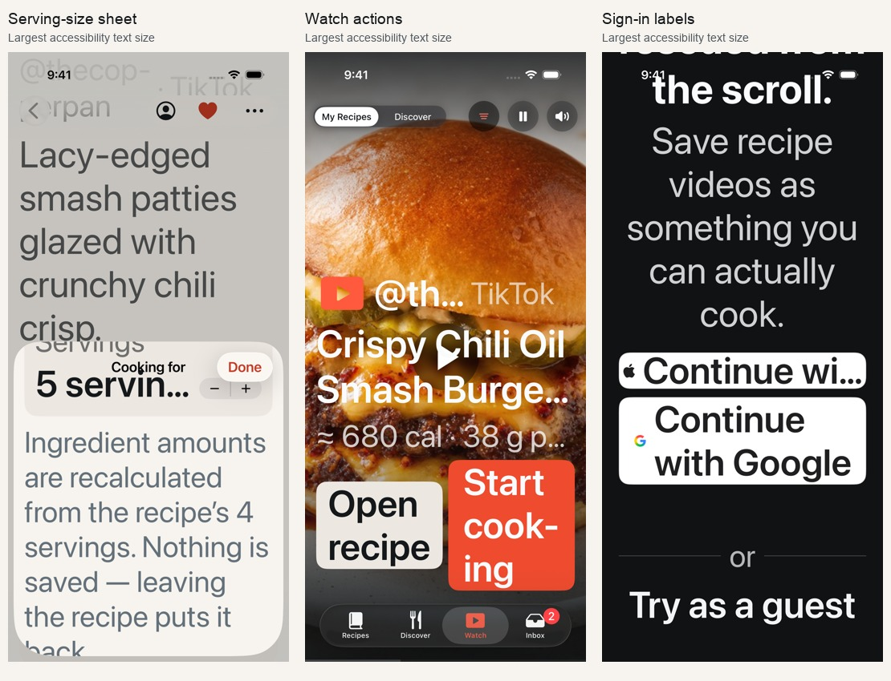

**Overeasy UI audit — 8 September 2026**

Reviewed `main` at `96c6f2c20359e8f89cb3777902f0f084abbf625e`, including serving-size scaling and the alternate app icon. This is an audit and evidence record; production code was not changed.

[Browse all 208 captured screens](captures/2026-09-08-ui-audit/index.html). The gallery is searchable by screen name, appearance, or AX5; each thumbnail opens a larger image.

**Visual direction: pass.** Food photography, native navigation, restrained surfaces, and the focused cooking view form a coherent product. There is no reason to redesign the app wholesale. The important work is accessibility and a few specific interactions.

**Result: 6 findings — 3 P1, 3 P2; no P0 found in the exercised flows.** Fix the serving-size layout and contrast first. Address Watch, sign-in labels, and editor navigation next.

| Dimension | Score | Assessment |
|---|---:|---|
| Accessibility | 2/4 | Contrast failures; enlarged text exposes clipped controls. |
| Performance | 3/4 | Navigation and the 80-recipe scenario completed; lazy layouts and artwork caching are present. This was not an Instruments or network-performance audit. |
| Responsive layout | 2/4 | Most screens scroll and reflow, but servings, Watch actions, and sign-in labels need work. |
| Theming | 2/4 | Light/dark coverage is broad; accent and secondary-label contrast remain inconsistent. |
| Design anti-patterns | 4/4 | Intentional native interface with useful imagery; no gratuitous visual system or decorative dashboard patterns. |
| **Total** | **13/20** | **Acceptable; significant accessibility work remains.** |

**[P1] 1. Serving-size sheet overflows at the largest text setting**

Evidence: [Servings at the largest text size](captures/2026-09-08-ui-audit/175-audit-servings-sheet-scaled-ax5.jpg).

Open a saved recipe, tap its yield, and increase the servings with Accessibility XXX Large text enabled. The sheet stays at its medium height. The “Cooking for” toolbar overlaps the serving row, the count truncates, the explanatory text extends past the bottom, and Reset is outside the visible sheet. There is no scroll container to reach it.

Location: [RecipeMetadataBand.swift:214](https://github.com/chetangoel01/recipe-app/blob/96c6f2c20359e8f89cb3777902f0f084abbf625e/Ladle/RecipeDetail/RecipeMetadataBand.swift#L214), especially the fixed medium detent at line 251 and horizontal stepper row below it. Category: accessibility / responsive layout.

Use a scrollable sheet with a large detent at accessibility sizes, and allow the serving label and stepper to stack. Verify the explanation, Reset, increment/decrement, and Done on both a standard and a short phone. This is content and control loss under text enlargement, not simply a long page.

**[P1] 2. Filled action buttons fail small-text contrast**

Evidence: [Dark-mode export action](captures/2026-09-08-ui-audit/159-audit-health-export-scrolled-dark.jpg).

The shared button pairs a 17-point semibold label in `#FAFBFC` with the selected accent. Default Tomato measures **3.57:1 in light mode and 2.78:1 in dark mode**. Cooking’s fixed red Next button measures **2.99:1**. Orange and Sage also fall short in dark mode: **3.80:1** and **4.19:1**. The combinations appear on real actions such as Continue, Retry import, Confirm & Export, and Next step.

Location: [LadleComponents.swift:120](https://github.com/chetangoel01/recipe-app/blob/96c6f2c20359e8f89cb3777902f0f084abbf625e/Ladle/Design/LadleComponents.swift#L120), [LadleTheme.swift:24](https://github.com/chetangoel01/recipe-app/blob/96c6f2c20359e8f89cb3777902f0f084abbf625e/Ladle/Design/LadleTheme.swift#L24), and [FocusModeView.swift:220](https://github.com/chetangoel01/recipe-app/blob/96c6f2c20359e8f89cb3777902f0f084abbf625e/Ladle/Cooking/FocusModeView.swift#L220). Category: accessibility / theming.

Adjust the shared foreground/fill pairs and verify all five accents in both appearances. Aim for at least **4.5:1** for these labels. Ratios use the committed sRGB colors and relative luminance, not compressed screenshot pixels. The threshold follows [Apple’s accessibility guidance](https://developer.apple.com/design/human-interface-guidelines/accessibility/) and [WCAG contrast guidance](https://www.w3.org/WAI/WCAG21/Understanding/contrast-minimum.html).

**[P1] 3. Small recipe facts are too faint**

Evidence: [Recipe facts in the light library](captures/2026-09-08-ui-audit/027-audit-recipes-grid-light.jpg).

Small labels repeatedly apply opacity to the primary color rather than use a contrast-checked secondary role. Examples in light mode: library grid facts at 58% opacity on Paper measure **4.25:1**; list source labels at 50% on Oat measure **3.24:1**; metadata-band captions at 56% on Oat measure **3.86:1**. These are useful recipe facts, not disabled controls. The native accessibility audit independently flagged visible library facts, recipe creator/source labels, and Nutrition’s Calories caption.

Location: [RecipeGridCard.swift:51](https://github.com/chetangoel01/recipe-app/blob/96c6f2c20359e8f89cb3777902f0f084abbf625e/Ladle/Library/RecipeGridCard.swift#L51), [RecipeListRow.swift:16](https://github.com/chetangoel01/recipe-app/blob/96c6f2c20359e8f89cb3777902f0f084abbf625e/Ladle/Library/RecipeListRow.swift#L16), and [RecipeMetadataBand.swift:172](https://github.com/chetangoel01/recipe-app/blob/96c6f2c20359e8f89cb3777902f0f084abbf625e/Ladle/RecipeDetail/RecipeMetadataBand.swift#L172). Category: accessibility / theming.

Replace the affected opacity treatments with secondary text colors verified on the actual Paper, Oat, and Steel surfaces. Audit nutrition and editor captions using the same rule. The same 4.5:1 small-text target applies.

**[P2] 4. Watch’s action row becomes difficult to read with enlarged text**

Evidence: [Watch actions with enlarged text](captures/2026-09-08-ui-audit/148-audit-watch-my-recipes-ax5.jpg).

At Accessibility XXX Large, the fixed side-by-side actions split “Save” into “Sav / e” and “Start cooking” into several fragments. The creator and recipe title truncate heavily. The buttons remain tappable, but scanning the central actions becomes unnecessarily difficult.

Location: [WatchView.swift:645](https://github.com/chetangoel01/recipe-app/blob/96c6f2c20359e8f89cb3777902f0f084abbf625e/Ladle/Library/WatchView.swift#L645) and the action `HStack` at line 685. Category: responsive layout / accessibility.

Stack the actions at accessibility sizes, give labels enough width, and reconsider how much overlay metadata competes with them. Preserve the current compact layout at ordinary sizes.

**[P2] 5. Sign-in labels truncate at enlarged text sizes**

Evidence: [Apple and Google labels with enlarged text](captures/2026-09-08-ui-audit/169-audit-welcome-actions-ax5.jpg).

The welcome screen’s custom Apple label becomes “Continue wi…” at Accessibility XXX Large. The native Apple button is fixed to 52 points while its custom label scales. These shared sign-in controls also appear in the account and guest-limit flows.

Location: [SignInOptionsView.swift:61](https://github.com/chetangoel01/recipe-app/blob/96c6f2c20359e8f89cb3777902f0f084abbf625e/Ladle/Account/SignInOptionsView.swift#L61), with the custom label at line 153. Category: responsive layout / accessibility.

Make both providers’ visible labels fit at supported text sizes without clipping or ambiguous truncation. Check the shared component in welcome, sign-in, and guest-limit contexts. Provider icons and accessibility labels remain available; this finding concerns the visible text.

**[P2] 6. Switching editor sections preserves an unrelated scroll position**

Evidence: [Method opening at its later steps](captures/2026-09-08-ui-audit/189-audit-editor-method-scrolled-dark.jpg).

Open Ingredients, scroll down, then select Method. Method opens partway down its steps, with the section heading and initial steps above the viewport. Switching to another section can similarly start at its middle or end. This makes fields appear to be missing until the user scrolls back up.

Location: [RecipeEditorView.swift:21](https://github.com/chetangoel01/recipe-app/blob/96c6f2c20359e8f89cb3777902f0f084abbf625e/Ladle/Edit/RecipeEditorView.swift#L21) and section selection at line 100. Category: navigation / responsive layout.

Start a newly selected section at its heading, or deliberately maintain an independent position for each section. The simplest fix is to reset the content’s scroll position when the section changes.

**Patterns and strengths**

The contrast issues share a small set of colors and opacity treatments; fix those centrally instead of recoloring each screen independently. Enlarged-text failures concentrate in compact horizontal controls and fixed-height presentations. Several other components already handle text growth well: the library switches to one column, Profile stacks its facts, nutrition macros stack, and recovery/privacy content scrolls.

Keep the food-led hierarchy, native menus and sheets, explicit safe re-import comparison, useful empty/error messages, and focus-mode instruction hierarchy. Existing interaction tests verified Discover saving in place, filters shared across tabs, Profile editing, app-icon switching, serving scaling, and clearing a reviewed import from Inbox.

The written design palette also lags the code: DESIGN.md describes cool porcelain while current assets use warm Paper/Oat/Steel values. This is documentation drift, not an instruction to change the product’s palette.

**Recommended order**

1. `impeccable adapt` for the serving-size sheet and enlarged-text action layouts.
2. `impeccable harden` for contrast and sign-in readability, with focused regression checks.
3. Correct editor section navigation, then run `impeccable audit` again.
4. `impeccable polish` after the functional and accessibility fixes pass.

These can be addressed individually or together. This audit does not select or implement a new visual direction.

**Screen coverage and verification**

The running app was exercised on an isolated iPhone 17 simulator, iOS 26.5, at 402 × 874 points. Light and dark appearances were checked, along with Accessibility XXX Large (AX5). Selected rare components also received isolated 375 × 667-point AX5 renders. The project targets iPhone; this pass was in portrait orientation.

| Screen family | What was checked |
|---|---|
| First run | Welcome, provider choices, name entry with keyboard, diet choices, all three walkthrough pages; normal and AX5. |
| Recipes | Grid, list, gallery, collections, sort/view/filter controls, search with no results, favorites, 80-recipe library, one-column large-text layout. |
| Discover | Shelves, full results, shelf filtering, context menu, read-only recipe preview, save in place, empty feed, failed feed and launch fallback. |
| Watch | Discover and My Recipes feeds, playback controls, filter menu, original-video sheet, light/dark/AX5 overlays, empty and failed feeds. |
| Inbox and import | Active/failed/review rows, empty Inbox, reviewed-row removal; link and manual entry with keyboard; processing, cancellation confirmation, completed and needs-review results; parser/private/offline failures, rate/quota limits; all three recovery forms. |
| Recipe detail | Header, metadata, ingredients, method, options menu, view-only serving scaling and Reset visibility, needs-review journey. |
| Editor | Basics, Media, Timing, Ingredients, Method, Nutrition; light and dark; enlarged-text forms and horizontal navigation. |
| Safe re-import | Intro/notes, candidate comparison, ingredients/method, acceptance and keep-current controls. No real recipe was replaced. |
| Nutrition and Health | Nutrition totals, macros, detail rows, estimated/unavailable states, export confirmation and serving picker. |
| Cooking | Full recipe, ingredient checklist, steps, focus mode, previous/next, enlarged text; isolated timer-running, paused, and finished renders. |
| Profile and account | Signed-in and guest profiles, name edit, avatar menu behavior, diet changes, accent selection, both icons, sign-in sheet, privacy/data text. |
| Rare account/sync states | Last guest save, guest limit, changed/deleted sync conflicts, recovery inputs; isolated light, dark, and short-phone AX5 renders. |
| Share Extension | Success in light/dark, failure and loading at accessibility sizes; isolated component renders. |
| Global failure states | Offline with/without saved recipes, expired authentication, initial store failure, empty library, Discover unavailable, import quota/rate limit. |

All **37 pre-existing app UI tests** and **7 Share confirmation tests** passed. App and Share Extension build-for-testing succeeded. Temporary audit-only capture runners expanded the screenshot coverage; their initial selector/scroll failures were investigated separately from product findings. They are not being added to the permanent test suite.

Native accessibility diagnostics covered Recipes, recipe detail, servings, and Nutrition. Output was manually checked: labels inside larger tappable recipe cards and content partly under a tab bar can produce misleading hit-area or contrast reports. Those raw reports are not counted as independent product bugs. The [diagnostic record](captures/2026-09-08-ui-audit/native-accessibility.json) is retained beside the screenshots. The final targeted enlarged-text recipe/editor/nutrition capture completed successfully after correcting the runner’s scrolling.

**Limits:** fixture data and simulated account states were used. This does not verify live Apple/Google authentication, production video-provider playback, real cross-device sync, photo permissions, or Health authorization/write/result flows. Health was reviewed up to confirmation and no nutrition was exported. VoiceOver navigation, hardware keyboard navigation, real-device motion performance, landscape, and the full device/locale matrix remain outside this pass. Source review of those paths is not presented as live visual verification. No new behavioral tests were warranted for a documentation-only audit.
