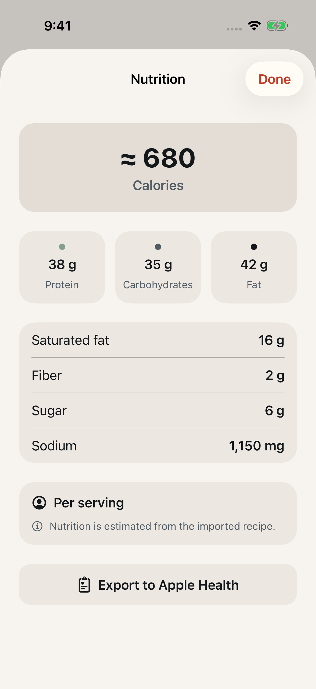
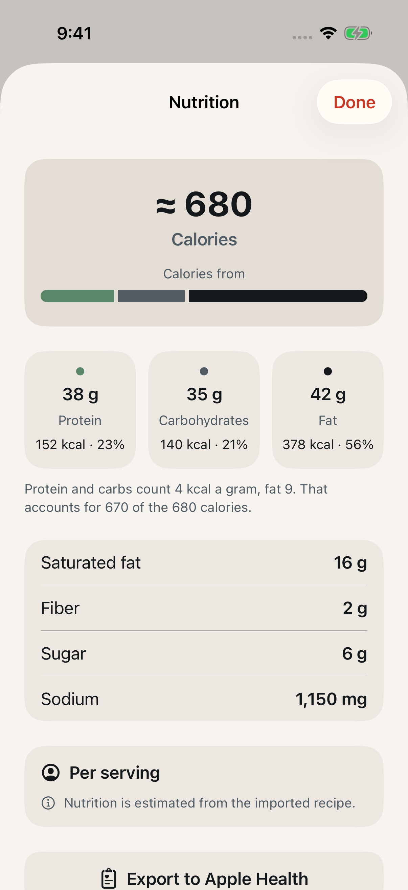
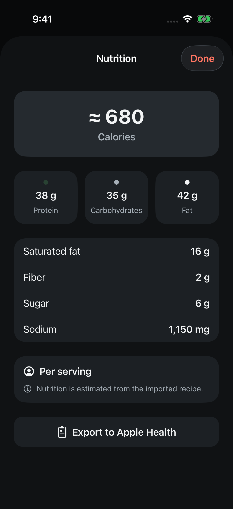
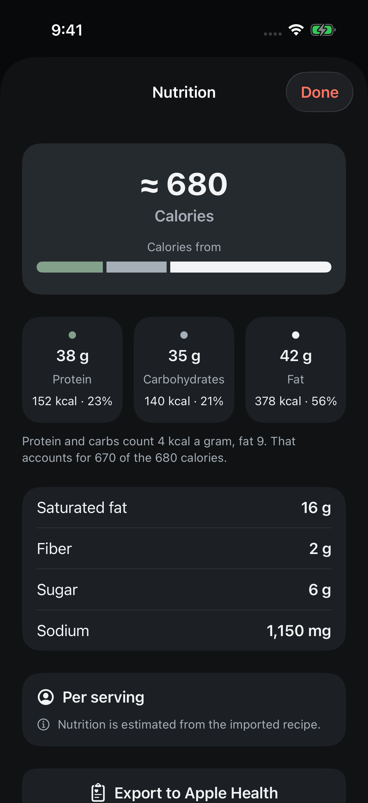
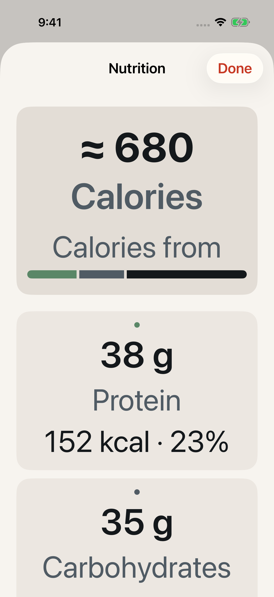
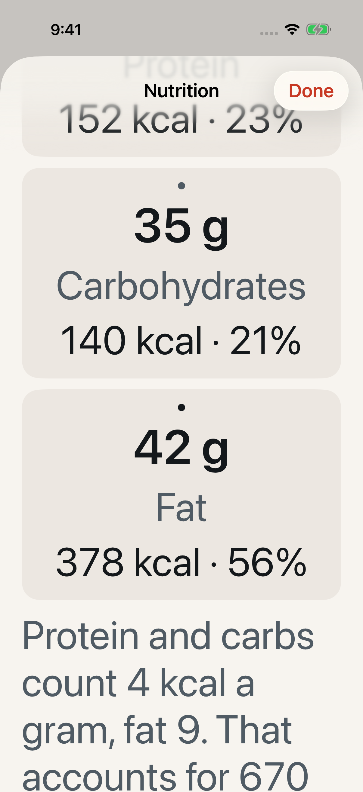

# Calories from protein, carbohydrates and fat on the nutrition sheet

Date: September 17, 2026

Issue [#144](https://github.com/chetangoel01/overeasy/issues/144). Branch
`codex/feedback-144-macro-calories`, stacked on
`codex/feedback-resolution-2026-09-17`.

## Purpose

The feedback was "maybe add a breakdown of the calories too in the nutrition
per serving view." The sheet printed a calorie total and three gram counts and
never said how one related to the other.

## Decision

The issue left the form of the breakdown open: by ingredient, by macro, or
both. On September 17 the owner chose **macros** — calories from protein,
carbohydrate and fat, computed in the app from figures it already holds, at
the usual 4, 4 and 9 kcal a gram. There is no backend or contract change.

**Calories by ingredient is deferred.** The shared nutrition model carries
aggregate values only, so an ingredient list needs the pipeline to send
per-ingredient contributions first.

## What the cook sees

Everything is per serving, like the rest of the sheet, and follows the seeded
smash burger through: 38 g, 35 g and 42 g come to 152, 140 and 378 kcal.

- **Hero.** Under the total and its "Calories" caption sit a small "Calories
  from" label and one 12-point bar in three segments — protein, carbohydrates,
  fat — with 4-point gaps and rounded ends.
- **Tiles are the legend.** A segment wears its tile's dot colour, in the
  tiles' order, and each tile gains one line under its name:
  "152 kcal · 23%". Past the default text size, while the tiles still sit
  three across, that line breaks at the dot into "152 kcal" over "23%"
  instead of shrinking; at accessibility sizes the tiles stack and it is one
  line again.
- **One quiet line under the tiles:** "Protein and carbs count 4 kcal a gram,
  fat 9." When the macro sum and the stated calories print as different whole
  numbers it adds "That accounts for 670 of the 680 calories."
- **Percentages** are shares of the macro sum, rounded by largest remainder so
  the three always add to 100 — 1 g of each is 24, 23 and 53, where rounding
  one at a time prints 101.
- **Missing data.** With any macro missing, or no usable serving basis, there
  is no bar, no kcal line and no note, and the tiles keep "Unavailable". With
  the macros but no calories, the bar and kcal lines stay and the comparison
  is dropped. A macro that is truly 0 g prints "0 kcal · 0%" and draws no
  segment. Nothing unavailable is drawn as zero.
- **VoiceOver.** A tile reads "Protein, 38 g, 152 calories, 23 percent". The
  bar and its label are hidden, because the tiles carry the same numbers, and
  the note is spoken with "calories" for "kcal".
- The new figures take no "≈": the
  [marker rides on calories alone](2026-09-07-approximate-nutrition-marker.md).
  The note adds no estimate or warning wording, so it does not pull against
  the quieter estimate notes asked for in #145.

## Decisions

1. **The two numbers are never reconciled.** Fibre, alcohol and a label's own
   rounding all keep 4, 4 and 9 away from a stated total, and the app cannot
   tell which. The note states both figures, names no reason, and moves
   neither. It compares the *printed* whole numbers, so 669.6 beside 670 is
   never explained as "670 of the 670".
2. **A sum above the total has its own sentence**, because "214 of the 210"
   reads as a mistake: "That comes to 214, more than the 210 calories." The
   brief only worded the shortfall, so this wording is a proposal for the
   owner. The seeded miso cookies are the case: 12 + 112 + 90 = 214 beside 210.
3. **The bar is drawn from the printed percentages**, not the raw kcal, so the
   picture and the numbers cannot disagree and the widths fill the bar
   exactly.
4. **A dot and its segment share one colour**, declared once in `MacroColor`
   so the two cannot drift apart: protein `Mark.protein`, carbohydrates
   `Label.secondary`, fat `Label.primary`.
5. **Protein has its own mark colour.** The dot used `Intent.success`, whose
   dark value `#294233` is a fill for light text to sit on: as a mark it was
   1.32:1 against the steel hero and 1.50:1 against a raised tile, so in dark
   mode the bar's first segment all but vanished, and it was only 2.10:1 and
   2.30:1 in light. `Mark.protein` (palette `thyme`) stays in the same sage
   family and clears WCAG's 3:1 for graphics on both surfaces: `#5A8767` in
   light, 3.06:1 on steel and 3.35:1 on raised, and `#83A18A` in dark, 5.12:1
   and 5.80:1. Carbohydrates and fat already passed — 5.16:1 at the least —
   and are unchanged. `Intent.success` itself is untouched; a data mark is
   not an intent, which is why this is a new `Mark` role and not a new value
   for the old one. The protein dot therefore changes colour too, which the
   before and after captures show.
6. **The kcal line is `metadata` in `Label.primary`**, against the general
   pairing of `metadata` with `Label.secondary`, because it is a value rather
   than supporting text. DESIGN.md records the exception.
7. **A negative gram count is treated as unavailable.** The editor will parse
   one, and it is bad data rather than a share of anything.

## Affected components

- `Packages/LadleCore/Sources/LadleCore/Nutrition.swift` — `MacroCalories`
  and `Nutrition.macroCalories`, nil unless all three macros are known,
  non-negative and add up to something.
- `Ladle/Nutrition/NutritionNote.swift` — `macroCalories(_:of:)`, the line
  under the tiles.
- `Ladle/Nutrition/NutritionView.swift` — the bar, the tile line, the note and
  `MacroColor`. The view reads `displayedNutrition`, which is already empty
  when the serving basis is unusable, so that case needs no gate of its own.
- `Ladle/Design/LadleTheme.swift` — the `thyme` palette name and the
  `Mark.protein` role, backed by
  `Ladle/Resources/Assets.xcassets/Thyme.colorset`.
- `DESIGN.md` gains a Nutrition section, a `Mark.protein` row in the colour
  table and a note on what a mark is.

No Swift file was added or removed, and a colorset lives inside the asset
catalog the project already references, so there is no project change.

## Tests

- `NutritionTests.swift`, suite "Macro calories": the 4/4/9 sums, shares that
  add to 100 on a split that naive rounding gets wrong, nil with a macro
  missing, and nil for a zero total or a negative gram count. Red first as a
  missing member.
- `NutritionNoteTests.testTheMacroNoteCitesTheTotalOnlyWhenTheWholeNumbersDisagree`.
  Red first against a helper that always compared: it printed "510 of the 510
  calories" and "of the" for a sum above the total.
- `AccessibleColorTests.testMacroMarksStandOutOnTheHeroAndTheTiles` holds the
  three marks to 3:1 on steel and on raised in both appearances. Red first
  against `Intent.success`, with exactly four failures, all protein: 2.10 and
  2.30 in light, 1.32 and 1.50 in dark. `thyme` also joins the list of
  palette names that `DesignTokenTests` keeps out of production screens.
- No hosted-view test. The view's gate is one optional, and the cases that
  make it nil are covered where it is computed.

## Verification

Xcode 27.0, on a private iPhone 17 Pro simulator (iOS 26.5) created for this
work and deleted afterwards.

```
swift test --package-path Packages/LadleCore
  Test run with 95 tests in 12 suites passed            (91 before)

xcodebuild test -project Ladle.xcodeproj -scheme LadleAllTests \
  -only-testing:LadleTests
  Test Suite 'All tests' passed
  Executed 592 tests, with 1 test skipped and 0 failures (590 before)

  -only-testing:LadleUITests/HIGRegressionUITests/testHealthExportReturnsToNutritionWithinTheSheet
  Executed 1 test, with 0 failures
```

The skip is the live App Attest test, as before. That UI test opens this sheet
and scrolls to the export button, which now sits lower; it ran before the
protein colour changed, which moves no layout. With the new colour,
`AccessibleColorTests`, `NutritionNoteTests` and `DesignTokenTests` ran
together (45 tests, 0 failures) ahead of the full suite above.
`git diff --check` is clean.

The after captures were retaken with the new protein colour, and sampled: the
segment and the dot are `#5A8767` on a `#E3DDD6` hero and an `#ECE7E1` tile in
light, and `#83A18A` on `#252A2F` and `#1C2024` in dark, so the ratios above
describe what is drawn. The before captures still show the old dot.

The captures below come from the seeded library through the same route:
recipe, Recipe options, View nutrition. The states the seeded library cannot
reach were rendered once through a
temporary hosted view that is not committed: a missing macro, no calories, an
unusable serving basis, a sum above the total, a true zero in dark, and
four-digit kcal at the default, extra-large and largest standard sizes.

| | Before | After |
| --- | --- | --- |
| Light |  |  |
| Dark |  |  |

Largest accessibility text size:

| Hero and first tile | Tiles and note |
| --- | --- |
|  |  |

## Known rough edges

- At the largest standard size "Carbohydrates" still shrinks to fit its tile,
  which leaves that tile a couple of points shorter than its neighbours. That
  predates this change.
