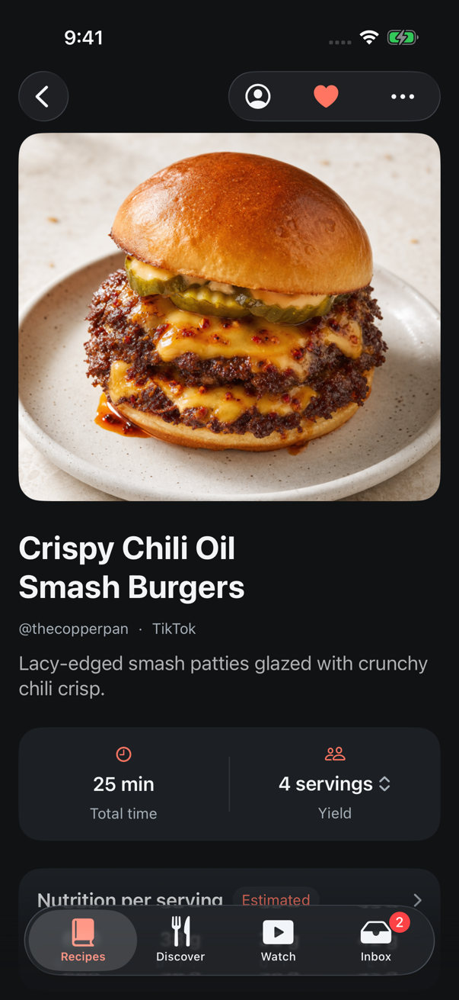
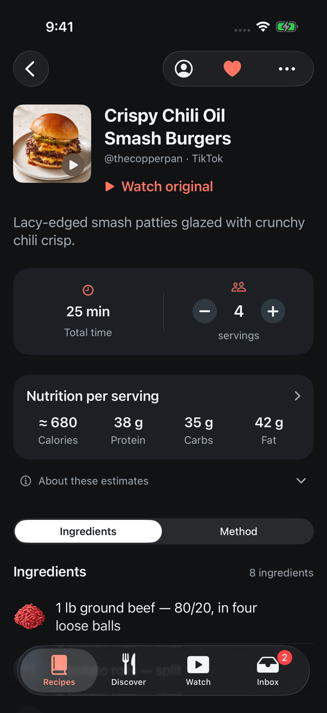
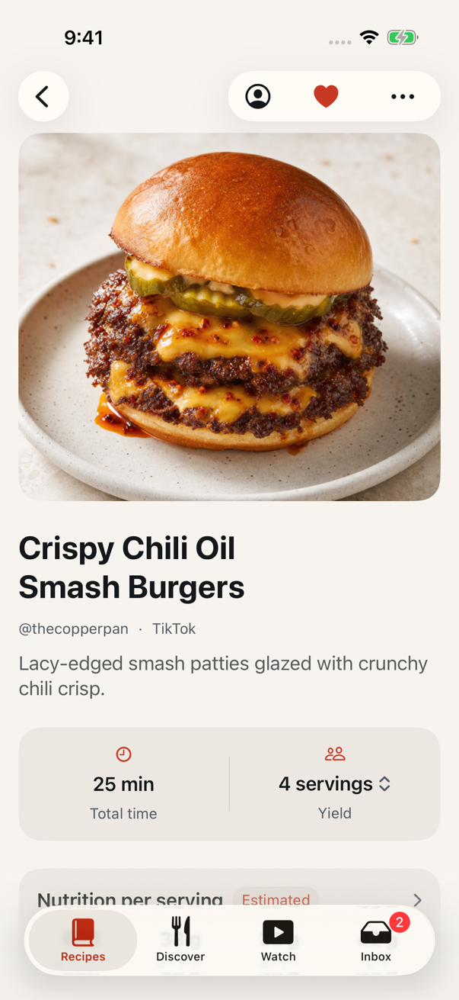
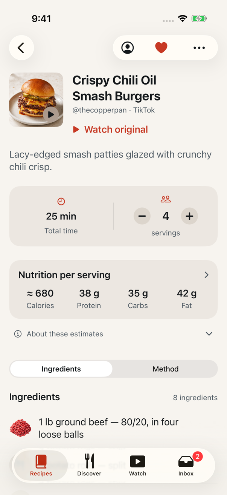

# Recipe details: compact header, Watch original, inline servings, quiet estimates

Date: September 17, 2026
Issues: [#151](https://github.com/chetangoel01/overeasy/issues/151),
[#150](https://github.com/chetangoel01/overeasy/issues/150),
[#148](https://github.com/chetangoel01/overeasy/issues/148),
[#145](https://github.com/chetangoel01/overeasy/issues/145)
Branch: `codex/feedback-recipe-details`, stacked on
`codex/feedback-resolution-2026-09-17`.
Status: **built, tested and captured on a simulator created for the task
(iPhone 17 Pro, iOS 26.5) and deleted after. Not run on a phone; VoiceOver
structure was read from the accessibility tree, not listened to.**

## Purpose

Four pieces of TestFlight feedback about one screen. Opening a recipe repeated
the photo the cook had just tapped, at 322 points, and pushed the facts below
the fold. The original video was only reachable through the options menu — and
a Discover preview has no options menu, so it had no way to the player at all.
Changing servings cost a sheet, a stepper and a Done. And one estimated recipe
said so three times over, in accent: on the value, on a badge, and in a
sentence — again under every ingredient the normaliser had weighed.

The owner approved a live mock of the screen on September 17; this is that
screen.

| Before | After |
| --- | --- |
|  |  |
|  |  |

## What the cook sees

- **A compact header (#151).** A 96-point thumbnail beside the title and
  byline, the description beneath. Time, servings and nutrition are whole on
  the first screen: on the base the nutrition card ended 76 points under the
  tab bar (`maxY` 866.7 against the bar's 791), and it now ends above it. At
  accessibility sizes the thumbnail sits above the title and the platform
  takes its own byline line. Missing or late artwork keeps the same square.
- **Watch original (#150).** On a recipe whose link a platform player accepts,
  a tertiary "Watch original" link sits under the byline and the thumbnail
  wears a play badge; both open the existing player sheet. Neither appears —
  and the options menu loses its entry — when `VideoEmbed.url(for:)` is `nil`,
  so there is no dead control. It works the same on a Discover preview.
  Closing the player returns to the same scroll position (measured: the
  anchor row's frame was identical before and after).
- **Inline servings (#148).** The band is still two even cells. The right one
  is the people glyph, the count between a round minus and plus, and the word
  "servings". After a change that line reads "servings · Reset" and the band
  keeps its height: in the unscaled and scaled first-screen captures
  everything under the band — the nutrition card, the estimates row, the top
  of the section picker — is pixel-identical, in dark and in light. The
  buttons disable at 1 and at `RecipeContractLimits.maximumServings`. Nothing
  is saved, the scaling still resets when the recipe changes and is still
  handed to Cook mode. A band with nothing to scale (the reimport sheet, a
  recipe claiming no yield) keeps the read-only "Yield" cell. `ServingsSheet`
  is deleted.
- **Quiet estimates (#145).** A value keeps one short hedge — "About 45 min",
  "≈ 560", "servings, estimated" — and the reasons live once, in a collapsed
  "About these estimates" row under the nutrition card (under the band when
  there is no nutrition; absent when there is nothing to list). Routine
  nutrition-amount assumptions (`ingredients[i].nutritionAmount`) moved off
  the rows into that note, named by ingredient. "Not counted" and doubts
  about an ingredient or step stay on their line, in `Label.secondary`. The
  accent time note and the "Estimated" pill are gone; "Partial" stays,
  neutral. The review notice is untouched.

## Decisions

**The owner's**, from the approved mock: the thumbnail header and its 22-point
bold title; "a link under the byline" for the video, with the thumbnail doing
the same; the count *between* the buttons with nothing else on that line
(after the first design crowded it) and "servings · Reset" beneath; one
disclosure for estimate reasons, with routine ingredient assumptions moved
into it. Also his, on September 17: UI tests cut to smoke journeys.

**Engineering calls, open to veto:**

- **`compactTitle`** (`.title2`, bold) is a new type role rather than a reuse:
  `title` takes three lines beside a thumbnail and `recipeTitle` is 20-point
  semibold, which is a card's name, not a screen's.
- **The stepper's circles are `Surface.badge`, not steel.** The brief said
  steel; DESIGN.md says steel disappears on a raised card, which the band is.
  `LadleIconButton` gained an `onCard` tone and a `diameter`, so the buttons
  are the shared icon button — 30 points drawn, 44 to press — not a one-off.
  Their glyph is the shared 16-point bold, a little heavier than the mock's.
- **The count is `recipeTitle`** (20 semibold), as the deleted sheet's was.
- **One adjustable element for VoiceOver** ("Servings", "6 servings, scaled
  from 4 servings", swipe up or down), with Reset a separate button named
  "Reset to 4 servings". The minus and plus are therefore not in the
  accessibility tree, so the smoke test presses the control's trailing end.
- **One settled announcement.** "Scaled to 8 servings. Ingredient amounts
  updated." / "Back to the recipe as written." waits a second after the last
  change; a newer change replaces a pending one. Per-step announcements would
  double what the adjustable element already reads.
- **Reset's target grows down and sideways only** (a content shape offset into
  the band's padding), so the line keeps its 18-point height and a press on
  the bottom of the plus is never a Reset. Probed both ways on the simulator:
  a press 6 points above the target stepped 5 → 6, and a press at the
  target's lower edge, about 30 points under the word, reset.
- **A hedged yield, scaled, reads plainly.** "servings, estimated" and "Yield
  unknown" appear only at the recipe's own count; once the cook has chosen a
  number it is theirs, so "Yield unknown" never sits over "· Reset".
- **"Watch original" uses the tertiary style at zero inset, held to its
  label**, so the glyph lands on the title's edge and the blank row beside it
  is not a button. Its height is the role's 52, not 44.
- **The play badge is material with a primary glyph**, like the grid card's
  favourite, so it holds contrast over any photo in both appearances.
- **Estimate notes are a subject over its reason**, and the brief's sentence
  "Nutrition is estimated from the ingredient amounts." became "Nutrition"
  over "Estimated from the ingredient amounts." so every line has that shape.
- **The reimport sheet loses routine notes too.** It reuses `IngredientList`
  and has no disclosure. It compares two versions of a recipe's text, and the
  normaliser's working is not part of that text.
- **The demo library's Sheet-Pan Gochujang Chicken is now fully estimated** —
  time, yield, and two assumed ingredient amounts — so the note has honest
  content to show. No other demo recipe changed.
- **On the recipe page "≈" now marks any estimate**, as the sheet, Health
  export and Watch feed already did. Library cards still mark only an
  incomplete total. `RecipePresentation.swift` and the
  [marker record](2026-09-07-approximate-nutrition-marker.md) say so.

## Affected components

- `Ladle/RecipeDetail/RecipeDetailView.swift` — header, thumbnail and link,
  playability gate on the menu, the facts group; `estimateNote` deleted.
- `Ladle/RecipeDetail/RecipeMetadataBand.swift` — inline stepper, label line,
  settled announcement; `ServingsSheet` and the accent time note deleted;
  nutrition card without the pill; `ladleYieldNote`, `isYieldEstimated`.
- `Ladle/RecipeDetail/RecipeEstimates.swift` — new: `isRoutineEstimate`,
  `ladleEstimateNotes`, `RecipeEstimatesDisclosure`.
- `Ladle/RecipeDetail/IngredientList.swift`, `MethodList.swift` — neutral
  notes; routine ones withheld from rows.
- `Ladle/Design/LadleTypography.swift` (`compactTitle`),
  `LadleComponents.swift` (`onCard`, `diameter`; `EstimateLabel` deleted),
  `RecipePresentation.swift` (comments), `Ladle/Data/PreviewFixtures.swift`.
- Docs: `DESIGN.md` (type table, header, video, servings, icon button,
  Estimates), and the [scaling](2026-09-08-recipe-scaling.md),
  [time display](2026-09-02-recipe-time-display.md),
  [approximate marker](2026-09-07-approximate-nutrition-marker.md) and
  [HIG fixes](2026-09-08-hig-fixes.md) records.

## Verification

- **Red first.** #151: the first-screen frame assertion failed on the base
  ("866.67 is greater than 791.0"). #150: the Discover preview had no link and
  no thumbnail button (3 failures). #148: no `recipe.servings` on the old band
  (2 failures). #145: `RecipeEstimatesTests` against a behaviour-less shell, 2
  assertion failures in the list test; the empty-list test passes against a
  shell by construction and guards the hide rule only once the list is real.
- **Final run, scratch capture harness removed:** `-only-testing:LadleTests` —
  "Executed 592 tests, with 1 test skipped and 0 failures (0 unexpected)"
  (the 590 baseline plus the two estimates tests). Smoke UI journeys only —
  `StateScenarioUITests/testPrimaryJourneyCapturesInboxDetailAndCooking`,
  `RecipeScalingUITests/testChangingTheYieldRewritesTheIngredientAmounts`,
  `DiscoverInteractionUITests/testDiscoverRecipeSupportsTapAndLongPress` —
  "Executed 3 tests, with 0 failures (0 unexpected)".
- **UI tests, by the owner's instruction of September 17:** none added. The
  Discover-preview video assertions written for #150 were taken back out
  (playability is already unit-tested in `LibraryNavigationStateTests`); the
  scaling journey was cut to increment → scaled row → Reset;
  `HIGRegressionUITests.testServingsResetIsReachableAtLargestTextSize`, which
  guarded the deleted sheet, was deleted rather than re-pointed.
- **Checked by hand in an uncommitted harness, not by a kept test:** the
  player opens from a Discover preview and from the thumbnail; a hand-typed
  recipe shows no link, badge, menu entry or disclosure; ten rapid presses
  count ten (4 → 14); the floor holds at 1; the disclosure reads "Collapsed" /
  "Expanded", lists the five notes on the chicken, and no routine reason is on
  a row; "Not counted" is still on the udon's oyster sauce.
- `git diff --check` clean before each commit; `xcodegen generate` is a no-op
  apart from the two new files.

## Captures

Half-size (603 × 1311), in `captures/2026-09-17-recipe-details/`. Dark and
light pairs were compared by checksum before being kept: the first dark set
was discarded because the appearance switch had not reached the app.

| | |
| --- | --- |
| Discover preview, before | [dark](captures/2026-09-17-recipe-details/before-discover-dark.png), [light](captures/2026-09-17-recipe-details/before-discover-light.png) |
| Discover preview, after | [dark](captures/2026-09-17-recipe-details/discover-preview-dark.png), [light](captures/2026-09-17-recipe-details/discover-preview-light.png) |
| Header at AX5 | [dark](captures/2026-09-17-recipe-details/header-ax5-dark.png) |
| No playable video | [dark](captures/2026-09-17-recipe-details/unplayable-dark.png) |
| Servings sheet, before | [dark](captures/2026-09-17-recipe-details/before-servings-sheet-dark.png) |
| Scaled to six | [dark](captures/2026-09-17-recipe-details/servings-scaled-dark.png), [light](captures/2026-09-17-recipe-details/servings-scaled-light.png) |
| Band at AX5, scaled | [dark](captures/2026-09-17-recipe-details/band-ax5-dark.png), [light](captures/2026-09-17-recipe-details/band-ax5-light.png) |
| Estimates, before | [band and pill](captures/2026-09-17-recipe-details/before-estimates-dark.png), [ingredient row](captures/2026-09-17-recipe-details/before-ingredient-notes-dark.png) |
| Estimates note open | [dark](captures/2026-09-17-recipe-details/estimates-open-dark.png), [light](captures/2026-09-17-recipe-details/estimates-open-light.png), [AX5](captures/2026-09-17-recipe-details/estimates-open-ax5-dark.png) |
| A note that stays on its row | [dark](captures/2026-09-17-recipe-details/row-note-dark.png) |

## Rough edges

- At AX5 the minus and plus stay 30 points beside a very large count. They
  are fixed-size controls on 44-point targets, like the navigation bar's.
- The likes, rating and "Saved by" line in the mock is #143 and is not here.
- No demo recipe has an incomplete total, so the neutral "Partial" pill was
  changed but not photographed.
- `DESIGN.md`'s colour table gives `Surface.badge` light as `#CDD5DC`; the
  code, which the stepper uses, is `#DCD5CC`. Left as found.
