# Engagement counts and star ratings — iOS

Date: September 17, 2026
Issue: [#143](https://github.com/chetangoel01/overeasy/issues/143)
Branch: `codex/feedback-143-ratings-ios`, from `main` with the
[ratings API](2026-09-17-recipe-ratings-api.md) merged.
Status: **built, unit-tested and captured on a simulator created for the task
(iPhone 17 Pro, iOS 26.5) and deleted after, against the demo service. Not run
against a server: nothing is deployed, so no real engagement read or rating
write has happened. Not run on a phone; VoiceOver structure was read from the
accessibility tree, not listened to.**

## Purpose

#143 asked whether a cook could judge a recipe by clearer counts and by what
people who made it thought. The backend half gave every shared source a save
count, the platform's like count, and a 1–5 star rating with a published
average. This is the app's half: show the numbers that exist, each labelled
for what it measures and whose it is, and let a cook rate a recipe they have
saved.

## What the cook sees

- **Recipe header.** The platform's likes belong to the platform, so they
  ride on the source line: "@thecopperpan · TikTok · 12K likes". Overeasy's
  own numbers take their own metadata line beneath it: "★ 4.6 (12) · Saved by
  18 cooks", the star and the average in `Label.primary`, the rest in
  `Label.secondary`. Stars appear only when the server sends an average (it
  withholds one under three ratings), and "(12)" only follows stars. At
  accessibility sizes the creator, the platform and the likes each take a
  line, as the first two already did, and the stars sit over the saves.
- **Unknown is absent.** No zero, no dash, no placeholder. A header without
  the Overeasy line closes up exactly as it was before ratings. A saved
  recipe that names its source holds that line's place from the first frame
  until the server answers, so the numbers arriving do not move the page; if
  no answer comes, the place is given back.
- **Rating card**, on a saved recipe that has a source, after the notes and
  above Start cooking: "Rate this recipe", five stars on 44-point targets,
  and "Counts toward the average other cooks see." Rated, it reads "Your
  rating", the chosen stars fill in the accent, and "Clear rating" takes the
  caption's line, so the card keeps its height on the tap that rates. Stars
  fill at once with selection feedback. The server's answer replaces the
  header's numbers, so a third rating visibly publishes an average. A failed
  write puts the previous stars back over "Couldn’t save your rating. Try
  again.", and VoiceOver hears "Couldn’t save your rating."
- **VoiceOver** meets the stars as one adjustable element: "Your rating",
  "4 stars" or "Not rated"; swiping down from one star clears. "Clear rating"
  is its own button. The Overeasy line reads "Rated 4.6 out of 5 by 12 cooks.
  Saved by 18 cooks" rather than the glyph's name, and the byline reads
  "@thecopperpan, TikTok, 12K likes".
- **Never** on a Discover preview — the cook has not saved it and the server
  would answer `409` — and never on a recipe typed in by hand, which has no
  source. A preview uses the numbers its Discover row already carried and
  asks the server for nothing; saving from the preview then asks as the saved
  copy, and the card arrives.
- **Discover rows** carry the same numbers: stars and saves when there is an
  average, "Saved by 15 cooks" when there is not. A row's text column beside
  the Save button is about 155 points wide and the line needs about 200, so
  there the stars sit over the saves — "★ 4.6 (12)" / "Saved by 18 cooks" —
  instead of the run breaking after "Saved by". Under Most liked a row still
  shows the likes it is ranked by, alone, when they are known. Watch's
  Discover videos use the same line. Shelf cards stay count-free.

## Decisions

**The owner's**, September 17: the first version is the counts that exist
plus 1–5 star ratings, and **no written reviews**. From the approved mock:
likes on the source line and Overeasy's numbers on their own line beneath,
with the two-tone treatment; the rating card's two states, its copy, and its
place above Start cooking; stars on Discover rows and none on shelf cards;
never a zero or a placeholder.

**Engineering calls, open to veto:**

- **A cursor reset alone would not have taught existing recipes their
  `sourceID`.** See [the resync](#how-existing-recipes-learn-their-source).
- **`sourceID` is never sent back.** `RemoteRecipeDTO` is also the `PUT` body,
  and the backend's `WireModel` forbids keys it does not know: echoing the
  field to a server that predates it would fail every edit with `422`. The
  write path sets it to nil, which leaves the key out. A contract test holds
  that, and was seen failing with the echo in place.
- **The editor carries `sourceID`** through `RecipeDraft`, as it carries the
  tags, so an edit does not cost the page its rating card until the next
  pull.
- **One formatter, three surfaces.** `EngagementText` holds the words and
  `EngagementLine` draws Overeasy's line; the header, `DiscoverRecipeRow` and
  Watch all use them, and Watch's own copy of "Saved by N cooks" is gone.
  Watch passes `Label.onAccent` for the emphasis.
- **The line never breaks mid-phrase.** `EngagementLine` is a `ViewThatFits`:
  one line where it fits, the stars over the saves where it does not. The
  first capture of a Discover row wrapped "★ 4.6 (12) · Saved by" / "18
  cooks", which is what prompted it. A starred row is one metadata line
  taller than an unstarred one as a result.
- **The star is the SF Symbol inside the text run**, not the "★" character,
  so it takes the text's size and weight at every Dynamic Type setting. The
  line carries a spoken label because VoiceOver reads the glyph by name.
- **Likes print as the existing formatter prints them**:
  `.number.notation(.compactName)` gives "24K", not the mock's "24.1K".
- **A like count of zero is left out**, like an unknown one: "0 likes" reads
  as a verdict, and the number is a snapshot from import either way.
- **Under Most liked, a row shows likes alone** — today's string, unchanged.
- **"Clear rating" is drawn like the servings band's Reset**, not as a
  52-point tertiary button: metadata type in the accent, on a target that
  grows down and sideways into the card's padding and never up into the
  stars. A 52-point button in place of an 18-point caption would have grown
  the card under the cook's finger on the tap that rates.
- **The failure line is an extra line under the footer**, not a replacement
  for it, so "Clear rating" stays reachable after a failed clear. It is
  metadata in `Label.secondary`: the stars snapping back are the signal and
  the line is the explanation.
- **Filled stars are the accent's label colour and empty ones
  `Label.secondary`**, the pairing the favourite heart uses. Glyphs are
  `IconSize.feature` (28) on 44-point targets, and the row steps back eight
  points so the first star lands on the title's leading edge.
- **The stars step up a size role at accessibility text sizes**, `hero` (38)
  on 54-point targets. Symbols in this app do not follow Dynamic Type, and
  the first AX5 capture had 28-point stars under a 53-point title. Five still
  fit a 375-point screen.
- **Tapping the star already chosen does nothing.** Clearing is explicit.
- **Writes are sent one at a time.** Two quick taps cannot reach the server
  out of order: the second waits for the first's answer, and only the last
  choice is sent. A failure drops whatever was queued behind it.
- **After a save from a preview, a failed engagement read keeps the row's
  numbers** and simply offers no card. "Failure shows nothing" is for a saved
  recipe opened cold, where there is nothing else to show.
- **`savedCount` on the engagement read includes the cook**, so a recipe only
  they saved reads "Saved by 1 cook". A Discover row's count never includes
  them. Both are what the server defines; the page shows what it is given.
- **`SourceEngagementServing` is its own small protocol** that
  `DiscoverServing` refines: the recipe page needs three calls and nothing
  else of Discover's.
- **The demo service keeps believable numbers** so a `-ui-testing` launch
  shows the feature: the smash burgers open on ★ 4.6 (12), the lemon orzo has
  two ratings and therefore no average until the demo cook adds a third, and
  the miso cookies have no likes. A demo recipe names itself as its source,
  which is what the demo's Discover card already assumed.

## Against a server without the API

Production does not have these routes or fields yet. The app must be
indistinguishable from the last release there, and it is, by construction:

- Discover items without `ratingAverage`/`ratingCount` decode as nil and 0,
  and recipes without `sourceID` decode as nil (LadleCore test, below).
- A saved recipe therefore has no `sourceID`, and a page without one **asks
  nothing**: no engagement request, no held line, no card. Against today's
  production the app never calls the new routes at all.
- Where a request is made and fails for any reason — `404` from a rolled-back
  server, offline, a timeout, a rate limit — the model swallows it: no line,
  no card, no message.
- No write ever carries `sourceID`, so edits cannot trip the old server's
  `extra="forbid"`.

Checked by the unit tests below and by reading the request paths; **not**
checked against a live old server.

## How existing recipes learn their source

Recipes already on a device were synced before `sourceID` existed, sync is
incremental, and the server bumps no revision for a field it merely started
serving. The expectation going in was a one-time full resync through the
`resetsCursor:` path. That would have been a silent no-op:
`applySyncPage` skipped any change whose revision the device already held,
and a pull from cursor 0 serves every recipe at exactly that revision.

Two changes, both small:

1. **`SwiftDataRecipeRepository.applySyncPage`**: a row at the revision it
   already holds is still skipped while it has a pending mutation — that is
   the echo of the device's own push, and it must not read as a conflict —
   but a *clean* row now takes the server's copy again. Same content, same
   revision; what differs is whatever this build reads that the one which
   stored the row did not. Older revisions are skipped as before.
2. **`RecipeSyncService`**: until a pull *from the beginning of the log* has
   carried a `sourceID`, the first sync of each launch resets the cursor.
   `SyncCursorStore` persists the flag (`ladle.sync.cursor.source-ids`), and
   it records what was learned, not that a pull was tried.

Why it is safe: pending mutations are pushed before the pull and a pending
row is never overwritten, so no local edit is lost; a conflict only exists
beside a pending mutation, so none is lost or invented; the client-initiated
reset does not run the snapshot reconcile, so nothing is deleted; the server
materialises each change from the recipe's current state, so a deleted recipe
replays as a delete and is never resurrected; and re-applying a clean row is
idempotent, so repeating the pull is harmless.

Why the flag is not a plain "done once": nothing is deployed. A build that
reached a phone before the backend did would spend a one-shot against a
server that sends no `sourceID`, learn nothing, and never try again — every
recipe saved before the upgrade would stay unrateable for good. So a pull
that teaches nothing leaves the flag unset, and the next launch pulls again.
The cost is one full pull per launch (one request per hundred log entries)
until the backend is deployed, and afterwards for an account with no sourced
recipe at all. Signing out and in also repairs a library, flag or no flag,
because that pull starts from zero too.

## Affected components

- `Packages/LadleCore`: `Recipe.sourceID`; `RemoteRecipeDTO.sourceID` (read,
  never written); `DiscoverRecipe.ratingAverage`/`ratingCount` and the
  lenient DTO; `SourceEngagement`, `RemoteSourceEngagementDTO`.
- `Ladle/Design/EngagementText.swift` — new: the shared words and line.
- `Ladle/RecipeDetail/RecipeRating.swift` — new: `RecipeEngagementModel`
  (load, optimistic rate and clear) and `RecipeRatingCard`.
- `Ladle/RecipeDetail/RecipeDetailView.swift` — likes on the byline, the
  Overeasy line, the card, the engagement task; `engagementService`.
- `Ladle/Library/DiscoverView.swift` (`DiscoverRecipeRow.engagementLine`),
  `WatchView.swift` (`metadata`), `LibraryView.swift` (passes the service).
- `Ladle/Remote/DiscoverService.swift` — `SourceEngagementServing`, the three
  remote calls, the demo's numbers and ratings.
- `Ladle/Sync/RecipeSyncService.swift`, `SyncCursorStore.swift`,
  `Ladle/Data/SwiftDataRecipeRepository.swift` — the resync above.
- `Ladle/Edit/RecipeDraft.swift`, `Ladle/Data/PreviewFixtures.swift`.
- Docs: `DESIGN.md` ("Discover and account"),
  `Backend/docs/integration-reference.md` (client note under "Engagement and
  ratings").

Local storage needed no schema change: `StoredRecipe` keeps the whole
`Recipe` as an encoded payload, and a payload written before the field
decodes it as nil.

## Verification

Four new tests and a handful of assertions on existing ones. Every one was
seen failing for the right reason: the two sync tests and the contract test
against the code as it was, the two tests of brand-new code against that
code deliberately broken.

- `swift test --package-path Packages/LadleCore` — **97 passed** (95 before).
  The fixture tests now hold the new fields; `writingARecipeSendsNull…` also
  holds that a write never carries `sourceID` (failed with the echo in
  place); `aServerWithoutRatingsStillServesDiscoverAndRecipes` strips the new
  keys and decodes 0 / nil / nil; `engagementFixture…` decodes
  `source-engagement.json`.
- `SwiftDataRecipeRepositoryTests.testAnUnchangedRevisionTeachesACleanRow…` —
  a replayed change at the revision already held gives a clean row its
  `sourceID` and leaves a row with a pending edit, its pending mutation and
  the conflict count alone. Against the old `<=` guard: `nil` is not equal
  to the source.
- `RecipeSyncServiceTests.testReplaysTheLogOnceALaunchUntilAPull…` — an old
  server: the first sync of the launch pulls from 0, the second does not,
  and the flag stays unset; the next launch meets a server that names
  sources, pulls from 0, sets the flag, and the launch after that does not
  start over. Cursors requested: `0, 7, 0, 9`. Without the replay: `42, 7,
  7, 9`.
- `RecipeEngagementTests` — the formatter (stars only with an average; no
  "(2)" without one; singular and plural; compact likes only when known;
  nothing for zero), and the model (nothing offered when the read fails; the
  stars are already filled when the write leaves; the answer takes the
  header's numbers; a failure restores the stars and raises the message;
  clear works). Broken three ways — "0 likes" drawn, `canRate` set before
  the answer, the failure not raised — it failed three times.
- `xcodebuild test -only-testing:LadleTests` — **602 tests, 1 skipped, 0
  failures** (598 before).
- The two smoke journeys that cross these screens,
  `StateScenarioUITests/testPrimaryJourneyCapturesInboxDetailAndCooking` and
  `DiscoverInteractionUITests/testDiscoverRecipeSupportsTapAndLongPress` —
  **2 tests, 0 failures**.
- No UI tests were added, at the owner's direction.

Looked at, in the demo build on the task's simulator, in dark, light and at
the largest accessibility size; the captures are below. Two things the
captures changed: a Discover row wrapped the line mid-phrase, which is why
`EngagementLine` stacks where it does not fit, and the stars were small
print at AX5, which is why they step up there. Measured on the unrated and
rated captures: everything under the card — the gap and Start cooking — is
pixel-identical between the two, in dark and in light, so the tap that rates
moves nothing.

Read from the accessibility tree with a throwaway XCUITest, not listened to:
the row is one element, "Your rating", whose value went "Not rated" → "4
stars" → "Not rated" across a tap and a clear; "Clear rating" is a button
with a 47.7-point-tall frame that exists only while rated; the header and
Discover lines carry the spoken label. The five star buttons still appear
under the row in XCUITest's snapshot, named "Favorite" by the symbol —
with and without `accessibilityHidden` on them, so the snapshot does not
show what `children: .ignore` hides. The row follows the servings stepper's
pattern exactly; whether VoiceOver can land on a star was **not** checked by
ear.

Not verified: any real request. The remote service's three calls are
untested against a server, and the old-server behaviour rests on the
decoding test and on the page making no request without a `sourceID`.

## Captures

All in `captures/2026-09-17-recipe-ratings/`, iPhone 17 Pro, demo data.
"AX5" is the largest accessibility text size.

| | Dark | Light | AX5 |
| --- | --- | --- | --- |
| Saved header, both lines | 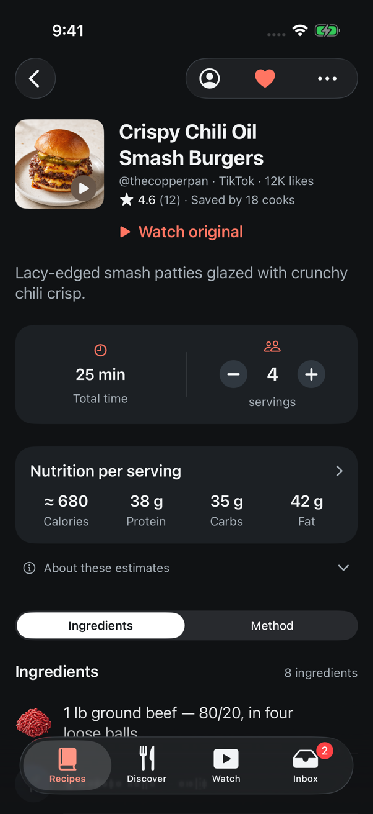 | 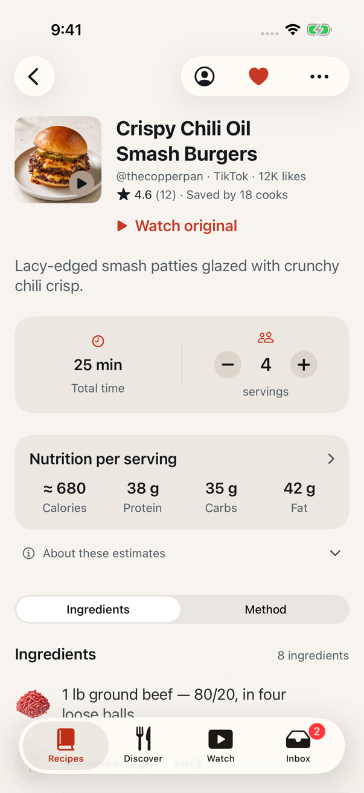 | 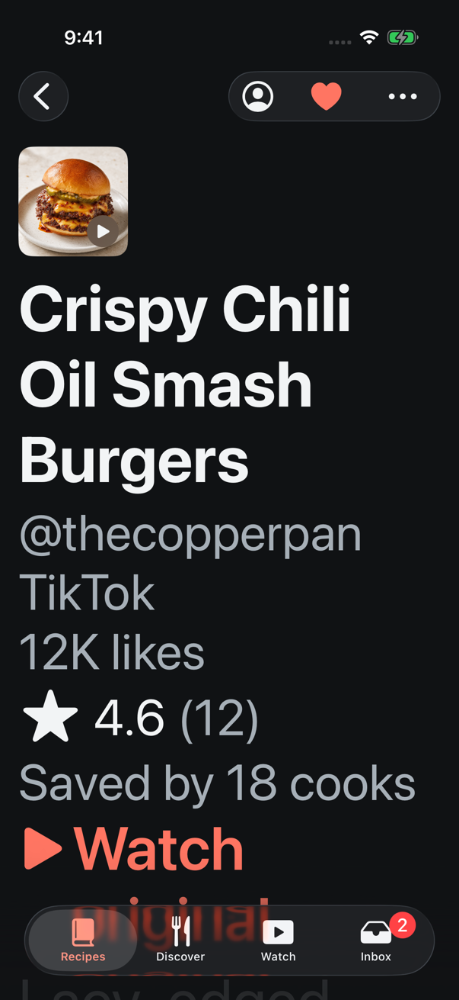 |
| Saved header, no average yet | 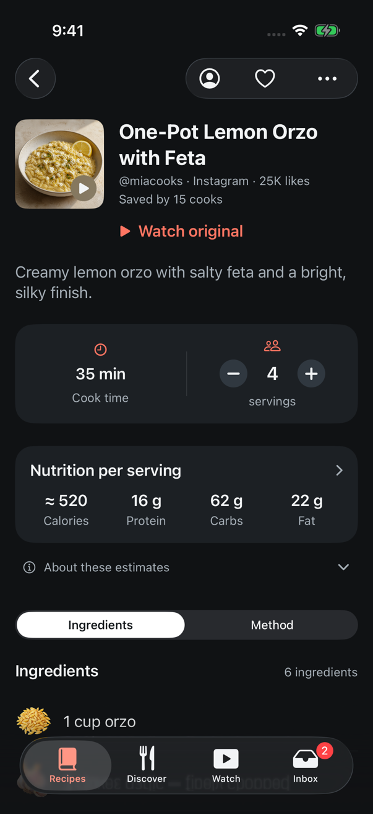 | 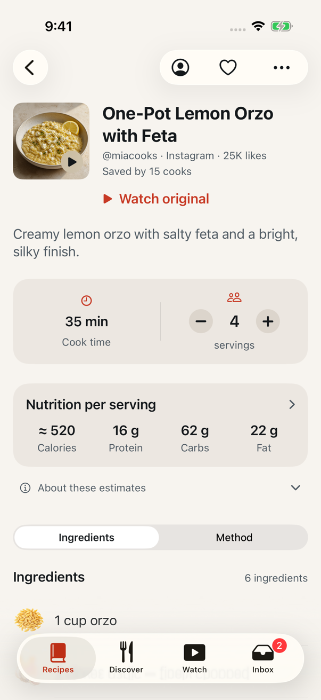 | 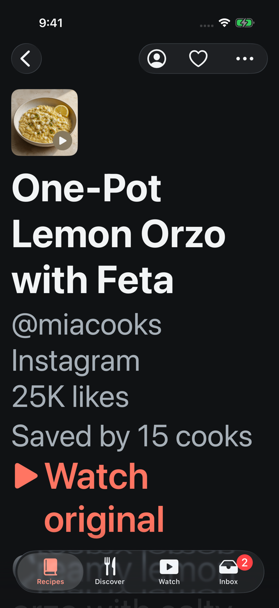 |
| Rating card, unrated | 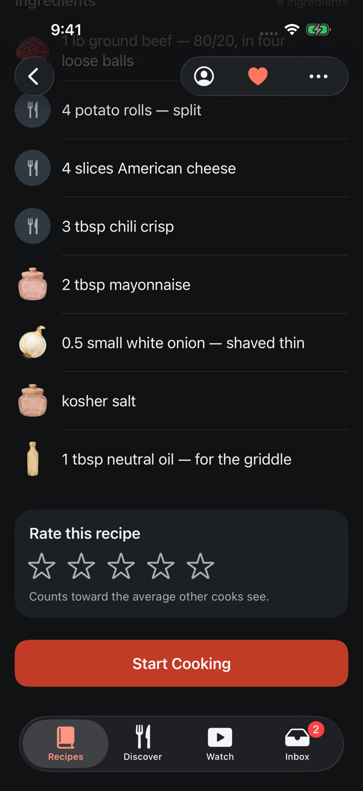 | 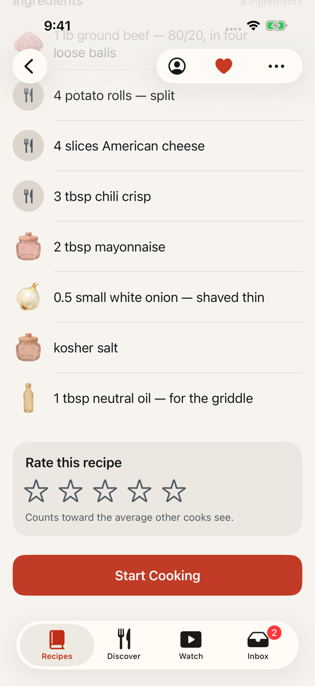 | 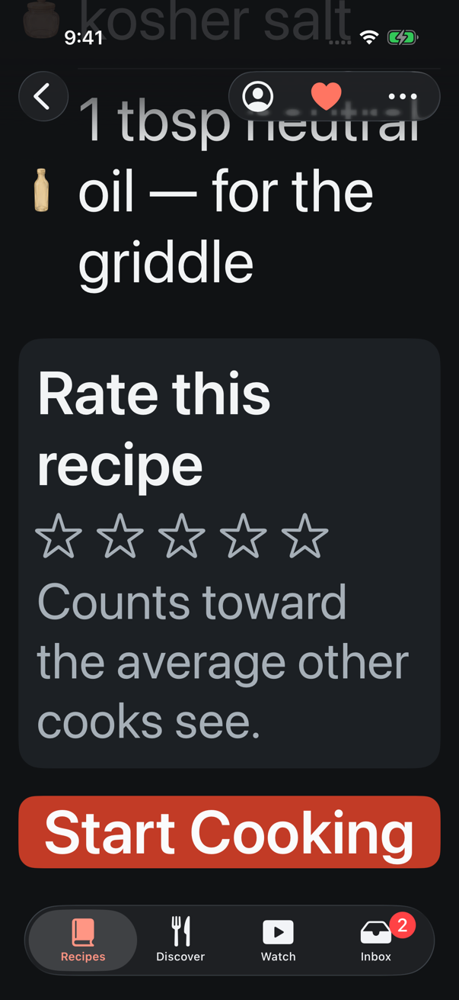 |
| Rating card, rated | 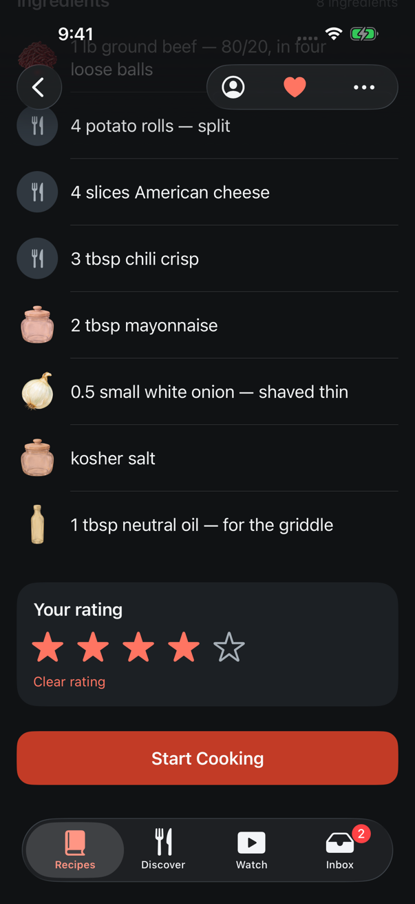 | 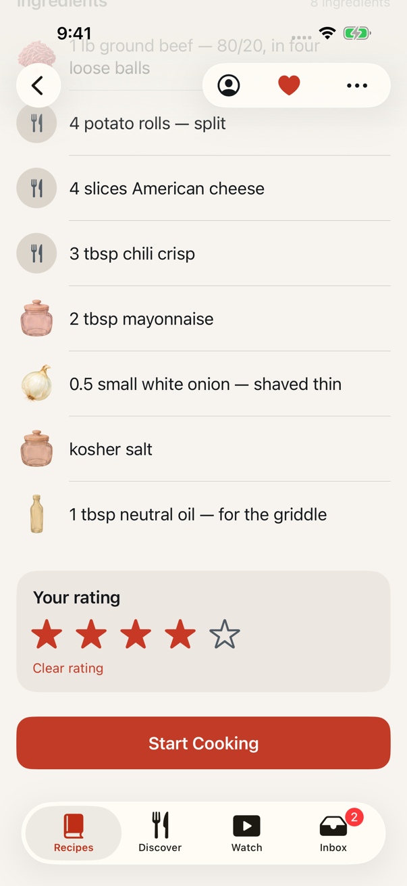 | 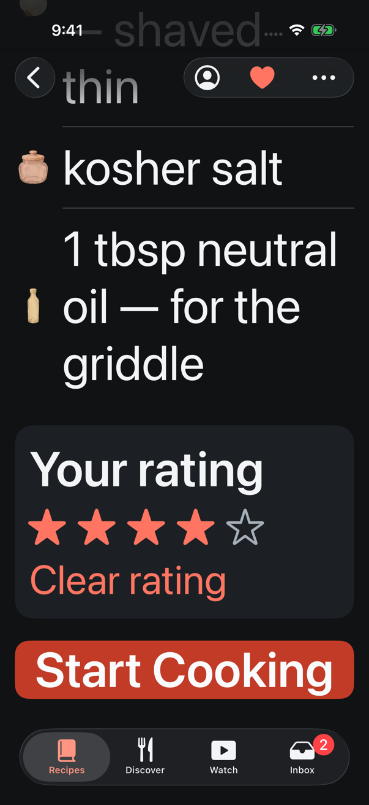 |
| Discover rows, with and without stars | 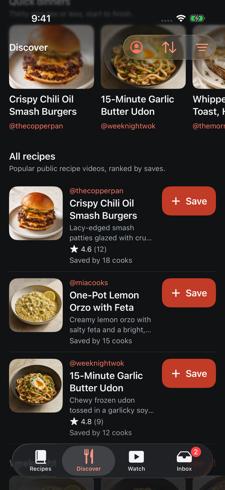 | 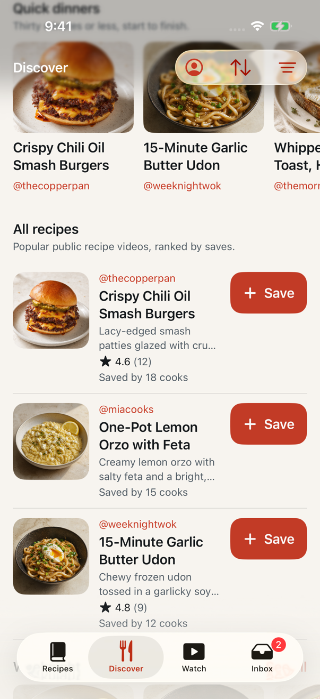 | 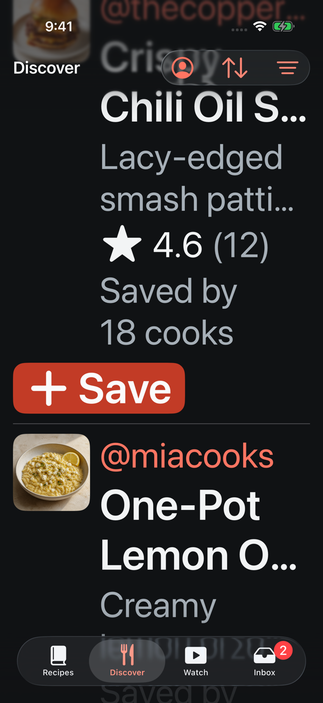 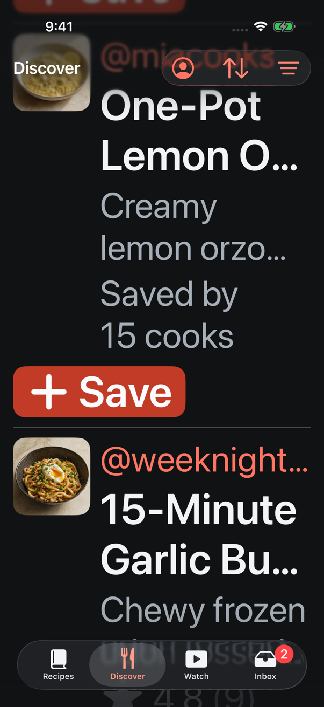 |
| Discover preview, header | 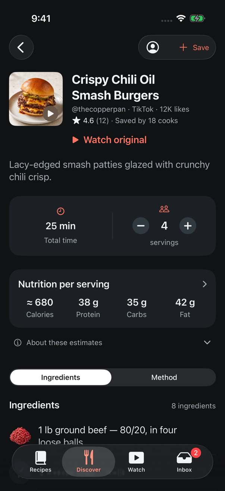 | 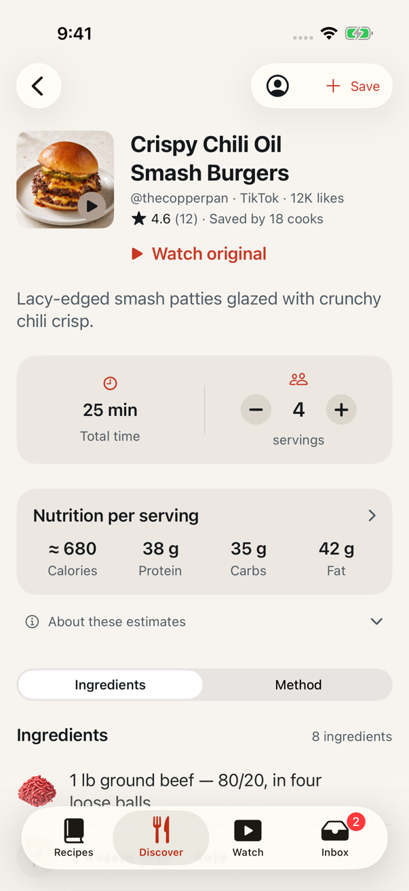 | 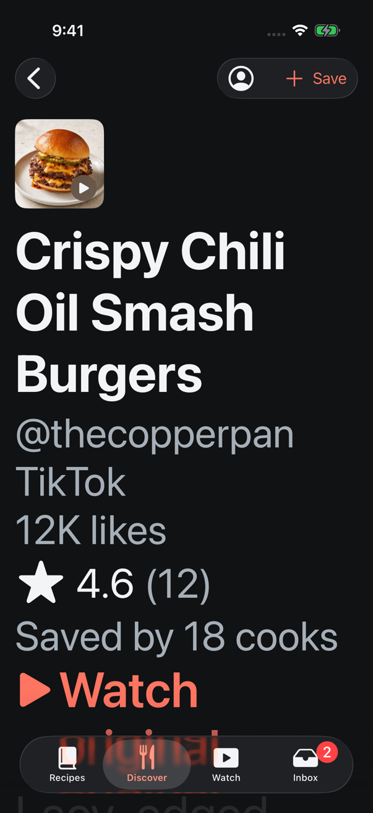 |
| Discover preview, end: no rating card | 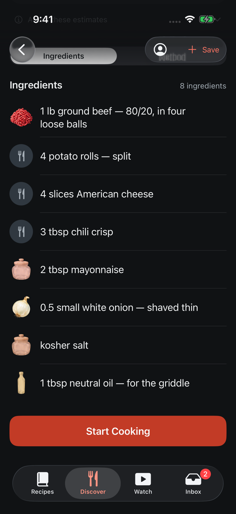 | 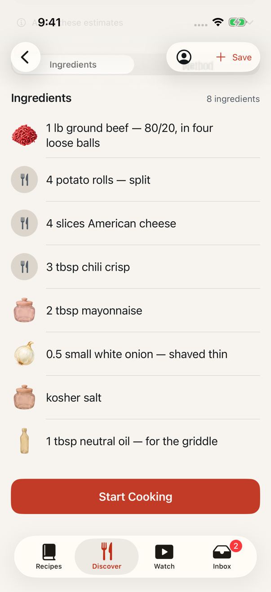 | 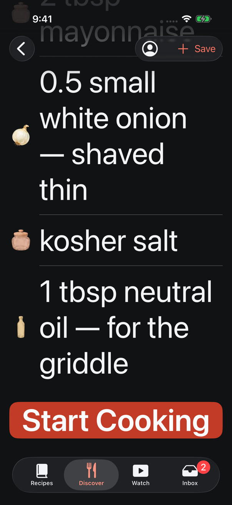 |

Three more, dark only:

- [`saved-header-after-rating-dark.png`](captures/2026-09-17-recipe-ratings/saved-header-after-rating-dark.png)
  — the same header after the demo cook's four stars: ★ 4.6 (12) became
  ★ 4.5 (13).
- [`rating-failed-dark.png`](captures/2026-09-17-recipe-ratings/rating-failed-dark.png)
  — the failure line. The demo service cannot fail a write, so this one was
  taken with an uncommitted one-line patch that failed a one-star rating.
- [`watch-discover-dark.png`](captures/2026-09-17-recipe-ratings/watch-discover-dark.png)
  — Watch's Discover feed on the shared line.

The captures came from an uncommitted XCUITest harness that walked the
screens and wrote PNGs to the host; it is not in the repository.
