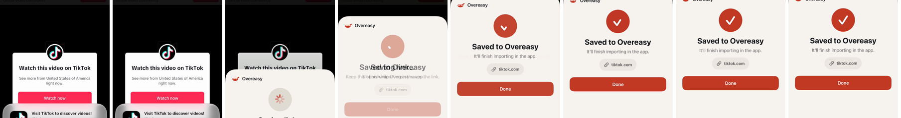

# Share Extension: "Saved to Overeasy" lands

Date: September 23, 2026
Branch: `codex/motion-bridges`
Status: **implemented on `codex/motion-bridges`; built, unit-tested (563
tests), UI smoke set run, and captured on the simulator.**

## Purpose

Sharing a link to Overeasy ended with "Saving link…" replaced by "Saved to
Overeasy" in a single frame. The status icon was three separate views, so the
steel disc with its spinner was swapped for an accent disc with a checkmark:
no motion and no haptic at the one moment the extension exists for.

## What the user sees

- The 86-point circle stays where it is. When the save lands its fill turns
  from steel to accent, the spinner fades out and the checkmark draws on.
- The title and message crossfade. The source capsule and **Done** fade in
  below them, so the brand and the circle never move.
- One success haptic plays as the save lands. A failure, or the confirmation
  shown again, plays none.
- A failed save keeps the steel circle; the spinner fades and the
  exclamation mark fades in.
- With Reduce Motion the new state appears at once: the circle is accent and
  the checkmark is in place immediately, with no fade, no fill transition and
  no Draw On. The haptic still plays: it is feedback, not motion.
- Sizes, colours, copy, accessibility labels and identifiers are unchanged.
  VoiceOver still finds the status as one 86-point element.

## Decisions

1. **The view animates by value.** `ShareViewController` assigns a new
   `rootView` for each state. The root keeps its identity in the hosting
   controller, so `.animation(_:value:)` and `.sensoryFeedback(trigger:)` see
   both states. The controller stays unanimated: animation belongs to the view
   that reads Reduce Motion. The curve is the house
   `.snappy(duration: 0.2, extraBounce: 0)`.
2. **The haptic rule lives on `ShareConfirmationState`.**
   `didSave(from:to:)` is true only for loading to success. The extension is
   its own target and cannot see `LadleFeedbackPolicy`, the same reason
   `ShareTheme` mirrors the palette. It has the same forward-only shape as
   `didComplete(from:to:)`.
3. **Draw On runs at the system's speed.** The checkmark enters with
   `.transition(.symbolEffect(.drawOn))` and default options. Its speed is
   system-owned and has to be judged on a device beside the 0.2-second fill.
   If it reads slow, `options: .speed(_:)` is the setting to change.
4. **Failure stays quiet.** It keeps the default fade and gets no draw or
   haptic, since nothing moved forward.
5. **One circle, one font.** The circle is a single `ZStack` with the state's
   symbol over it. The symbol font moved onto the stack, where both marks
   share it and the spinner ignores it. `.accessibilityElement(children:
   .combine)` keeps the 86-point element the separate views each had.

## Affected components

- `LadleShare/ShareConfirmationView.swift`: `ShareConfirmationState.didSave`,
  the single-circle `statusIcon`, and the animation and feedback modifiers.
- `LadleTests/ShareConfirmationViewTests.swift`:
  `testOnlyTheSaveLandingPlaysSuccessFeedback`.
- `DESIGN.md`, **First run and Share Extension**.

## Verification

- Red, then green: the new test's assertions were first run against a stub
  that returned `false` and failed on loading to success, then passed with
  the rule. xcodebuild was held for the build stage, so they ran on macOS in a
  scratch harness that compiled `ShareConfirmationState` alone.
- `xcrun --sdk iphonesimulator swiftc -typecheck -swift-version 6 -target
  arm64-apple-ios26.0-simulator` over `ShareConfirmationView.swift` and
  `ShareConfirmationViewTests.swift`: clean. This covers
  `.transition(.symbolEffect(.drawOn))` and the conditional
  `.sensoryFeedback`.
- `git diff --check`: clean.
- `xcodebuild build -scheme Ladle` (Debug, iOS Simulator): succeeded with
  Ladle, LadleShare and LadleTimers; no new warnings.
- `xcodebuild test -scheme LadleAllTests -only-testing:LadleTests`: 560
  tests, 1 skipped, 0 failures, including the three existing
  `ShareConfirmationViewTests` render tests.
- Red, then green under xcodebuild: with the parent's
  `ShareConfirmationView.swift` restored, `ShareConfirmationViewTests` failed
  to compile (`ShareConfirmationState` has no member `didSave`); with this
  change, all 5 of its tests pass.

To judge on a device: how fast Draw On runs; whether the steel-to-accent fill
interpolates rather than jumps; whether the success haptic reaches the user
from the extension; and Reduce Motion showing the new state at once.
Enqueueing is a local write, so the loading state may last only a moment and
the change can happen while the sheet is still presenting.

### Captures

Recorded on the iPhone 17 simulator (iOS 27.0), light appearance, Tomato accent, seeded demo data (`-ui-testing -onboarding-complete`), with `xcrun simctl io recordVideo`; each strip is frames of that recording, left to right.

- 
  Sharing a TikTok link from Safari. The sheet rises on "Saving link…" with the
  spinner, then the circle turns from steel to accent, the copy crossfades,
  source and Done fade in, and the checkmark draws on.

The success haptic cannot be observed in the simulator; its loading-to-success
rule is unit-tested. Reduce Motion was not captured.
