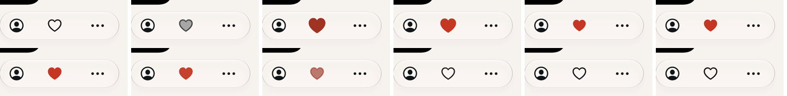
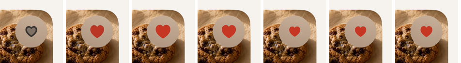

# Icons that change state morph instead of blinking

Date: September 23, 2026
Branch: `codex/motion-bridges`
Status: **implemented on `codex/motion-bridges`; built, unit-tested (563
tests), UI smoke set run, and captured on the simulator.**

## Purpose

Every control whose glyph shows its state swapped symbols in one frame: the
heart, play and pause, the timer ring, a step's completion circle; Save's fill
and spinner snapped in with the tap. Stock iOS morphs a changing symbol. This
brings Overeasy's glyphs into line with that, without changing any size,
colour, label, identifier or haptic.

## What the cook sees

- **Favorites.** The heart morphs between `heart` and `heart.fill` in
  Recipes' grid and list and on the recipe page. Switching a favorite on also
  plays one bounce; switching it off never does.
- **Icon buttons.** Everything drawn by `LadleIconButton` morphs when its
  symbol changes, so Watch's play/pause and mute controls do too. Watch has no
  heart of its own; its favorite is in the context menu.
- **Cooking.** The timer ring's play, pause and checkmark morph into each
  other, including the checkmark at zero. The card's colour, its titles and
  the reset button still change in the same frame. Focus Mode's "Mark step
  complete" circle morphs into the filled checkmark and back; the words
  change at once. Moving to another step shows that step's circle as it is,
  with no morph.
- **Save.** On a Discover row, Watch and the recipe page's toolbar, the tap
  (fill drops or the label fades, spinner in) moves on the house curve. On
  landing the Discover row leaves and the recipe page's heart takes Save's
  slot; Watch crossfades "Saved" in. The plus is never on screen as it becomes
  the checkmark, so it does not morph.
- **Reduce Motion.** Every glyph changes in one frame, nothing bounces, and
  Save's fill and label change at once. Colour, label and haptics are
  unchanged.

## Decisions

1. **Three shared modifiers in `LadleComponents.swift`**, each reading
   Reduce Motion itself so the animation stays in the view:
   `ladleAnimation(value:)` animates a change to `value` on
   `.snappy(duration: 0.2, extraBounce: 0)`, or not at all under Reduce
   Motion; `ladleSymbolReplace(value:)` adds SF Symbols' Replace to it; and
   `ladleSymbolBounce(on:)` bounces once when its Bool goes from false to
   true. Save uses `ladleAnimation` rather than reading Reduce Motion in its
   own view: `DesignTokenTests` builds Discover's `saveButton` outside a
   body, and a property read there logs SwiftUI's "Accessing Environment
   outside of being installed on a View" warning.
2. **The bounce reuses `LadleFeedbackPolicy.didComplete(from:to:)`**, the
   rule the completion haptics already use. It counts only the switches on,
   so switching off leaves the effect's trigger alone. No new policy, so no
   new test: the forward-only rule is already covered by
   `testFeedbackPolicyOnlyAcknowledgesMeaningfulStateChanges`.
3. **Under Reduce Motion the content transition is `.identity`**, not just a
   nil animation, so the Replace cannot play whatever transaction the change
   arrives in.
4. **The animation is scoped to the glyph** on icon buttons, the heart, the
   timer ring and Focus Mode. Focus Mode's label is written as
   `Label { Text } icon: { Image }` so the Replace touches only the symbol
   and never the words.
5. **Save's animation is keyed on `isSaving`, not `isSaved`.** The fill drops
   at the tap, when the button disables, not when the save lands, and saving
   flipping back is what crossfades Watch's "Saved" in. A saved state learnt
   from a background load flips `isSaved` alone and does not animate the
   button, in line with "routine background loading must not introduce
   animated movement".
6. **Save's glyph gets no Replace, because Save never becomes Saved in
   place.** The Discover list drops a saved row in the same update the save
   lands (`removesSavedRecipeImmediately`); on the recipe page
   `DiscoverSaveModel.save` sets `access = .saved` in that update, so the
   heart takes Save's slot; Watch swaps the label for a `ProgressView` while
   saving, so "Saved" is re-inserted and crossfades in. A Replace on the plus
   would never play at a save and would only animate a Saved state learnt in
   the background, so the labels stay as they were. Keeping Watch's label
   under an overlay, as the Discover row does, would change the button's
   accessible name and spinner tint while saving, which this change rules
   out; that is left for the owner.
7. **Focus Mode's circle is keyed to its step** (`.id(step.id)` on the
   image). The step section is one view whichever step is current, so without
   it moving from a completed step to an open one played the checkmark back
   into a circle, which reads as un-completing it. The id is on the glyph, not
   the button, so the button's success-haptic trigger is untouched. That
   trigger also sees step changes, so moving onto a completed step likely
   plays the success haptic; this predates the change, which does not touch
   haptics, and is left for the owner.

## Affected components

- `Ladle/Design/LadleComponents.swift`: `ladleAnimation(value:)`,
  `ladleSymbolReplace(value:)`, `ladleSymbolBounce(on:)`, and
  `LadleIconButton`'s glyph.
- `Ladle/RecipeDetail/RecipeDetailView.swift`: the toolbar heart, and Save's
  animation.
- `Ladle/Library/DiscoverView.swift`: `DiscoverRecipeRow.saveButton`'s
  animation.
- `Ladle/Library/WatchView.swift`: `WatchRecipePage`'s Save animation.
- `Ladle/Cooking/RecipeTimer.swift`: `RecipeTimerButton.timerRing`'s glyph.
- `Ladle/Cooking/FocusModeView.swift`: the "Mark step complete" icon, keyed
  to its step.
- `DESIGN.md`: Buttons.

## Verification

- `git diff --check`: clean.
- `xcodebuild build -scheme Ladle -configuration Debug` for an iOS 27
  simulator: the app, `LadleShare` and `LadleTimers` build with no new
  warnings (only the existing unused `viewport` in `WatchView.swift`).
- `xcodebuild test -scheme LadleAllTests -only-testing:LadleTests`: passes.
  `testDiscoverSaveKeepsItsBoundsWhileLoadingAtEveryTextSize` still holds
  Save's bounds while loading, and no longer logs the unhosted environment
  warning (decision 1).
- No unit test added: the change adds no rule or state beyond
  `LadleFeedbackPolicy.didComplete(from:to:)`, whose forward-only rule is
  already covered, and the transitions are visual. UI tests are not added
  for motion.
- Not run in this stage: on-device checks.

To check at integration, with Reduce Motion both off and on:

- The heart in the grid, the list and the recipe page morphs, bounces once on
  favorite and not on unfavorite; nothing bounces with Reduce Motion on.
- The timer ring's glyph morphs on start, pause, resume, finish and reset
  while the card colour and title change at once.
- Focus Mode: the step circle morphs on toggle, not when moving between
  steps (complete a step, tap Next, and the next circle does not morph); the
  words change at once.
- Watch: the play/pause and mute glyphs morph.
- Discover row and Watch Save: the tap moves on the curve; the Discover row
  leaves on landing and Watch's "Saved" crossfades in.
- Recipe page toolbar Save: the tap fades the label and brings the spinner in
  on the curve; instant under Reduce Motion.
- VoiceOver still reads "Mark step complete" by its title alone now that the
  label takes an icon closure.

### Captures

Recorded on the iPhone 17 simulator (iOS 27.0), light appearance, Tomato accent, seeded demo data (`-ui-testing -onboarding-complete`), with `xcrun simctl io recordVideo`; each strip is frames of that recording, left to right.

- 
  The recipe page's heart. Top: favoriting morphs the outline into the fill and
  bounces once. Bottom: unfavoriting morphs back with no bounce.
- 
  A Recipes grid card's heart, through `LadleIconButton`: the same Replace and
  single bounce on the photo's material circle.

The timer ring and Focus Mode's step circle use the same modifier and were not
captured separately. Reduce Motion was not captured.
